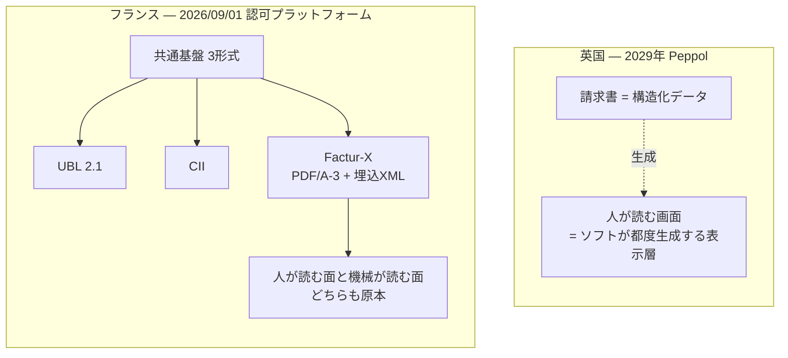
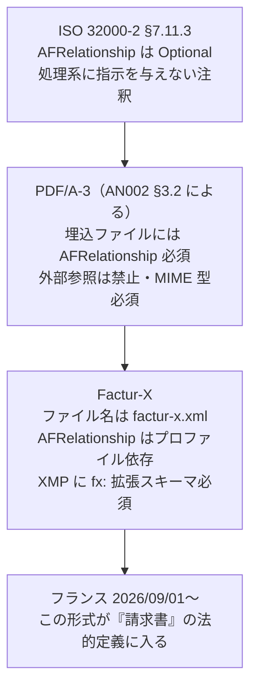
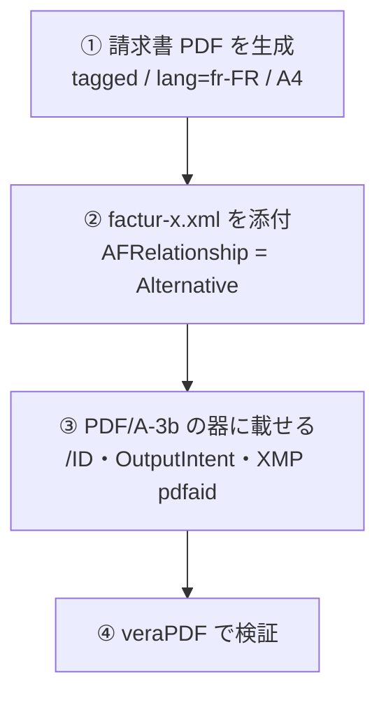
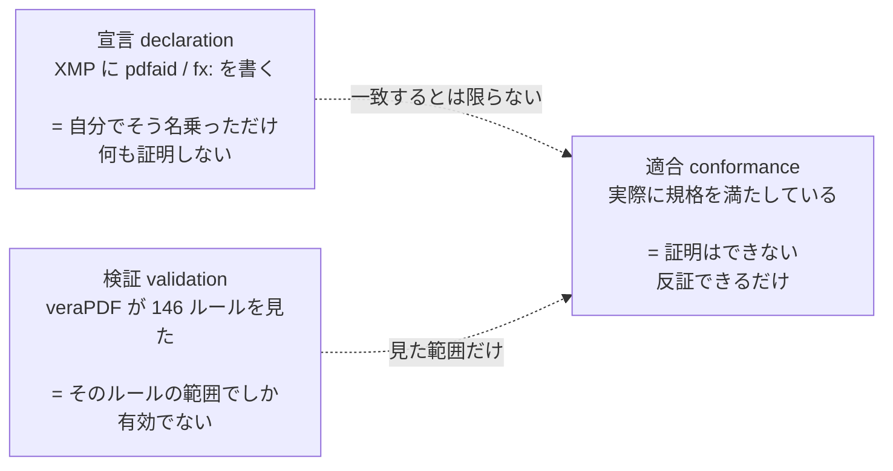
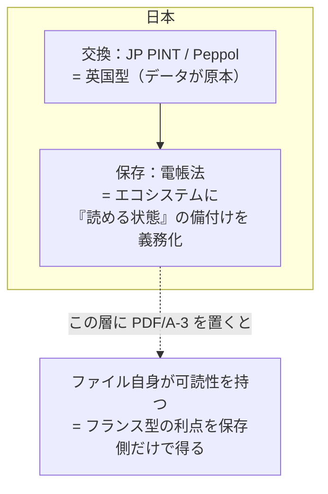

PDF Association に、こういう記事が出た[^disclaimer]。

https://pdfa.org/the-uk-says-a-pdf-is-not-an-invoice-france-just-made-it-one/

同じ年に、同じ問題（VAT ギャップ、つまり付加価値税の徴収漏れと、その解消には、電子インボイスやリアルタイム報告の自動化が必要という課題）に対して、海峡の両側が逆の答えを出した、という話です。

[^disclaimer]: この記事は PDF Association の会員による寄稿で、冒頭に「本記事の見解は著者のものであり、PDF Association の方針や立場を反映するものではない」というディスクレーマーが付いています。以下「元記事」と呼びますが、PDF Association の公式見解ではありません。

面白かったので読んで終わりにせず、**フランスが「請求書」と認めた形式を実際に自分で作って、検証ツールにかけてみました**。

その形式は **Factur-X** といって、1 つの PDF ファイルの中に、以下両方入れたものです。

- 「人が目で読むため」の請求書の見た目
- 「会計システムが読み取るため」の請求書データ（XML）

人も機械も、同じ 1 ファイルから請求書を読み取れる。

そこで、こういう実験をしました。**わざと、その 2 つの中身を食い違わせてみたのです。**

:::message alert
同じ 1 つのファイルなのに、以下金額が 10 倍違うようにした。

- 人が目で読む金額は 1,200 ユーロ
- 会計システムが読み取る金額は 12,000 ユーロ

ところが、**PDF の業界標準の検証ツールは、このファイルを「問題なし」と判定**しました。
**チェック項目 146 個すべてに合格**です。
:::

つまり、**検証ツールが緑になっても、請求書として正しいことは何ひとつ保証されていない**。しかもこの形式は、来月からフランスで法的な請求書になります。

以下、仕様・実測・日本への含意の順に書きます。

## 1. 何が起きたのか

### 英国：請求書はデータである

英国は 2026 年 6 月 23 日の HMRC の政策文書で、e-invoicing の基盤ネットワークに **Peppol** を採用すると確定させました。

> The government has announced that the electronic procurement system Peppol will be the core interoperability network for e-invoicing in the UK. This will give software developers and taxpayers an indication of the direction of travel for our work towards the e-invoicing mandate in 2029 (…)
>
> — [Tax update 2026: simplification, modernisation and fairness summary](https://www.gov.uk/government/publications/summary-of-tax-update-2026-simplification-modernisation-and-fairness/tax-update-2026-simplification-modernisation-and-fairness-summary)（HMRC, 2026-06-23）

:::message
**Peppol（ペポル）とは**

請求書などの商取引文書を、企業のシステム間で直接やり取りするための共通基盤です。文書フォーマットの仕様（BIS）、送受信のネットワークと通信規約（AS4）、そして参加者を認定する運用ルール。この 3 点セットで成り立っています。

構造は**四隅モデル（four-corner model）** と呼ばれます。売り手と買い手がそれぞれ認定を受けたアクセスポイント（接続を担うサービス事業者）と契約し、アクセスポイント同士が文書を中継する。**国が中央に置く単一のプラットフォームは存在しません。**

ISO や CEN のような標準化機関の規格ではなく、ベルギーに拠点を置く非営利団体 **OpenPeppol AISBL** が仕様を所有・維持しています。国ごとに管理団体（Peppol Authority）が置かれ、その国のサービス事業者を認定する仕組みで、**日本ではデジタル庁が 2021 年 9 月からこの役割を担っています**（第 6 節で詳しく触れます）。

この「中央に何も置かない」という性質が、次に見るフランスとの決定的な違いになります。
:::

範囲についてはその前、2025 年 11 月 26 日公表の consultation response が、**本協議の目的における** e-invoice の定義から、PDF・Word・JPEG 等の画像・HTML・OCR・FAX 画像を明示的に外しています。

注意すべきは、これが**まだ制度そのものの法的定義ではない**ことです。同じ文書が「完全な技術標準は業界と共同設計中」「詳細なロードマップは 2026 年 11 月の Budget 2026 で公表」とも言っています。ただし方向性は読めていて、

:::message
**「請求書とはデータであり、人間が読む画面はソフトウェアが都度生成する表示層にすぎない」**
:::

という立場です。

### フランス：PDF も請求書である

フランスは 3 年早く、しかも逆の設計で来ました。**2026 年 9 月 1 日**（この記事を書いている時点で 1 か月後）から、フランスで VAT の課税対象となるすべての事業者は、規模を問わず**認可プラットフォーム（plateformes agréées）経由で電子請求書を受領できる状態**にしていなければなりません。発行義務は大企業・中堅企業が同じ日から、中小・零細は 2027 年 9 月 1 日から。

そして受け入れるべき「共通基盤」の3形式が、**UBL 2.1 / CII / Factur-X**。前2つは純粋な構造化 XML です。3 つめの Factur-X が本題で、これは **PDF/A-3 の文書に CII の XML を埋め込んだハイブリッド**。

:::message
人はビューアで読み、機械は XML を読む。
どちらかが他方の派生物ではなく、**両方が請求書** とみなす。
:::



同じファイルが、リヨンでは請求書で、マンチェスターでは（2029 年以降）請求書ではない。**ファイルは 1 ビットも違わないのに、定義が違う。**

## 2. Factur-X を支えている仕様を読む

ここから技術の話です。Factur-X の土台は PDF/A-3 が「任意のファイルを埋め込める」ようにしたことですが、その埋め込みの意味づけを担っているのが **Associated Files** という仕組みで、これは ISO 32000-2（PDF 2.0）の 14.13 に規定があります。

なお PDF/A（ISO 19005）の条文は有償規格で、この記事では原文を参照していません。**PDF/A について書いていることはすべて、PDF Association の Application Note からの引用**です。この区別は記事の後半で効いてきます。

### AFRelationship は、基本仕様では「情報提供にすぎない」

まず ISO 32000-2 の Table 43（file specification dictionary のエントリ）を読むと、`AFRelationship` はこうなっています。

> **AFRelationship** name
> (**Optional**; PDF 2.0) A name value that represents the relationship between the component of this PDF document that refers to this file specification and the associated file (…)
>
> **Alternative** shall be used if this file specification is an alternative representation of content, for example audio.
>
> (…)
>
> NOTE 3 The value of AFRelationship **does not explicitly provide any processing instructions for a PDF processor**. It is provided for information and semantic purposes for those processors that are able to use such additional information.
>
> — ISO 32000-2:2020 (with Errata Collection 3), 7.11.3, Table 43

つまり基本仕様では、`AFRelationship` は **Optional で、処理系に何の指示も与えない、意味論的な注釈**です。書いても書かなくてもいいし、書いてもビューアは何もしなくていい。

### PDF/A-3 がそれを必須化した

ところが PDF/A-3 は違います。PDF Association の Application Note 002（Associated Files）が、PDF/A-3 が PDF 2.0 に対して**上乗せしている**制約を列挙しています。

> PDF/A-3, which introduced Associated Files to PDF in 2012, imposes some additional requirements that are not present in PDF 2.0:
>
> - PDF/A-3 excludes external file references, so associations can be specified only for embedded files
> - Since PDF/A-3 requires the AF entry for all embedded files, each file's MIME-type is always required
> - **PDF/A-3 requires every embedded file to be an Associated File and thus requires the AFRelationship entry in each case**
> - (…)
>
> — PDF 2.0 Application Note 002: Associated Files, 3.2

ここが順序として面白いところで、**Associated Files を PDF に持ち込んだのは PDF/A-3（2012）が先**で、PDF 2.0（2017/2020）が後から本体仕様に取り込んでいます。実際、ISO 32000-1（PDF 1.7）を全文検索しても `AFRelationship` は 1 件もヒットしません。PDF/A-3 は、当時まだ本体仕様に無かったキーを先取りして必須化した、ということになります。

### さらに AN002 は「ハイブリッド請求書」を名指ししている

同じ AN002 が、Alternative を使うべきケースとして電子請求書そのものを挙げています。

> In many important use cases - **electronic invoices being the classic example** - data must be readable by both humans and machines. (…) A "hybrid" invoice embeds a machine-readable structure (usually XML) into a PDF (or PDF/A-3) representation of the data.
>
> In all cases where the containing PDF and the associated file are different "renderings" of the same data (…) **The AFRelationship entry will be Alternative and the AF entry will be in the document catalog.**
>
> — PDF 2.0 Application Note 002: Associated Files, 4.1.2

### 4 段の積み上げ

整理するとこうです。



**「処理系に何の指示も与えない」と仕様が明記しているキーの上に、4 段積んだ先端に、脱税の有無を分ける法的定義が乗っている。** これが今の e-invoicing の構造です。

:::message
`AFRelationship` の値はプロファイル依存で、`Alternative` に固定ではありません。PDF 面のほうが情報量の多い MINIMUM / BASIC WL では `Data` を使うとされています（PDF が XML の「代替表現」ではないため）。この点の根拠は解説記事による二次情報で、Factur-X 仕様本文では未確認です。
:::

## 3. 実際に作ってみる

仕様を読んだので作ります。使ったのは自作の MCP サーバ群ですが、やっていることは素の PDF 操作なので、pikepdf でも iText でも同じです。

### 材料

- **見た目**：フランス国内 B2B のシンプルな請求書 1 ページ
  税抜 1 000,00 EUR、TVA 20 % で 200,00 EUR、税込 1 200,00 EUR
- **XML**：CII（UN/CEFACT CrossIndustryInvoice）で同じ内容

XML 側のプロファイル宣言はここです。

```xml:factur-x.xml
<rsm:ExchangedDocumentContext>
  <ram:GuidelineSpecifiedDocumentContextParameter>
    <ram:ID>urn:cen.eu:en16931:2017</ram:ID>
  </ram:GuidelineSpecifiedDocumentContextParameter>
</rsm:ExchangedDocumentContext>
```

この URN は EN 16931 プロファイルの正しい GuidelineID です。

:::message alert
**ただし、これも「宣言」です。** 今回は EN 16931 の Schematron にかけていないので、この XML が本当に EN 16931 準拠かは測っていません（実際、支払手段 BG-16 など足りない BT があります）。この記事の主題がさっそく自分に返ってきているので、先に書いておきます。
:::

Factur-X には MINIMUM / BASIC WL / BASIC / EN 16931 / EXTENDED の 5 プロファイルがあります。MINIMUM と BASIC WL は明細行を持たず（WL = _without lines_）、EN 16931 準拠でもないため、移行的な位置づけとされています。またフランス向けには **EXTENDED-CTC-FR**（EXTENDED の部分集合）という参照プロファイルがあり、根拠規格は AFNOR XP Z12-012 です。

### 手順



③ の時点で、書き込み側のツールはこう警告してきます。

```text:pdf-writer-mcp が返した警告
This file now CLAIMS PDF/A-3b (pdfaid:part=3, conformance=B),
but conformance was NOT checked here. (...)
If the document does not actually conform, that claim is now false.
```

**XMP に pdfaid を書くのは「宣言」であって「適合」ではない**、という区別です。この記事の後半はずっとこの話になります。

### できたもの

生成されたファイルの中身を覗くと、Filespec は仕様どおりでした。

```:03-facturx-candidate.pdf ─ Filespec 辞書
<<
/Type /Filespec
/F (factur-x.xml)
/UF <FEFF...factur-x.xml...>
/EF << /F 50 0 R >>
/Desc <FEFF...Factur-X CII invoice (EN 16931 profile)...>
/AFRelationship /Alternative      ← ここ
>>
```

埋め込みファイルストリーム側も、ISO 32000-2 14.13.2 が **shall とした `Subtype`（MIME 型）**と、**should とした `Params`（あるなら `ModDate` は shall）**の両方を満たしています。

```:03-facturx-candidate.pdf ─ EmbeddedFile ストリーム辞書
<<
/Type /EmbeddedFile
/Subtype /text#2Fxml              ← text/xml を名前オブジェクトとしてエスケープ
/Params << /Size 4361 /CreationDate (D:...) /ModDate (D:...) >>
/Filter /FlateDecode
>>
```

カタログにも `/AF` 配列と `/Names`（EmbeddedFiles 名前ツリー）の両方が入りました。ISO 32000-2 14.13.2 の NOTE 3 が言うとおり、**後者も入れておかないと、Associated Files に対応していないツールから普通の添付として取り出せません**。

## 4. veraPDF に通す

```json:03-facturx-candidate.pdf の判定
{
  "engine": "verapdf",
  "flavour": "PDF/A-3b",
  "compliant": true,
  "checkedRules": 146,
  "passedRules": 146,
  "failedRules": 0,
  "violations": []
}
```

**146 ルール全 PASS。veraPDF は PDF/A-3b COMPLIANT と判定しました。**

:::message
実行環境は以下です。

```text:verapdf --version
veraPDF 1.30.0
Built: Wed Jun 03 13:47:00 JST 2026
（Homebrew の formula は verapdf 1.30.2、同梱 jar は gui-1.30.0.jar）
```

**ルール数は veraPDF のビルドと Validation Profile のリビジョンに依存します。** この記事はこのあと「146 ルールの範囲でしか有効でない」と繰り返し書くので、その範囲が環境ごとに違うことも込みで、バージョンを先に置いておきます。再現するときは自分の環境の数字を見てください。
:::

これで Factur-X の請求書ができた……と言いたいところですが、**言えません**。

### 問題 1：これは Factur-X ではない

XMP を吐き出すとこうなっています。

```xml
<rdf:Description rdf:about="" xmlns:pdfaid="http://www.aiim.org/pdfa/ns/id/">
  <pdfaid:part>3</pdfaid:part>
  <pdfaid:conformance>B</pdfaid:conformance>
</rdf:Description>
<rdf:Description rdf:about="" xmlns:pdfuaid="http://www.aiim.org/pdfua/ns/id/">
  <pdfuaid:part>1</pdfuaid:part>
</rdf:Description>
<!-- pdfaExtension（PDF/UA スキーマ宣言）、dc:、xmp: も入っている -->
<!-- fx: が無い -->
```

ついでなので、ここに出ている PDF/UA-1 の宣言も測っておきました。
**`pdfua-1` で 106/106 PASS** !
宣言を見つけたら測る、というルールを自分に適用するとこうなります。

しかし **Factur-X としては不完全です。**
Factur-X は、XMP に `urn:factur-x:pdfa:CrossIndustryDocument:invoice:1p0#`（prefix `fx`）の拡張スキーマを置き、`DocumentType` / `DocumentFileName` / `Version` / `ConformanceLevel` を宣言することを要求します。**受け取り側は、まずこの XMP を見て「この PDF に請求書 XML が入っているか、どのプロファイルか、ファイル名は何か」を判断する**ので、ここが無いと Factur-X として認識されません。

それでも veraPDF は 146/146 で通しました。
当然です。**veraPDF が判定したのは PDF/A-3b であって、Factur-X ではない。**
ここは自作ツール側の宿題でもあって、現状 pdfaid と pdfuaid 以外の任意の XMP 拡張スキーマを書く口がありません（設計上の抜けとして記録しました）。

### 問題 2：もっとまずい方

こちらが本命です。**XML の合計金額だけを 10 倍に書き換えて、同じ手順でもう 1 本作りました。**

```diff xml:factur-x.xml → factur-x-divergent.xml
-        <ram:GrandTotalAmount>1200.00</ram:GrandTotalAmount>
-        <ram:DuePayableAmount>1200.00</ram:DuePayableAmount>
+        <ram:GrandTotalAmount>12000.00</ram:GrandTotalAmount>
+        <ram:DuePayableAmount>12000.00</ram:DuePayableAmount>
```

PDF のページには **1 200,00 EUR** と印字されたまま。埋め込み XML は **12 000,00 EUR**。人間の目と会計システムが、同じ 1 ファイルから 10 倍違う金額を読み取ります。

veraPDF の判定：

```json:05-divergent-candidate.pdf の判定
{
  "flavour": "PDF/A-3b",
  "compliant": true,
  "checkedRules": 146,
  "passedRules": 146,
  "failedRules": 0
}
```

**146/146 PASS。**

|                         | 正しい方              | 金額が食い違う方           |
| ----------------------- | --------------------- | -------------------------- |
| catalog `/AF`           | ✅                    | ✅                         |
| `AFRelationship`        | `Alternative`         | `Alternative`              |
| `/Names /EmbeddedFiles` | ✅                    | ✅                         |
| veraPDF PDF/A-3b        | **COMPLIANT 146/146** | **COMPLIANT 146/146**      |
| XMP `fx:` 拡張スキーマ  | ❌ 無し               | ❌ 無し                    |
| PDF 面と XML 面の金額   | 一致                  | **1 200 vs 12 000**[^diff] |

[^diff]: 厳密には 2 本は金額以外にも差があります。添付の `/Desc`、`/Size`、`ModDate`。PDF のページ内容と生成手順は同一です。

これは veraPDF のバグでも何でもありません。**veraPDF が見ているのは PDF/A-3b の 146 ルール、つまり「このファイルが自己完結して開けるか」の側であって、「中身が正しいか」はそもそもその 146 に入っていない**からです。ハイブリッド形式が抱え込んだ固有の失敗モード——**2 つの原本が食い違う**——を見る層は、この検証のどこにも存在しません。

## 5. 宣言 / 適合 / 検証

ここまでの実測を、3 つの言葉に整理しておきます。この区別は PDF を扱うとき常に効きます。



- **宣言**：XMP に `pdfaid:part=3` と書く行為。ツールは 1 行で書けます。適合していない文書に書けば、**自分について嘘をつく PDF** ができあがる
- **適合**：誰にも証明できません。**反証できるだけ**です
- **検証**：veraPDF が「146 ルールの範囲で反証できなかった」と言っただけ。**Factur-X としての妥当性も、金額の整合も、この 146 に入っていない**

今回作った 2 本目は、この 3 つが全部きれいに乖離した例です。**宣言は正しく、検証も全 PASS で、それでも請求書としては完全に壊れている。**

e-invoicing の義務化が始まると、この「宣言と実体のズレ」は技術的な行儀の悪さでは済まなくなります。フランスの認可プラットフォームで弾かれるならまだ幸運で、通ってしまえば**内容の異なる 2 つの原本が法的効力を持って流通する**。

## 6. 日本はどちら側なのか

さて、日本です。

**交換の思想は英国型です。** デジタル庁は 2021 年 9 月に日本の Peppol Authority となり、標準仕様 **JP PINT** を策定・公開しています。売り手のシステムから買い手のシステムへ、人を介さず直接データ連携させるという説明は、英国の「請求書はデータである」と同じ立場です。

**ところが保存の側は違います。** 電子帳簿保存法は電子取引の取引情報について電磁的記録の保存を義務づけていますが（[法第7条](https://laws.e-gov.go.jp/law/410AC0000000025)）、その保存要件のなかで「読めること」をどう定義しているかを見ると、こうなっています。

> 当該国税関係帳簿に係る電磁的記録の備付け及び保存をする場所に当該電磁的記録の電子計算機処理の用に供することができる**電子計算機、プログラム、ディスプレイ及びプリンタ並びにこれらの操作説明書を備え付け**、当該電磁的記録をディスプレイの画面及び書面に、**整然とした形式及び明瞭な状態で、速やかに出力**することができるようにしておくこと。
>
> — 電子計算機を使用して作成する国税関係帳簿書類の保存方法等の特例に関する法律施行規則 第2条第2項第2号
> 出典：[e-Gov法令検索](https://laws.e-gov.go.jp/law/410M50000040043)

条文の主語は「国税関係帳簿に係る電磁的記録」ですが、同規則第4条第1項が、電子取引の取引情報に係る電磁的記録の保存についても**この第2条第2項第2号の要件に従うこと**を求めています。

読んでいて背筋が伸びるところです。日本法は**「読めること」をファイルの性質としてではなく、保存場所に置く機器とプログラムの備付け義務として書いている**。

冒頭の記事は、純粋な構造化データの弱点を「6 年目」の問題として指摘していました。UBL や CII の可読性は完全に媒介されたもので、スタイルシート、レンダラ、プラットフォーム、あるいは今も動くアーカイブ済みビューアを必要とする。それらはどれも**ファイルの性質ではなく、ファイルを取り巻くエコシステムの性質**であり、エコシステムの寿命は税務保存年限より短い、と。

では日本の年限はどうかというと、**これを決めているのは電帳法ではありません**。電帳法施行規則第4条第1項は「当該書面を保存すべきこととなる場所に、当該書面を**保存すべきこととなる期間**」としか書いておらず、期間は各税法に委ねています。法人の場合はこうです。

- **原則 7 年** — 法人税法施行規則第59条第1項（青色申告法人の帳簿書類の整理保存）
- **10 年** — 同規則第26条の3第1項。ただし全部ではなく、「同項の欠損金額が生じた事業年度の第五十九条第一項各号に掲げる帳簿書類」、つまり**欠損金の繰越控除を受けようとする場合の、その欠損金が生じた事業年度の帳簿書類**に限られます

つまり英国の「6 年目問題」は、日本では**「7 年目（場合により 10 年目）問題」**になります。そして日本法は、その問題を**エコシステム側の備付け義務として正面から引き受けている**。英国型（データが原本、表示は都度生成）でもフランス型（ファイル自身が両方を持つ）でもない、第 3 の解き方です。

ただし、義務を課すことと実際に読めることは別です。7 年後にそのプログラムのライセンスが生きているか、そのビューアが動く OS があるか——備付け義務は、その問いを事業者に丸投げしているとも読めます。



**JP PINT の XML をそのまま 7 年寝かせるのか、それとも PDF/A-3 に抱かせて寝かせるのか。** Factur-X 型のアーカイブは、日本では「交換形式」ではなく「保存形式」として筋が通る、というのが今回作ってみた実感です。少なくとも、これを禁じる規定は電帳法とその施行規則には見当たりません。

## 7. まとめ

- 英国は 2029 年の義務化に向けて Peppol を基盤に据えた。協議段階の定義では PDF は e-invoice に含まれない。技術標準は Budget 2026 のロードマップ待ち
- フランスは 2026 年 9 月 1 日に「PDF も請求書」で始める。Factur-X が共通基盤の 3 形式に入っている
- Factur-X は、ISO 32000-2 が「処理系に指示を与えない注釈」と明記した `AFRelationship` の上に 4 段積み上げた構造の先端にある
- **PDF/A-3b の検証（veraPDF 146 ルール）は、Factur-X としての妥当性も、PDF 面と XML 面の整合も、一切見ていない**。金額が 10 倍食い違うファイルが 146/146 で PASS した
- 「宣言」「適合」「検証」は別物。義務化が進むと、この区別を怠ることのコストが技術的なものから法的なものに変わる
- 日本は交換が英国型、保存が電帳法という二層構造。「読めること」を機器とプログラムの備付け義務として定義している。年限を決めているのは電帳法ではなく各税法

「PDF 請求書」という言葉は、**海峡のどちら側に立っているかを言わないともう何の意味も持たない**——というのが元記事の締めでした。作ってみた側から一つ足すなら、**どちら側に立っていようと、PDF/A の検証が通ったことは請求書として正しいことを何ひとつ意味しない**、です。

検証の緑は、見た範囲の緑でしかありません。

### 使ったもの

今回の検証は、自作の MCP サーバ群で行いました。

- **pdf-spec-mcp** — ISO 32000-2 / PDF/UA / PDF Association の Application Note を全文検索して条文を引く
- **pdf-writer-mcp** — PDF 生成・添付（`attach_file`）・PDF/A の器に載せる（`ensure_pdfa`）
- **pdf-reader-mcp** — 生成物の構造を読み戻す
- **pdf-verify-mcp** — veraPDF に委譲して PDF/A / PDF/UA を判定、ISO 32000 条項制約を検査

いずれも npm で公開しています → [npmjs.com/~shuji-bonji](https://www.npmjs.com/~shuji-bonji)

### 証跡

この記事で測ったファイル一式（生成した PDF 5 本と CII XML 2 本、md5 つき）を置いてあります。

@[card](https://github.com/shuji-bonji/zenn-articles/tree/main/artifacts/facturx-pdfa3-uk-france-einvoicing)

:::message alert
`04` と `05` は**意図的に壊した検体**です。請求書の雛形として流用しないでください。

一方、検証ツールを書く人には「PDF/A の検証を通ってしまう不整合」の実物なので、テストフィクスチャとして自由に使ってください。作り方はこの記事に全部書いてあるので、バイナリを伏せても何も守れません。だから公開しています。
:::

### 参考

**一次資料（原文を確認して引用したもの）**

- ISO 32000-2:2020 (with Errata Collection 3) — 7.11.3 Table 43 / 14.13。[PDF Association 経由で無償入手可](https://pdfa.org/sponsored-standards/)
- ISO 32000-1:2008（PDF 1.7）— `AFRelationship` が存在しないことの確認に使用
- PDF 2.0 Application Note 002: Associated Files（PDF Association）— 3.2 / 4.1.2
- [Tax update 2026: simplification, modernisation and fairness summary](https://www.gov.uk/government/publications/summary-of-tax-update-2026-simplification-modernisation-and-fairness/tax-update-2026-simplification-modernisation-and-fairness-summary) — HMRC, 2026-06-23
- [電子計算機を使用して作成する国税関係帳簿書類の保存方法等の特例に関する法律施行規則](https://laws.e-gov.go.jp/law/410M50000040043) — e-Gov法令検索
- [法人税法施行規則](https://laws.e-gov.go.jp/law/340M50000040012) — 第59条第1項 / 第26条の3第1項

**解説・報道（二次情報）**

- [The UK says a PDF is not an invoice. France just made it one.](https://pdfa.org/the-uk-says-a-pdf-is-not-an-invoice-france-just-made-it-one/) — PDF Association への寄稿記事（著者個人の見解というディスクレーマー付き）。この記事の出発点
- [Facturation électronique et plateformes agréées](https://www.impots.gouv.fr/facturation-electronique-et-plateformes-agreees) — impots.gouv.fr
- [Factur-X](https://fnfe-mpe.org/factur-x/) — FNFE-MPE。プロファイル構成・AFNOR XP Z12-012 との関係
- [デジタルインボイス（Peppol e-invoice）について](https://www.digital.go.jp/) — デジタル庁。2021 年 9 月から Japan Peppol Authority として活動、JP PINT を策定・公表
- Peppol の四隅モデル・OpenPeppol AISBL によるガバナンス・アクセスポイント認定の仕組みは、複数の解説記事を突き合わせて記述しました（OpenPeppol の一次文書は未確認）
- Factur-X の XMP 拡張スキーマと `AFRelationship` のプロファイル依存については、実装ライブラリの解説を参照しました（仕様本文は未確認）

:::message alert
**この記事が測っていないこと**

- 生成した CII XML を EN 16931 の Schematron にかけていません
- ISO 19005（PDF/A）の原文は参照していません。PDF/A について書いたことはすべて AN002 経由です。したがってこの記事が言えるのは「veraPDF はこう判定した」までで、「ISO 19005 に適合する」ではありません
- フランスのフォーマット要件の一次資料（DGFiP spécifications externes、AFNOR XP Z12-012）は参照していません

宣言と適合を分ける記事なので、自分の宣言も分けておきます。
:::
