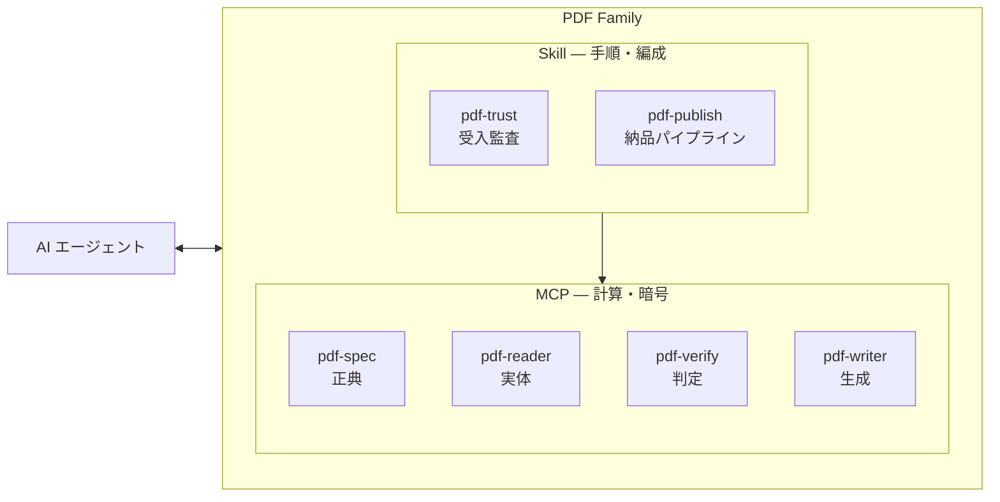

## はじめに

これまで、PDF 仕様書を「引く」pdf-spec-mcp、内部構造を「読む」pdf-reader-mcp、署名を「検証する」pdf-verify-mcp、そして受入監査の pdf-trust-skill と、PDF まわりの MCP サーバーと Skill を個別に紹介してきました。

https://zenn.dev/shuji_bonji/articles/zenn-pdf-verify-mcp

https://zenn.dev/shuji_bonji/articles/zenn-pdf-trust-skill

これらを **1 つの体系**としてまとめたドキュメントサイトを公開しました。

https://shuji-bonji.github.io/pdf-agent-stack/

まとめてみて気づいたことがあります。

これまで作ってきたのは MCP サーバーという「道具」の集まりではなく、**AI が PDF について正しく言い切るための知識インフラ**でした。

- 仕様の原文
- ファイルの観測
- 暗号学的な判定
- 専門家の手順

人間の専門家が頭の中と本棚に持っているものを、AI が接続できる形で外側に組んだもの、と言ったほうが実態に近いです。

本記事は、その視点からの設計原則の話です。

- 「なぜ 4 つのサーバーに分けたのか」
- 「なぜ LLM に判定させないのか」
- 「なぜ同じレポートの中で言い方の強さが変わるのか」

最後に、この原則がバグ発見にそのまま効いた実例（官報 PDF と自作検体で検証バグを切り分けた話）を書きます。

## 課題意識 — LLM は PDF を「読める」が「言い切れる」か

「LLM に PDF を渡す」、の実態はたいてい「テキストを抽出して読ませる」です。
要約や QA ならそれで足ります。しかし次のような問いは、抽出テキストをいくら眺めても答えられません。

- この契約書の署名は**暗号学的に**有効か？署名の後に誰かが書き足していないか？
- この請求書は電帳法を見据えた**長期保存形式**になっているか？
- この PDF は **PDF/UA** としてスクリーンリーダーで読めるか？

これらの問いの答えは、LLM の推論から出すものではありません。
LLM の生成は本質的に確率的で、同じ質問でも答えが揺れえます。

一方、署名の有効性は**決定論的な検証処理**で決まります。

```
ダイジェストは一致するかしないか？
CRL は署名者を覆うか覆わないか？
```

このように答えは常に一意で、実行のたびに変わってはいけません。
ここに LLM の「たぶん大丈夫です」を混ぜたくない — というのが課題意識の出発点でした。

## 足りないのはツールではなく「知識のインフラ」だった

人間の PDF 専門家は何を持っているでしょうか？

- ISO 32000 という**規範**
- ファイルを開いて調べる**観測手段**
- 署名や適合を測る**検証器**
- そして「どの順で何を見て、どこまで言い切ってよいか」という**手順と作法**

専門性の実体はこの 4 つの束です。

LLM にはこのどれも安定した形では備わっていません。
仕様の記憶は曖昧で（ISO 32000 は本文だけで 1,000 ページ近くあります）、ファイルは開けず、暗号計算はできず、「どこまで言い切ってよいか」の規律は持ちません。

### 検証可能な知識インフラを外側に建てて、AI がそれを参照する

ここを埋めるのに、モデルに知識を教え込む方向ではなく、**`検証可能な知識インフラを外側に建てて、AI をそれに接続する`** 方向を選びました。

| 知識の種類 | 担い手                            | 中身                                                                           |
| ---------- | --------------------------------- | ------------------------------------------------------------------------------ |
| 規範知識   | pdf-spec                          | ISO 32000 ほか **17 文書**の原文を、条文 ID・shall/should/may 付きで引ける形に |
| 事実知識   | pdf-reader                        | 目の前のファイルの観測（テキスト・構造木・フォント・署名フィールド）           |
| 判定知識   | pdf-verify                        | 暗号検証・veraPDF 委譲・決定論的ルール表 — 「どう判定するか」のコード化        |
| 手順知識   | Skills（pdf-trust / pdf-publish） | 専門家のワークフロー — 呼ぶ順序・読み方・報告の作法                            |

以降の節は、この 4 種の知識をどういう規律で組んだか？という、本体の設計の話です。

## 設計の中心にある 3 つの区別

体系全体が、この区別の上に建っています。

| 区別                    | 何のことか                                                                                                         | 気をつけること                                                                                                       |
| ----------------------- | ------------------------------------------------------------------------------------------------------------------ | -------------------------------------------------------------------------------------------------------------------- |
| **宣言**（declaration） | 文書が「私は PDF/A です」と**自分で名乗っている**こと。実体は XMP メタデータへの `pdfaid` / `pdfuaid` の書き込み。 | 名乗りは誰でも書き込める。<br>**それ自体は何も証明しない。**                                                         |
| **適合**（conformance） | 文書が規格の要求を、<br>**実際にすべて満たしている**こと                                                           | 全条項の充足を証明することは誰にもできない。できるのは**違反を 1 つ見つけて反証する**ことだけ。                      |
| **検証**（validation）  | 検証器にかけて**違反が見つからなかった**という結果                                                                 | その検証器が実装している規則の**範囲内でしか**意味を持たない。「veraPDF で違反なし」と「規格に適合」は同じではない。 |

要するに、**自己申告**（宣言）と、**事実**（適合）と、**調べた範囲で嘘が見つからなかったこと**（検証）は、それぞれ別物という当たり前の区別です。
ですが、PDF の世界では、この 3 つが「PDF/A 対応」の一語に潰されて流通しがちで、混ぜた瞬間に「宣言だけ書かれた非適合ファイル」が『準拠 PDF』として通ってしまいます。

この混同への対処は、道具の仕様そのものに焼き込みました。

pdf-writer-mcp の `ensure_pdfa` は、まさに「宣言を書く」ツールです。XMP に `pdfaid` を書き込み、trailer の `/ID` や OutputIntent といった文書レベルの要件も足します。つまり**混同事故の入口になりうるツール**なので、**成功したときにも必ず警告を返す**仕様にしています。

こうしておくと何が起きるか。このツールを呼ぶのは AI エージェントなので、警告はそのままエージェントの文脈に残ります。「宣言は書いたが、まだ測っていない」という事実を毎回突きつけられたエージェントは、自然と次の一手（検証）に進みますし、少なくとも警告を無視して「PDF/A 化が完了しました」と言い切ることは難しくなります。**人間向けの注意書きではなく、エージェントの次の行動を曲げるための警告**です。

```
This file now **CLAIMS** PDF/A-3b …, but conformance was **NOT checked** here.
```

警告が言っているのは次のことです。

- いま書いたのは「私は PDF/A-3b です」という**名乗り（宣言）** であって、適合の確認ではない
- `ensure_pdfa` は元からある違反（フォント未埋め込み・暗号化など）を**修復しない**。違反は書き込み後も残ったまま
- 違反が残ったまま宣言だけが付いたファイルは、「PDF/A と名乗っているが、実際には PDF/A ではないファイル」になる — つまり**宣言を書いたことで、文書が嘘をつく状態になりうる**
- 信用する前に pdf-verify-mcp の `validate_conformance` で測ること（判定を下すのは veraPDF）

運用ルールはシンプルです。**宣言を書いたら、同じ flavour で必ず測る。測れない状況なら、宣言を書かない。** このルールはツールの警告文と、納品 Skill（pdf-publish）の手順書の両方に組み込んであり、「宣言だけ書かれた非適合ファイル」が検査を受けずにパイプラインを素通りすることは、仕組みの上でできなくなっています。

## 4 層に分けた理由

前節の表を実行系に落としたものが、この 4 層 + Skill です。



役割は 4 つで、それぞれ**越えてはいけない一線**を持っています。

- **pdf-spec（正典）**: 仕様は何を要求するかに答える。**ファイルは開かない**
- **pdf-reader（実体）**: 中身に何があるかを観測する。**合否は言わない**
- **pdf-verify（判定）**: 反証を探す。**証明はできない**
- **pdf-writer（生成）**: 仕様どおりに書く。**適合は作れない**

### 観測と判定を混ぜない

統合して 1 つの MCP サーバーにしたほうが、利用者の設定は楽になります。実際、外部レビューでそう提案されたこともあります。それでも分けているのは、観測と判定を同じサーバーに同居させると、**「観測のついでに合否も言ってしまう」実装が簡単に書けてしまう**からです。

:::message
たとえば署名フィールドを読むツールが、ついでに「有効に見えます」と返し始めたら、受け取る側はもう、それが観測された事実なのか誰かの判定なのか区別できません。
:::

そこでサーバーを分け、reader には暗号検証のコードを**そもそも持たせない**ようにしました。この越境は構造的に起こせません。「reader の観測と verify の判定が食い違ったら、判定が勝つ」というルールも、両者が別々の根拠を返すからこそ機械的に運用できます。

### 単一の役割で、単独で完結して使える

分けている理由はもうひとつあります。
それは、それぞれが**単一の役割で、単独で完結して使える**ことです。

「PDF を読みたいだけ」なら pdf-reader を 1 台つなげば足りますし、署名検証が要らない利用者に暗号検証のコードを配る必要もありません。

もともとこの 4 台は、最初から体系として設計したわけではなく、

- 仕様を引きたい
- 中身を読みたい
- 署名を検証したい
- 仕様どおりに書きたい

という必要に応じて **1 台ずつ作ってきた**ものです。単独で役に立つ部品を積み上げていったら、境界の規律ごと束ねられて体系になった — 冒頭の「作っていたら知識インフラになっていた」は、この経緯の話でもあります。

## ジャッジはコード、ナラティブは LLM

受入監査（pdf-trust）の最終判定は 4 値です。

- `trust_and_use`:  
  署名は有効・署名者のチェーンは信頼済み・失効も確認済み。そのまま利用してよい
- `use_with_caution`:
  暗号学的な完全性は確認できたが、署名者の身元や失効確認など未評価の項目が残る。留意事項付きで利用する
- `human_review_required`:  
  署名がない・検証が完了できないなど、機械では白黒を付けられない。人間の確認に回す
- `reject`:  
  ダイジェスト不一致・署名検証の失敗・失効の確認など、受け入れてはならない根拠が見つかった

この判定を **LLM は下しません**。

pdf-verify-mcp の

- `evaluate_policy`:  
  検証事実（署名の有効性・信頼チェーン・失効・改ざん）を固定ルール表に通す決定論的エンジン

が下します。

同じファイル・同じプロファイルなら、モデルが何であれ、いつ実行しようが、**常に同じ判定**が返ります。

LLM の仕事はその後です。

発火したルールを人間に説明する、推奨アクションを文章化する、必要なら法令根拠を（houki 系 MCP の**原文**から）引く、といったことを行います。

判定の上書きは Skill の手順書で明示的に禁止しています。

再現性が要る監査で、判定器が非決定的なのは受け入れられません。
逆に、判定理由を人間に伝わる形にするのは LLM が得意です。
**得意なほうに仕事を渡す**、それだけの話ですが、この線を守ると「監査レポートの数字がなぜか実行のたびに変わる」類の事故が構造的に起きなくなります。

## 言い切り強度 T1 / T2 / T3 — 同じレポートの中で言い方が変わる

この PDF Agent Stack Family 全体で守っている語法があります。**どの規範文書が手元にあるかで、言える強さが変わる**というものです。

| 層  | 対象                          | 書いてよい                              | 書いてはいけない      |
| --- | ----------------------------- | --------------------------------------- | --------------------- |
| T1  | ISO 32000・ISO 14289 (PDF/UA) | 条文を引用して断定                      | —                     |
| T2  | ISO 19005 (PDF/A)             | 「**veraPDF が** COMPLIANT **と判定**」 | 「ISO 19005 準拠」    |
| T3  | ETSI PAdES                    | 「**構造が** B-LT **に一致する**」      | 「PAdES B-LT に適合」 |

PDF/UA は仕様原文がコーパスにあるので条文を引いて言い切れます。PDF/A は原文がない代わりに veraPDF という第三者検証器があるので「誰が判定したか」を名指しします。PAdES に至っては規範も検証器もない — 構造を観測しているのは自分自身なので、「これは観測であって適合判定ではない」と言い続けるしかありません。

まどろっこしく見えますが、受入監査のレポートは「この文書は◯◯準拠です」と相手に伝えるために使われます。**適合の刻印は、押した者が責任を負う** — 実測していないことを実測したかのように書かない、というだけのことです。

## 原則が実際に効いた話 — 検証バグを known-good 検体で切り分ける

この体系の「実測しか書かない」文化が、そのままバグ発見に効いた実例を書きます。

ドキュメントサイトに載せる監査例を採るため、実在の署名付き PDF を探しました。使ったのは**インターネット官報**です。官報の PDF には内閣府の電子署名と、AMANO のタイムスタンプ局による文書タイムスタンプ（DocTimeStamp）が付いています。EU の [esig/dss](https://github.com/esig/dss) テストコーパスの PAdES 検体も併用しました。

pdf-verify-mcp にかけると、署名本体はどちらも VALID。ところが **DocTimeStamp だけが、両方の検体で INDETERMINATE** になりました。診断は同一: `Missed detached data input array`。

ここで選択肢が 2 つあります。「実在の官報と EU の公式テストコーパスで落ちるのだから、検証側のバグだろう」と決めつけるか、疑うか。前者はもっともらしいのですが、**外部検体の「正しく署名されているはず」は仮説であって実測ではありません**。官報の署名運用が変則的な可能性も、DSS のテストファイルが意図的に変な形をしている可能性も、この時点では否定できません。

そこで **known-good 検体を自作**しました。自作 CA・署名者証明書・ダミー TSA を生成し、pyHanko で署名・署名タイムスタンプ・DocTimeStamp を付与します。全工程が管理下にあるので、この検体の期待値だけは仮説ではなく事実です。

結果: **自作検体でも同じ診断で INDETERMINATE**。しかも決定的な対照が取れました — **同じダミー TSA が発行した「署名タイムスタンプ」は、同じファイルの中で検証に成功していた**のです。3 つの独立した生成系（pyHanko / esig-dss / 官報の AMANO）で同一症状、かつ同一 TSA でも通る経路と落ちる経路があります。バグは DocTimeStamp の検証分岐に局在すると確定しました。

原因は 1 行の一般化でした。使用ライブラリの pkijs は、CMS の中身が RFC 3161 の TSTInfo である場合、encapsulated（内包）であっても messageImprint の再検証用に外部データを要求します。検証コードは「内包型なら外部データ不要」と一般化していて、TSTInfo だけがその例外でした。修正して、3 検体すべての DocTimeStamp が VALID になりました（v0.14.2 として公開済み）。

ついでに、判定の姿勢も 1 か所直しました。「imprint は一致・署名計算は false・エラーなし」を従来 INDETERMINATE にしていたのを、通常署名と同じ規則 — **計算して false が出たなら、それは反証であり INVALID** — に揃えました。判定不能は無罪ではない、を判定器自身にも適用した形です。

## 例文を捏造しないと決めると、ドキュメントが実験になる

サイトのユースケースや Skill のページに載っている実行例・レポート例は、**すべて実測ログ**です。もっともらしい出力例を書かない、と決めてあります。

これは倫理の話というより実利の話で、実測で例を採ろうとすると**書く前に動かすことを強制される**ため、上の DocTimeStamp バグのような「載せる前に直すべきもの」が発掘されます。もうひとつ拾い物もありました。4 値判定の実例を全部そろえようとしたとき、`trust_and_use`（最良判定）だけがなかなか出ませんでした。署名が有効で、CA 証明書を信頼アンカーとして渡しても、**失効確認が good にならない**と最良判定に届かない設計だからです。自作 CA に CRL を発行させ、署名時に DSS へ同梱してようやく到達しました。CRL の有無だけで判定が分かれる対の検体は、そのまま「LTV とは何か」の教材としてサイトに載っています。

## ドキュメントサイト — 見取り図と、知識を陳腐化させない仕組み

ここまでが PDF Agent Stack 本体の話です。最後に、冒頭で紹介したドキュメントサイトの話を分けて書きます。サイトの役割は 2 つ — 体系の**見取り図**であることと、載っている知識が**古くならない仕組み**を持つことです。

構成は次のとおりです。

- **ガイド**: 全体構成・責務境界・本記事で書いた原則（三区別・T1/T2/T3・ジャッジはコード）
- **ユースケース 6 本**: 受入監査・納品パイプライン・長期保存 (PDF/A)・アクセシビリティ (PDF/UA)・仕様調査・一括監査。すべて「シナリオ → 登場ツール → シーケンス図 → プロンプト例 → 結果の読み方」の型で、実行例は実測
- **ツールリファレンス**: 全サーバーの全ツールの引数・戻り値
- **Reference**: ISO 仕様書の読み方入門・エラーコード・用語集など

同期の仕組みは 3 つ入れてあります。

まず、ツールリファレンスは手書きしません。MCP サーバーは接続時のハンドシェイクで自分のツール一覧（`tools/list`）を返すので、**実際にサーバーを起動し、その応答からページを生成**します。正しさの基準は常にサーバー実装の側にあり、ドキュメントと実装がずれたら、それは「再生成すれば直る」種類の問題になります。

日本語ページは翻訳メモリを介して作ります。英語原文のハッシュと訳文を対で保存しておき、原文が更新された項目はハッシュが合わなくなるため、**古い訳を表示し続けるのではなく、いったん英語表示に戻して「要再訳」として検出**されます。訳が古いまま嘘をつくことを、人の注意力ではなく仕組みで防ぐためです。

あわせてサイト全体を `llms.txt` でも提供しており、**この知識インフラ自体が LLM から読める**ようになっています。

構成要素はすべて OSS です。

https://github.com/shuji-bonji/pdf-agent-stack

## おわりに

振り返ると、やってきたのは「MCP サーバーを 4 つ作った」ことではなく、**規範・事実・判定・手順という 4 種の知識を、AI が接続できる形で外側に組んだ**ことでした。「LLM に PDF を扱わせる」を突き詰めると、LLM にやらせないことを決める作業になります。計算はコード、判定もコード、言い切りの強さは規範文書の有無で決まり、例文は実測から採ります。LLM が担うのは編成と説明 — そしてそれで十分に強い、というのが作ってみての実感です。

モデルの中の知識は次のモデルに持ち越せませんが、**外側に建てた知識インフラはモデルが替わっても残ります**。ISO の条文が要ること、暗号計算が要ること、失効情報がなければ「失効していない」と言えないことは、モデルがどれだけ賢くなっても変わらないからです。

同じ問題意識で PDF — に限らず、AI に専門領域を渡す設計 — と格闘している方の参考になれば幸いです。

## 関連リンク

- [PDF Agent Stack ドキュメントサイト](https://shuji-bonji.github.io/pdf-agent-stack/)
- [pdf-spec-mcp](https://github.com/shuji-bonji/pdf-spec-mcp) / [pdf-reader-mcp](https://github.com/shuji-bonji/pdf-reader-mcp) / [pdf-verify-mcp](https://github.com/shuji-bonji/pdf-verify-mcp) / [pdf-writer-mcp](https://github.com/shuji-bonji/pdf-writer-mcp)
- [pdf-trust-skill](https://github.com/shuji-bonji/pdf-trust-skill) / [pdf-publish-skill](https://github.com/shuji-bonji/pdf-publish-skill)
- [PDFの署名が「本物か」をLLMが検証できるMCPサーバーを作った](https://zenn.dev/shuji_bonji/articles/zenn-pdf-verify-mcp)
- [「このPDF、信用していい？」に答える Claude Skill を作った](https://zenn.dev/shuji_bonji/articles/zenn-pdf-trust-skill)
