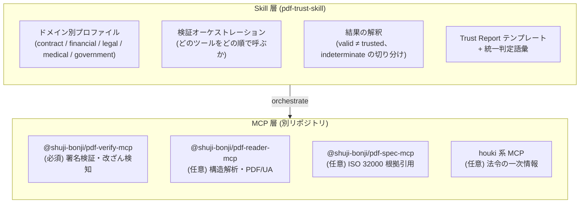
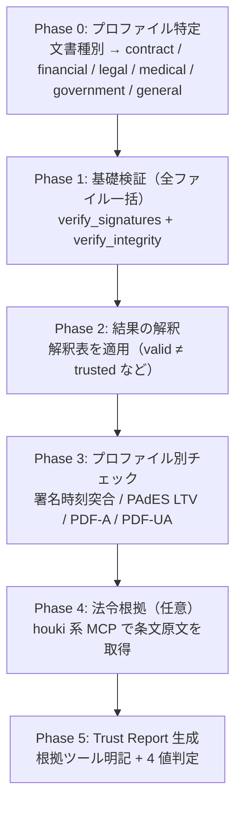

## はじめに

取引先から届いた契約書 PDF、税務調査に備えて保存している請求書 PDF、行政サイトからダウンロードした公文書 PDF。これらが「本物か・改ざんされていないか・信用してよいか」を Claude に監査させる **Agent Skill** を公開しました。

https://github.com/shuji-bonji/pdf-trust-skill

暗号学的な署名検証・改ざん検知・PAdES / PDF-A チェック・（任意で）法令根拠の照合を、文書のドメイン別プロファイル（契約書・請求書・訴訟資料・診療文書・行政文書）に沿って実行し、4 値の推奨判定付き **Trust Report** を返します。

本記事では「なぜ MCP サーバではなく Skill にしたのか」「監査がどう流れるか」「改ざんされた契約書を実際に検知させた例」を紹介します。

## 判定するのは「真正性」であって「真偽」ではない

最初にスコープをはっきりさせておきます。

### この Skill が答えるのは:

- この PDF の電子署名は暗号学的に有効か
- 署名した後に中身が変更されていないか
- 署名者の証明書は信頼できる CA につながるか、失効していないか
- 長期保存（電帳法・PDF/A・LTV）に耐える形式か

### 答え**ない**のは:

- 書かれている内容が事実として正しいか（真偽）
- 契約として法的に有効か（法的判断）

「原本のまま完全であること」の検証と、「内容が正しいこと」の判断は別物です。後者は利用者（必要なら有資格者）に委ねる、というのが設計上の一線です。

## なぜ MCP ではなく Skill なのか

筆者は PDF 検証まわりの MCP サーバ群（PDF family）を公開しています。設計原則は一貫していて、**決定論的計算（暗号検証・パース）は MCP サーバ、手順・判断・知識は Skill** です。

信頼性監査は「どのツールをどの順で呼び、結果をどう解釈し、どう報告するか」という純粋なオーケストレーションです。これをサーバとして実装しても保守対象のプロセスが増えるだけなので、Markdown の行動指針 = Skill にしました。



暗号学的な実作業はすべて [@shuji-bonji/pdf-verify-mcp](https://www.npmjs.com/package/@shuji-bonji/pdf-verify-mcp) が担います。Skill 側には「構造解析からの推測で真正性を代替しない」という禁止事項を明記しています。「本物か」に答えられるのは暗号学的検証だけだからです。

https://www.npmjs.com/package/@shuji-bonji/pdf-verify-mcp

pdf-verify-mcp そのものの設計（ByteRange ダイジェストの独立照合、レガシー署名・暗号化 PDF への対応など）は別記事で詳しく紹介しています。

https://zenn.dev/shuji_bonji/articles/zenn-pdf-verify-mcp

## 監査の流れ



最終判定は次の 4 値に統一しています。

| 判定                    | 意味                                                        |
| ----------------------- | ----------------------------------------------------------- |
| `trust_and_use`         | 署名有効 + 信頼チェーン確認 + 失効なし + 必須チェック全通過 |
| `use_with_caution`      | 暗号学的には有効だが、身元未評価 / 失効不明などの留保つき   |
| `human_review_required` | 判定不能・DocMDP 違反疑い・必須チェック不合格               |
| `reject`                | 無効 — ダイジェスト不一致・署名検証失敗・失効確認済み       |

### ドメイン別プロファイル

同じ「署名なし PDF」でも、契約書なら不合格、住民向けの行政告知なら現実的に許容、と判断基準はドメインで変わります。プロファイルは `references/` に分離してあり、該当するものだけがロードされます。

| プロファイル | 想定文書                   | 重点                                         |
| ------------ | -------------------------- | -------------------------------------------- |
| contract     | 契約書・NDA・発注書        | 署名者の身元、署名時刻の整合                 |
| financial    | 請求書・決算書・申告書     | 長期検証可能性（LTV・PDF/A）、電子帳簿保存法 |
| legal        | 訴訟資料・法務文書         | 証拠性、増分更新の全履歴                     |
| medical      | 診療情報提供書・検査報告書 | 最も保守的な判定、PDF/UA                     |
| government   | 行政文書・公共告知         | PDF/A 長期保存、GPKI の深いチェーン          |

たとえば medical プロファイルは「`use_with_caution` を `human_review_required` に格上げする」という上書き規則を持ちます。患者情報で「注意して使う」という中間状態を許容しないためです。

## 実例: 改ざんされた契約書を検知する

自作のテスト CA で署名した契約書 PDF と、その署名済みバイト列を 1 バイトだけ書き換えた改ざんコピーの 2 通を、「取引先から契約書が 2 通届いた。CA 証明書もある」というシナリオで監査させました。

結果のサマリ（実際の Trust Report から抜粋）:

| ファイル              | 判定                 | 要旨                                                               |
| --------------------- | -------------------- | ------------------------------------------------------------------ |
| contract_signed.pdf   | **use_with_caution** | 署名は有効・チェーンは提供 CA で trusted。ただし失効確認が unknown |
| contract_tampered.pdf | **reject**           | ByteRange digest が CMS messageDigest と不一致 — 署名後に改変      |

注目してほしいのは、正常な方も `trust_and_use` に**ならなかった**点です。失効情報が PDF に埋め込まれておらず、オンライン失効確認も（外部 HTTP アクセスを伴うため）ユーザーの許可なしには実行しない設計なので、「失効していないことは未確認」という留保が判定に反映されます。

もうひとつ、改ざん版のレポートには「ファイルサイズが signed 版と同一で、最終署名はファイル全体をカバーしている → 末尾追記（再保存痕）ではなく署名範囲内の上書き改変」という切り分けが入りました。「署名後に変更あり = 改ざん」と短絡しない解釈表が効いています。増分更新（連署や LTV データの追加）は PDF では合法だからです。

さらに contract プロファイルは法令照合先として電子署名法を指定しているため、レポートには houki 系 MCP で取得した第 2 条（定義）・第 3 条（真正な成立の推定）の条文原文が出典 URL 付きで引用されました。条文をモデルの記憶から書くことは Skill で禁止しています。

## 解釈でハマりやすいポイント

Skill の中核は `pdf-verify-mcp` の出力をどう読むかの解釈表です。実測で確認した挙動をいくつか紹介します。

**valid ≠ trusted。** trust_anchors（信頼する CA 証明書）を渡さない場合、`verdict: valid` は「暗号学的完全性のみ確認、署名者の身元は未評価」を意味します。ここを混同して「有効です」とだけ報告すると誤導になるため、レポートの警告欄への明記を必須にしています。

**trust_anchors には CA 証明書を渡す。** 自己署名のリーフ証明書そのものを渡すと、チェーンエンジンは「not a CA certificate」で untrusted にします。一方、アンカーが署名者チェーンと無関係な場合は「No valid certificate paths found」になり、エラーメッセージから原因を区別できます。

**INVALID は改ざんとは限らない。** 署名済み PDF を後から暗号化・再保存すると署名は壊れます。改ざんの断定は `verify_integrity` の増分更新情報との突き合わせが必要です。

**indeterminate にも種類がある。** レガシーな SubFilter（`adbe.pkcs7.sha1` 等)の未対応もあれば、「CMS payload is not valid BER/DER + 埋め込み証明書 0 件」のように署名生成ツール側の不備を示すケースもあります。後者も改ざんと断定せず `human_review_required` に送ります。

## インストール

必須 MCP は `pdf-verify-mcp` の 1 つだけです。

```jsonc
// claude_desktop_config.json — 最小構成
{
  "mcpServers": {
    "pdf-verify-mcp": {
      "command": "npx",
      "args": ["-y", "@shuji-bonji/pdf-verify-mcp"],
    },
  },
}
```

Skill 本体は marketplace 経由か手動コピーで導入します。

```bash
# A. Marketplace（Claude Code）
/plugin marketplace add shuji-bonji/claude-plugins
/plugin install pdf-verify-mcp@shuji-bonji
/plugin install pdf-trust@shuji-bonji

# B. 手動（Claude Code）
git clone https://github.com/shuji-bonji/pdf-trust-skill
cp -r pdf-trust-skill/skills/pdf-trust ~/.claude/skills/pdf-trust
```

Cowork（Claude Desktop）の場合は **Settings → Customize → Plugins** に marketplace（`https://github.com/shuji-bonji/claude-plugins`）を追加するか、`skills/pdf-trust/` を zip（`.skill`）にして **Settings → Capabilities → Skills** から追加します。

任意 MCP（pdf-reader-mcp / pdf-spec-mcp / houki 系）が未接続でも縮退動作します。その際、実施できなかった検査は黙って省略せず「未実施（ツール未接続）」とレポートに明記されます。黙って項目を落とすと「チェック済みで問題なし」と誤読されるからです。

## 制限事項

- 本 Skill の出力は技術的所見であり、法的助言ではありません
- trust_anchors として渡す CA 証明書自体の正当性（入手経路）の検証は範囲外です
- オンライン失効確認（OCSP/CRL）は外部 HTTP アクセスを伴うため、ユーザーに確認してから実行する設計です

## おわりに

「この PDF、信用していい？」という問いは、実は「署名は有効か」「署名者は誰か」「署名後に何が起きたか」「保存期間の終わりまで検証できるか」という別々の問いの束です。pdf-trust-skill は、この分解と解釈の手順を Skill として固定し、暗号学的な実作業を MCP に委ねることで、毎回同じ規律で監査が回るようにしたものです。

契約書の受入チェックや電帳法対応の保存監査など、PDF の信頼性が気になる場面があればぜひ試してみてください。フィードバックは [GitHub Issues](https://github.com/shuji-bonji/pdf-trust-skill/issues) へお願いします。

## 関連リンク

- [pdf-trust-skill](https://github.com/shuji-bonji/pdf-trust-skill) — 本記事の Skill
- [pdf-verify-mcp](https://github.com/shuji-bonji/pdf-verify-mcp) — 暗号学的検証を担う必須 MCP
- [PDFの署名が「本物か」をLLMが検証できるMCPサーバーを作った](https://zenn.dev/shuji_bonji/articles/zenn-pdf-verify-mcp) — pdf-verify-mcp の紹介記事
- [pdf-reader-mcp](https://github.com/shuji-bonji/pdf-reader-mcp) / [pdf-spec-mcp](https://github.com/shuji-bonji/pdf-spec-mcp) — 任意 MCP
- [claude-plugins](https://github.com/shuji-bonji/claude-plugins) — 個人 marketplace
