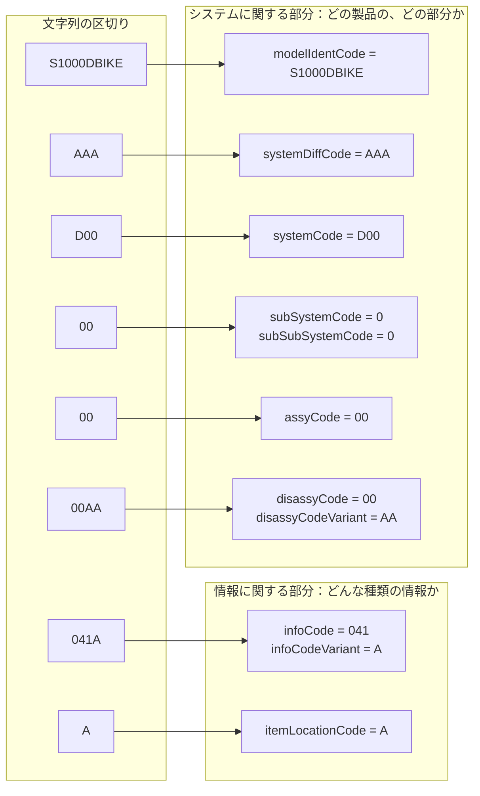

第5章「Data Module Code の読み方」で html-embed に置き換える前の Mermaid の図。

```mermaid
flowchart LR
  subgraph STR["文字列の区切り"]
    S1["S1000DBIKE"]
    S2["AAA"]
    S3["D00"]
    S4["00"]
    S5["00"]
    S6["00AA"]
    S7["041A"]
    S8["A"]
  end
  subgraph INFO["情報に関する部分：どんな種類の情報か"]
    B1["infoCode = 041<br/>infoCodeVariant = A"]
    B2["itemLocationCode = A"]
  end
  subgraph SYS["システムに関する部分：どの製品の、どの部分か"]
    A1["modelIdentCode = S1000DBIKE"]
    A2["systemDiffCode = AAA"]
    A3["systemCode = D00"]
    A4["subSystemCode = 0<br/>subSubSystemCode = 0"]
    A5["assyCode = 00"]
    A6["disassyCode = 00<br/>disassyCodeVariant = AA"]
  end
  S1 --> A1
  S2 --> A2
  S3 --> A3
  S4 --> A4
  S5 --> A5
  S6 --> A6
  S7 --> B1
  S8 --> B2
```
