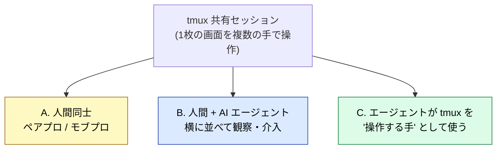
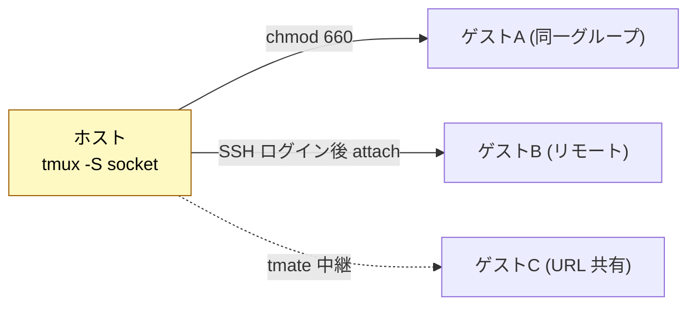
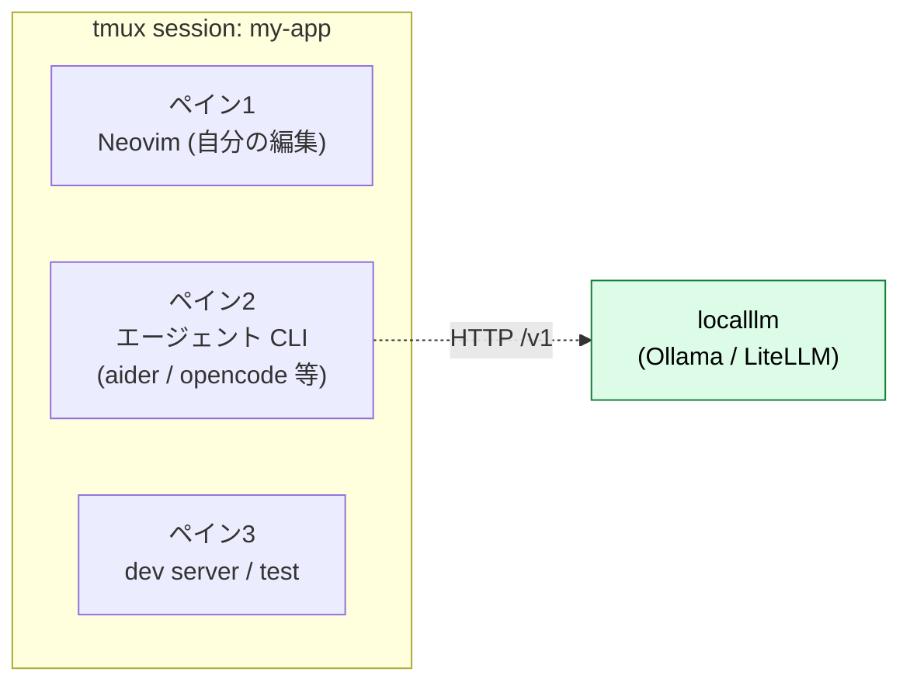
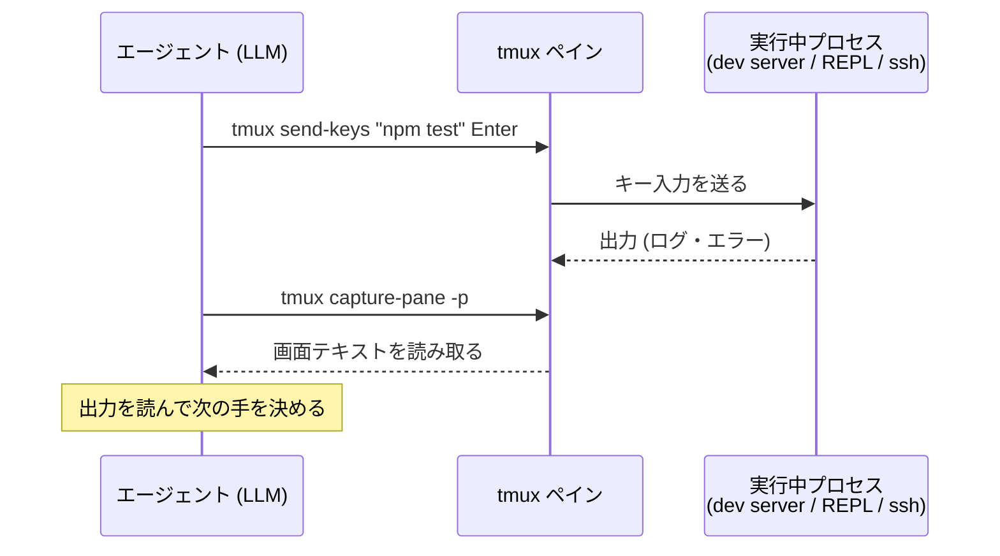
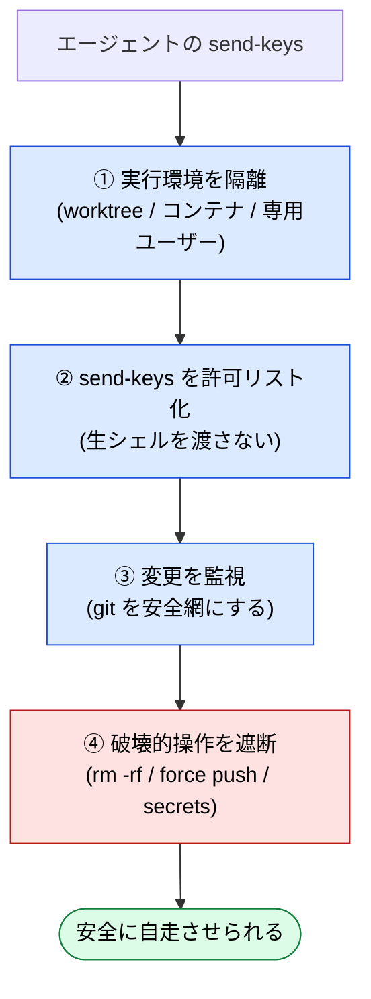
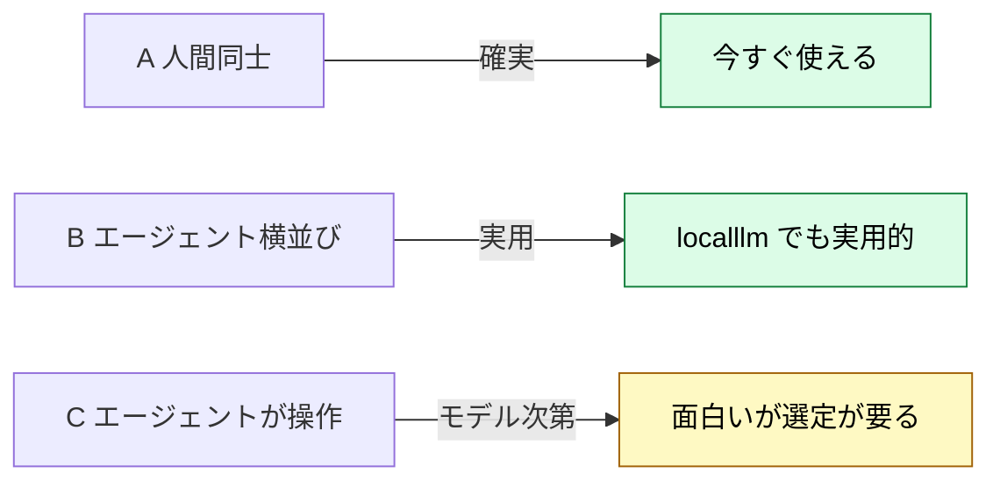

# tmux でペアプロ — 人間同士から AI エージェント / ローカル LLM まで

:::message
**この章でできるようになること**
tmux の「画面共有」を、人間同士のペアプロだけでなく **AI エージェントとの協働** にまで広げて理解し、
localllm (ローカル LLM) を使ったエージェントペアプロを自分で組めるようになります。
チームに AI 駆動開発のノウハウを渡すときの土台にもなります。
:::

:::message
**前提**: [tmux 章](tmux.md) で tmux の基礎（セッション / ペイン、detach/attach）を把握していること。
ローカル LLM 連携部分は [`local-llm-on-mac`](https://github.com/shuji-bonji/local-llm-on-mac) の localllm が稼働している前提。
:::

## 全体像 — tmux ペアプロには 3 層ある

tmux の本質は「1 枚の画面を複数の手で操作できる」ことです。
まずはこの「複数の手」を **誰に / 何に開放するか** で 3 層に分けると、全体像が掴みやすくなります。



| 層    | 誰が画面を操作するか   | 代表ツール                     | 本プロジェクトでの位置 |
| ----- | ---------------------- | ------------------------------ | ---------------------- |
| **A** | 人間 + 人間            | tmux 標準 / tmate / wemux      | チーム共有の基本       |
| **B** | 人間 + エージェントCLI | aider / opencode / Claude Code | localllm で今すぐ実用  |
| **C** | エージェントが直接     | `send-keys` / `capture-pane`   | 自律開発の実験場       |

## A. 人間同士（tmux 本来の機能）

サーバ運用の経験がある人には馴染みのある領域です。**同じセッションに二人が attach** すれば、
画面もキー入力も共有されます。やり方は接続形態によって変わるので、順に見ていきましょう。

### 同一ユーザー・同一マシン

```bash
# 一人目
tmux new -s pair
# 二人目（同じマシンの別ターミナルから）
tmux attach -t pair
```

### 別ユーザー・別マシン — 安全な共有ソケット

別ユーザーと共有するなら **専用ソケットを作って権限を絞る** のが定石です。

```bash
# ホスト側: グループ共有のソケットで起動
tmux -S /tmp/pair-socket new -s pair
chmod 660 /tmp/pair-socket          # 同一グループだけ読める
# ゲスト側（同一マシン or SSH ログイン後）
tmux -S /tmp/pair-socket attach -t pair
```

### リモートで手軽に — tmate

毎回 SSH 設定をするのが面倒なら **[tmate](https://tmate.io/)**（tmux フォーク）が便利です。
起動すると共有用の SSH/Web URL を自動で発行してくれるので、相手はそれに繋ぐだけで済みます。

```bash
brew install tmate
tmate                # 表示される ssh URL を相手に渡す
```

:::message alert
tmate は中継サーバ経由で接続を張ります。**業務コードを扱うなら自前ホストの共有ソケット + SSH** が安全です。
外部中継を使う場合は、見せて良い画面か・read-only で渡せるか（`tmate -r`）を必ず確認してください。
:::



## B. 人間 + AI エージェント（横に並べる）

一番素直で、**localllm で今すぐ実用になる** 構成です。
エージェント CLI を 1 ペインで走らせ、自分は別ペインで編集・確認していきます。



エージェントがペイン 2 で diff を提案・適用し、あなたは隣で結果を見ながら介入する。まさにペアプロです。
tmux が「消えない共有作業机」なので、[neovim-tmux 章](neovim-tmux.md) のレイアウトがそのまま流用できます。
人間ゲストと AI を **同じセッションに同居** させれば、人間 2 + AI 1 のモブプロにもなります。

## C. エージェントが tmux を「手」として使う

ここが自律開発の面白いところです。LLM エージェントに tmux 操作コマンドを渡すと、
**状態を持つターミナルを直接操作** できるようになります。



```bash
# エージェントが使う 2 つの基本動作
tmux send-keys -t my-app:1 "npm test" Enter   # コマンドを送る（手）
tmux capture-pane -t my-app:1 -p              # 画面を読む（目）
```

一度きりの `bash` 実行と違って、**dev サーバ・REPL・対話的な ssh セッションのような「状態を持つプロセス」を継続して操作** できるのが利点です。
ここがポイントで、エージェントに「目（capture-pane）」と「手（send-keys）」を与える設計は、エージェントハーネスの定番パターンになっています。

:::message alert
この層は強力な分、危険でもあります。エージェントが任意コマンドを `send-keys` できる = **実質シェルを渡す** ということです。
隔離環境（専用ユーザー / コンテナ / 使い捨て VM）で動かし、`rm` 等の破壊的操作の扱いを決めてから使い始めてください。
**具体的な防御の組み方は、この章の後半「安全策 — エージェントに『手』を渡す前に」節にまとめます。**
:::

### 最小オーケストレーション例（承認プロンプトに自動応答）

`capture-pane`（目）と `send-keys`（手）を while ループで回すと、
**対話的 CLI の承認プロンプトに条件付きで自動応答**する最小のオーケストレーションが組めます。実際に見てみましょう。

```bash
#!/usr/bin/env bash
# pane を監視し、確認プロンプトが出たら y を送る（最小例）
PANE="agent-refactor:0.0"
while true; do
  # ① ANSI エスケープ（色・カーソル制御）を除去してから判定する
  out=$(tmux capture-pane -p -t "$PANE" | sed -E 's/\x1b\[[0-9;]*[mK]//g' | tail -n 5)
  if echo "$out" | grep -q "Proceed? (y/n)"; then
    # ② -l = リテラル送信（特殊文字の誤解釈を防ぐ）。Enter は分離して送る
    tmux send-keys -t "$PANE" -l 'y'
    tmux send-keys -t "$PANE" Enter
  fi
  sleep 2
done
```

:::message alert
自動応答は便利な反面、**エージェントの暴走をそのまま承認**してしまう危険があります。
条件は厳しめにし、`git diff` の監視（`watch git diff --stat`）とセットで使ってください。
監視レイアウト（pane に本体・差分・ログを並べる）の組み方は
[tmux 章](tmux.md) の §11.4 具体例① を参照してください。
:::

:::message
実戦投入するなら、上のループの 2 点が堅さを左右します。
**① ANSI 除去**: `capture-pane` の出力には色・カーソル制御コードが混ざり、素の `grep` はマッチを外します。
`sed -E 's/\x1b\[[0-9;]*[mK]//g'` を一段噛ませます（特に Claude Code 系の色付き出力で実害が出やすい）。
**② `send-keys -l`**: 送る文字列は **リテラルモード**で送り、`Enter` を別送りにすると特殊文字の誤解釈を防げます。
:::

### 複数エージェントを並列で回す

セッションを分ければ、複数のエージェントを並走させて、まとめて俯瞰できます。

```bash
tmux new -s agent-refactor   # エージェントA: 大規模リファクタ
tmux new -s agent-tests      # エージェントB: テスト修正
tmux ls                      # 全体を俯瞰（(attached) の有無で監視状況も分かる）
```

:::message
`(attached)` の有無で「走らせたまま誰も見ていない（デタッチ済み）」エージェントを見分けられます。
`tmux ls` の読み方は [tmux 章](tmux.md) の §7.1 を参照してください。
:::

## 安全策 — エージェントに「手」を渡す前に

C 層は「エージェントに `send-keys` を許す = 実質シェルを渡す」構成です。ローカル LLM は暴走しても LAN 内で完結するとはいえ、**その LAN 内にあなたのリポジトリと dotfiles がある**以上、無防備に開放してはいけません。守り方は 1 つの銀の弾丸ではなく、**多層防御（defense in depth）** で考えます。



外側の層ほど「そもそも触れさせない」、内側ほど「触れても壊れない」防御です。全部やる必要はありませんが、**C 層を常用するなら最低でも ① と ③ は入れましょう**。

### ① 実行環境を隔離する（サンドボックス）

一番効くのは「壊れて困るものを、そもそもエージェントの手の届く範囲に置かない」ことです。手軽な順に 3 段階あります。

- **git worktree で作業ツリーを分ける（最小・まず これ）**
  メインの作業ツリーとは別ディレクトリ・別ブランチにエージェントを閉じ込めます。事故ってもブランチを捨てれば済み、`main` は無傷です。

  ```bash
  # エージェント専用の worktree を切る（別ブランチ・別ディレクトリ）
  git worktree add ../agent-sandbox -b agent/refactor
  tmux new -s agent-refactor -c ../agent-sandbox   # このセッション内だけで作業させる
  # 気に入らなければ丸ごと捨てる
  git worktree remove ../agent-sandbox --force
  git branch -D agent/refactor
  ```

- **コンテナ / 使い捨て VM で OS ごと隔離する（強め）**
  ファイルシステムもネットワークも隔離したいなら、リポジトリだけをマウントしたコンテナ内で `tmux` ごと動かします。壊れたら破棄して作り直すだけです。

- **専用ユーザーで権限を絞る（サーバ運用の定石）**
  localllm 上でエージェント用ユーザーを作り、書き込み可能な範囲を作業ディレクトリだけに限定します。`sudo` は当然渡しません。

### ② send-keys を許可リスト化する

エージェントに「生の `send-keys`」を渡すと何でも打てます。**間に薄いラッパを噛ませ、許可したコマンドだけ通す**と、事故の大半は入口で止まります。

```bash
#!/usr/bin/env bash
# safe-send.sh — 許可リストに載ったコマンドだけ tmux に流す
PANE="agent-refactor:0.0"
cmd="$*"

# 許可する接頭辞（必要なものだけ最小限に）
allow='^(npm (test|run build|run lint)|git (status|diff|add -p|commit)|ls|cat |rg )'
# 明示的に拒否する危険パターン（許可に紛れても弾く二重チェック）
deny='(rm -rf|:> |mkfs|dd if=|curl .*\| *sh|sudo|git push .*-f|chmod -R 777)'

if [[ "$cmd" =~ $deny ]]; then
  echo "BLOCKED (deny): $cmd" >&2; exit 1
fi
if [[ ! "$cmd" =~ $allow ]]; then
  echo "BLOCKED (not allowed): $cmd" >&2; exit 1
fi

tmux send-keys -t "$PANE" -l "$cmd"
tmux send-keys -t "$PANE" Enter
```

エージェントには `tmux send-keys` そのものではなく、この `safe-send.sh` だけを「手」として渡します。許可リストは **狭く始めて、必要になったら足す** のが鉄則です（最初から広げると意味がありません）。

### ③ 変更を監視する（git を安全網にする）

「壊れても気づけて、戻せる」状態を作っておけば、多少の暴走は怖くありません。git がそのまま安全網になります。

- **差分を常時可視化する**: 監視ペインに `watch` で diff を出しておき、想定外の変更が膨らんだら止めます。

  ```bash
  # 別ペインで走らせておく（agent-pair の監視レイアウトに追加）
  watch -n 2 'git status -s && echo "--- stat ---" && git diff --stat'
  ```

- **こまめにコミット or stash してチェックポイントを作る**: エージェントの 1 タスクごとにコミットしておけば、`git reset --hard HEAD~1` で 1 手戻せます。
- **pre-commit フックで危険パターンを止める**: 秘密情報や巨大差分をコミット直前で弾きます。

  ```bash
  # .git/hooks/pre-commit（chmod +x を忘れずに）
  if git diff --cached | grep -nE '(API_KEY|SECRET|BEGIN (RSA|OPENSSH) PRIVATE KEY)'; then
    echo "秘密情報らしき差分を検出。コミットを中止しました。" >&2
    exit 1
  fi
  ```

````

### ④ 破壊的操作を遮断する

②の deny リストと重なりますが、**「取り返しのつかない操作」だけは環境側でも二重に塞いで**おきます。

- `rm -rf` / `git push --force` / `git clean -fdx` / リモートの本番への接続は、そもそも許可リストに載せない。
- 承認が要る操作は、前掲の「最小オーケストレーション例（承認プロンプトに自動応答）」の自動応答から**外し、人間が必ず目視で承認**する。
- 可能なら実行前に **dry-run**（`npm publish --dry-run`、`rsync --dry-run` 等）を挟み、影響範囲を出力させてから本実行する。

:::message
**原則**: エージェントに渡す権限は、**「最悪の 1 手を撃たれても、ブランチを捨てるだけで復旧できる」**範囲に収める。①（隔離）で被害の上限を決め、③（監視）で早期に気づき、②④で入口を塞ぐ——この 3 点が揃って初めて、C 層を安心して常用できます。
:::

:::message
**L3 リンク機会メモ**: この「許可リスト＋隔離＋監視」は、L3 (`ai-agent-architecture`) の **エージェントに与える権限をどう設計するか（Tool の最小権限・人間承認ゲート・可観測性）** の素朴な実装です。send-keys ラッパは Tool 呼び出しの認可レイヤー、git 監視は可観測性レイヤーに対応。`zennbook-toc-memo.md` の L3/L4 リンク表に追記候補。
:::

## ローカル LLM (localllm) で動かす — 鍵は 2 つ

**ちゃんと動きます。**ただし、次の 2 点が成否を分けるので押さえておきましょう。

```mermaid
flowchart TD
    Q["localllm でエージェントペアプロ"] --> A{"CLIが OpenAI互換に<br/>向けられる?"}
    A -->|aider 等| B["--openai-api-base で直結"]
    A -->|Claude Code 系| C["LiteLLM 経由でプロキシ"]
    B --> D{"モデルの<br/>tool calling は十分?"}
    C --> D
    D -->|Yes 大きめ/対応モデル| E["実用的に回る"]
    D -->|No 小型モデル| F["編集・実行が破綻しがち"]
    style E fill:#dcfce7,stroke:#15803d,color:#000
    style F fill:#fee2e2,stroke:#b91c1c,color:#000
````

### 鍵1: エンドポイント接続

まずはエージェント CLI を **localllm の OpenAI 互換エンドポイントに向けます**。

```bash
# aider を localllm の Ollama に直結する例 (手元で動かす場合。localllm 上なら http://localhost:11434/v1)
aider --openai-api-base http://localllm.local:11434/v1 \
      --openai-api-key ollama \
      --model gemma2:9b           # localllm に pull 済みのモデル名に合わせる
```

Claude Code はそのままだと **クラウド（Anthropic）で動く**ので、tmux ペインで起動すればすぐクラウドエージェントとして協働に加われます。さらに前章 ([neovim-claudecode](neovim-claudecode.md)) の `provider = "none"` を使えば、**そのペインの Claude Code に Neovim との IDE 接続 (選択共有・エディタ内 diff) を通したまま**この協働レイアウトに参加させられます。**localllm に向けたいときだけ**、間に **LiteLLM** を噛ませて localllm にプロキシします。localllm 側に LiteLLM Proxy を載せる構成は姉妹本 [`local-llm-on-mac`](https://github.com/shuji-bonji/local-llm-on-mac) で扱っており、その口を使えば Claude Code のようなツールも localllm に向けられます。

### 鍵2: モデルの tool calling 能力（本質的制約）

エージェントはファイル編集・コマンド実行を **tool call** で行います。ここが弱いモデルだと、破綻しやすくなります。
本プロジェクトの検証どおり、**tool calling のしっかりしたモデル選定が前提**になります
（gemma 系の十分大きいモデルは実用域、小型モデルはエージェント用途で苦しい）。

:::message
本プロジェクトの方針上、自律エージェント用途では **中国・ロシア系モデル (Qwen / DeepSeek 等) は使いません**。
localllm のモデル選定知見は、姉妹本 [`local-llm-on-mac`](https://github.com/shuji-bonji/local-llm-on-mac) を参照してください。
クラウドモデルより一段ハードルが高いのは正直なところですが、だからこそ localllm が「試行錯誤の土俵」として効きます。
:::

## まとめ — 3 層の温度感



A（人間同士）は確実に使えて、B（エージェント横並び）は localllm でも今すぐ実用になります。
C（エージェントが tmux を操作）は面白いものの、モデル選定が要る——この温度感で整理できます。

## アンインストール手順 (フェーズ C 用)

```bash
# 共有ソケットは使い終わったら削除
rm -f /tmp/pair-socket
# tmate を入れた場合
brew uninstall tmate           # 他で使っていなければ
# aider 等のエージェント CLI は各ツールの手順でアンインストール
# localllm 側は既存 Ollama / LiteLLM を叩いただけなので変更なし
```
