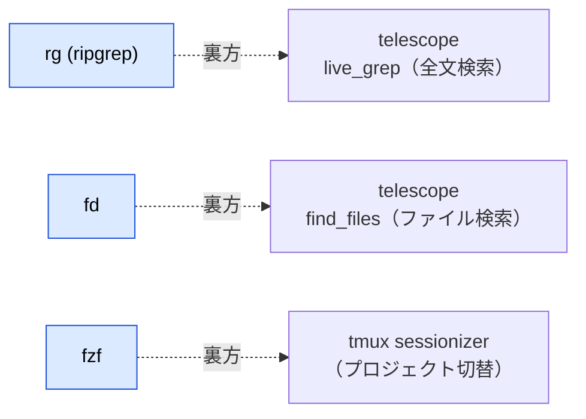

# rg / fd / fzf — 「裏方」を表で使う

:::message
**この付録でできるようになること**
setup 章で入れた **ripgrep (`rg`) / fd / fzf** は、本文では Neovim・tmux の**裏側**で動いていました
（telescope の全文検索・ファイル検索、tmux の sessionizer）。この 3 つは **ターミナル単体でも毎日使える**強力な道具です。
ここでは最小の使い方だけを引けるようにまとめます。
:::

:::message
**前提**: setup 章で `rg` / `fd` / `fzf` を導入済み（`rg --version` 等で確認）。導入物はこの付録では増やしません。
:::

## 本文との関係 — どこで裏方をしていたか



裏で動く仕組みを一度「表」で触っておくと、Neovim/tmux 側の挙動（なぜ速いか・なぜ `.gitignore` 配下が既定で出ないか）も腑に落ちます。

---

## 1. rg (ripgrep) — 速い grep

`grep` の高速版です。**既定で `.gitignore` を尊重し、隠しファイルとバイナリを除外**して検索します。だから「リポジトリ内の意味のある検索」がそのまま速く出ます。

```bash
rg useState                 # カレント以下を再帰検索（.gitignore は自動で除外）
rg -i todo                  # 大文字小文字を無視
rg -n useState              # 行番号つき（-n。既定でも付くことが多い）
rg -l useState              # ヒットした「ファイル名」だけ一覧
rg useState src/            # 場所を絞る
rg -g '*.ts' useState       # glob でファイル種別を絞る（TS だけ）
rg -t ts useState           # 定義済みタイプ名でも絞れる（ts / css / html …）
rg -w state                 # 単語境界（"state" だけ。"useState" は除外）
rg -A2 -B2 useState         # ヒット行の前後2行も表示（文脈）
```

:::message
`.gitignore` に載っているものも含めて検索したいときは `rg -u`（`-uu` でさらに隠しファイルも、`-uuu` でバイナリも）。「`node_modules` が出ない！」ではなく「**出ないのが既定で正しい**」— 出したいときだけ `-u` を足す、と覚えます。
:::

### rg で見つけて、そのまま開く

`rg -l`（ヒットしたファイル名だけ）を `fzf` に流せば、「その語を含むファイル」から選んで開けます。

```bash
nvim "$(rg -l TODO | fzf)"          # TODO を含むファイルから選んで開く
rg -l useState | fzf | xargs nvim   # 同じことを xargs で
```

:::message
**一歩進んで「その行」に飛ぶ。** `rg -n`（行番号つき）の結果を選び、`nvim +行番号 ファイル` の形に組み替えると、ヒット箇所そのものに着地できます（ファイル名にスペースが無い前提の簡易版）。

```bash
rg -n TODO | fzf --delimiter : | awk -F: '{print "+"$2, $1}' | xargs nvim
```

:::

## 2. fd — 速い find

`find` の高速・直感版です。こちらも **既定で `.gitignore` 尊重・隠しファイル除外**。書式が `find` よりずっと素直です。

```bash
fd README                   # 名前に "README" を含むものを再帰で探す
fd -e ts                    # 拡張子で絞る（.ts ファイル一覧）
fd -e ts -e tsx             # 複数拡張子
fd -t f                     # ファイルのみ（-t d でディレクトリのみ）
fd -H config                # 隠しファイルも含めて探す（-H = hidden）
fd pattern src/             # 場所を絞る
fd -x wc -l                 # 見つかった各ファイルにコマンド実行（-x = exec）
```

:::message
`rg` も `fd` も同じ思想（`.gitignore` 尊重・隠し除外・高速）で揃えてあるので、**「検索は rg、ファイル探しは fd」** と役割で覚えると迷いません。telescope の `find_files` が速いのは、この `fd` が裏で走っているからです。
:::


### fd で見つけて、そのまま開く

`fd` は候補（パスの一覧）を出すだけなので、`fzf` で選ぶ・`xargs` に渡す・`-X` でまとめて開く、と繋ぐと「探して開く」が一手になります。

```bash
nvim "$(fd -e md | fzf)"              # .md 候補から1つ選んで開く（★下の gif）
fd -e ts | fzf | xargs nvim           # 同じことを xargs で（★下の gif）
fd README -X nvim                     # マッチした README 系を全部まとめて開く
nvim "$(fd -e md README | head -1)"   # 先頭マッチだけを開く
```


:::message alert
**複数マッチと `-x` / `-X` の注意。**
`nvim "$(fd README)"` を**そのまま**使うと、マッチが複数あるとき全行が 1 引数に潰れて壊れます（クォート無しだと今度はスペース入りファイル名で割れます）。複数マッチが起きうるなら **`| fzf`（選ぶ）か `-X`（全部開く）** が安全です。
また `-x`（小文字＝マッチごとに**並列起動**）と `-X`（大文字＝**1回だけ起動**）は別物で、**nvim には必ず `-X`** を使います（`-x` だと nvim が多重起動して操作不能になります）。
:::

## 3. fzf — ファジーファインダ（組み合わせて化ける）

fzf は単体だと地味ですが、**「標準入力の候補を対話的に絞り込み、選んだ行を標準出力に返す」**フィルタだと理解すると一気に世界が広がります。


この「入口（stdin）と出口（stdout）」を他コマンドと繋ぐのがコツです。

```bash
fzf                                 # カレント配下のファイルを対話選択（結果を表示）
nvim "$(fzf)"                        # 選んだファイルを Neovim で開く ★下の gif
cd "$(fd -t d | fzf)"               # fd で出したディレクトリ一覧から選んで cd
rg -l useState | fzf                # useState を含むファイルから選ぶ
nvim "$(rg -l useState | fzf)"      # ↑を選んでそのファイルを開く
git switch "$(git branch --format='%(refname:short)' | fzf)"  # ブランチを選んで切替
fzf --preview 'cat {}'              # 右にプレビューを出しながら選ぶ（{} = 現在候補）
```

:::message
**`nvim "$(fzf)"` が入口です。** `$(...)` は「中のコマンドの出力を、その場に文字列として差し込む」シェルの機能（コマンド置換）。fzf が返した 1 行（＝選んだファイル名）が `nvim` の引数になり、そのまま開きます。`fd` / `rg` の出力を `| fzf` に流し込めば、候補の作り方を自由に変えられます。
:::


<!-- ↑ 差し込み予定: `nvim "$(fzf)"` で README.md を選択→開く gif。images/ 配下に fzf-nvim.gif を置く -->

:::message
**fzf のシェル統合（任意）**: `~/.zshrc` に fzf のキーバインドを読み込むと、`Ctrl-r`（履歴のあいまい検索）・`Ctrl-t`（カレント配下のファイル挿入）・`Alt-c`（ディレクトリ移動）が使えます。導入は `$(brew --prefix)/opt/fzf/install` か、`source <(fzf --zsh)`（新しめの版）。本書の必須ではないので、気に入ったら足してください。
:::

## まとめ — 3 つの役割

| ツール  | 何をする           | 単体での代表例          | 本文での裏方           |
| ------- | ------------------ | ----------------------- | ---------------------- |
| **rg**  | 中身を速く検索     | `rg -g '*.ts' useState` | telescope `live_grep`  |
| **fd**  | ファイルを速く探す | `fd -e ts`              | telescope `find_files` |
| **fzf** | 候補を対話選択     | `nvim "$(fzf)"`         | tmux sessionizer       |

いずれも `.gitignore` 尊重・高速という思想で揃っており、`fd`/`rg` で候補を作り `fzf` で選ぶ、という**パイプでの組み合わせ**が本領です。

## もっと詳しく

- [BurntSushi/ripgrep](https://github.com/BurntSushi/ripgrep) — `rg`。`man rg` / `rg --help` も充実
- [sharkdp/fd](https://github.com/sharkdp/fd) — `fd`。`fd --help`
- [junegunn/fzf](https://github.com/junegunn/fzf) — `fzf`。wiki に組み合わせ例が豊富

（各ツールの日本語解説記事も併読すると、さらに手に馴染みます）

## リセット手順

この付録は既存コマンドの使い方だけで、導入物はありません（`rg` / `fd` / `fzf` 本体を消す場合は setup 章のリセット手順を参照）。
