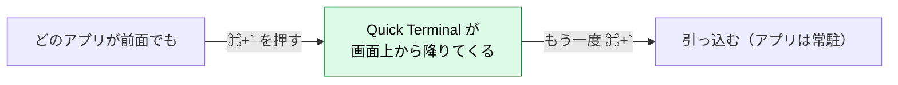
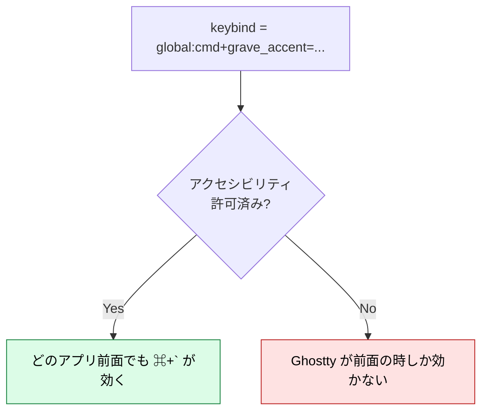
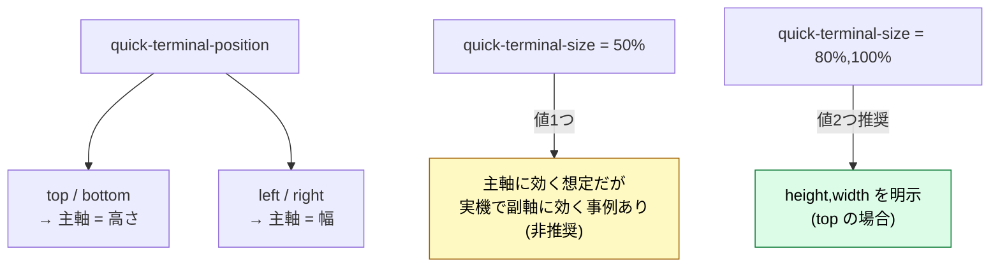
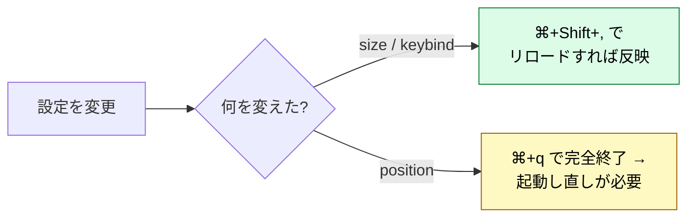

# Ghostty を導入して使いこなす — tmux + Neovim 向け

:::message
**この章でできるようになること**
Ghostty を導入し、tmux + Neovim に最適化した初期設定を書けるようになります。
そのうえでネイティブ操作（分割・タブ・コピペ・スクロール・CLI）を一覧で引け、
「⌘+` でどこからでも降りてくる常駐ドロップダウン端末（Quick Terminal）」まで組めるようになります。
:::

:::message
**前提**: setup 章で Ghostty を導入済み（Homebrew 含む）であること。
キーバインドは **macOS 既定**（1.3.x で確認）で、すべて config で上書きできます。
:::

本章は「Ghostty 側で完結すること」を 1 章にまとめたものです。**設定 → 操作 → 常駐化** の順に、上から読めば導入が終わります。tmux との使い分け（どちらに分割を寄せるか等）は次章 [terminal-and-tmux](terminal-and-tmux.md) で扱うので、ここでは **Ghostty 単体の話**に集中します。

## 1. 導入

まずは、**setup 章でまとめて導入済み** の Ghostty のバージョンだけ確認しておきます。
（未導入であれば `brew install --cask ghostty` を実行してください）

```bash
ghostty --version    # 1.2 以上であることを確認（quick-terminal-size に必要）
```

:::message
**iTerm2 を使っている方へ**
Ghostty と iTerm2 は別アプリなので共存できます。アンインストールせずに、**Ghostty を普段使いにしていって、iTerm2 を開かなくなったら消す** という段階移行が可能です。tmux 設定はターミナル非依存なので、移行コストはほぼゼロです。
:::

## 2. 設定ファイル

本書では設定ファイルを `~/.config/ghostty/config`（XDG パス）に置いて進めます。
（Ghostty 内なら `⌘+Shift+,` でいつでも再読込できます。`⌘+,` のメニュー編集には macOS 特有の注意があるので、下の alert を読んでおいてください）
GUI の設定画面はまだなく、テキストファイル 1 つで完結するのが Ghostty の流儀です。

```bash
mkdir -p ~/.config/ghostty && touch ~/.config/ghostty/config
```

:::message
**「正式な置き場所」は 1 つではありません。XDG パスと macOS 固有パスは、どちらも公式です。**
ただし **2 か所に分散させず、どちらか一方に統一する**のが鉄則です。

Ghostty は複数パスを順番に読み込み、後のものが先のものを上書きします。読み込み順は次のとおりです。

1. **XDG（全 OS 共通）**: `$XDG_CONFIG_HOME/ghostty/config(.ghostty)`（既定 `~/.config/ghostty/`）
2. **macOS 固有**: `~/Library/Application Support/com.mitchellh.ghostty/config(.ghostty)`

macOS 固有パスは **常に XDG の後に読み込まれる**ので、両方に同じキーを書くと **Application Support 側が優先されます**。そして **Settings メニュー（`⌘+,`）が開く／作るのも Application Support 側** です（[Discussion #9147](https://github.com/ghostty-org/ghostty/discussions/9147) / [#5516](https://github.com/ghostty-org/ghostty/discussions/5516)）。

**どちらを選ぶかは好みの問題ですが、以下に指標を示します。**

| 目的                                     | 推奨する場所                                                         | 理由                                                       |
| ---------------------------------------- | -------------------------------------------------------------------- | ---------------------------------------------------------- |
| **dotfiles管理・クロスプラットフォーム** | `~/.config/ghostty/config.ghostty`（XDG）                            | 管理しやすく、Linux とも統一できる                         |
| **macOS ネイティブ体験を重視**           | `~/Library/Application Support/com.mitchellh.ghostty/config.ghostty` | `⌘+,` の挙動と一致しやすい                                 |
| **両方使いたい場合**                     | XDG をメインにし、Application Support は最小限に                     | 読み込み順序上、Application Support が後勝ちになるため注意 |

本書は dotfiles 管理しやすい **XDG（`~/.config`）を例**に進めますが、Application Support でもまったく問題ありません。**唯一の注意は「両方に書かない」** こと。`~/.config` に置いたのに `⌘+,` で Application Support 側を編集し始めると、「`~/.config` の設定が効かない」混乱に陥ります。

ファイル名は v1.2.3 以降 `config.ghostty`、それ以前は `config` です。どちらも読まれますが、拡張子ありで統一しておくと将来安全です。
:::

## 3. 設定例（tmux + Neovim 向け・好みで調整）

設定は好みの世界です。以下は **あくまで一例**（作者の実設定がベースです）なので、ピンと来た行だけ拾って、不要な行は削除して構いません。「これを全部書かないと動かない」というものではありませんから、気軽に眺めてください。

:::message alert
Ghostty の config は **inline コメント（値の右側の `#`）に非対応**です。
Ghostty の設定ファイルは、ごくシンプルな key = value 形式のカスタムパーサーを採用しているため、このような挙動になります。
コメントを書き入れる際は、必ず設定値とは行を分けるようにしてください。
:::

```ini
# ~/.config/ghostty/config

# テーマは未指定（Ghostty デフォルト）が素直で見やすい。
# 揃えたい時だけ有効化（引用符なし・`ghostty +list-themes` の表記どおり）
#theme = TokyoNight

font-size = 14
# 内蔵フォントなら未指定でOK。変えたい時だけ
# font-family = "BlexMono Nerd Font Mono"
font-feature = -dlig

window-padding-x = 8
window-padding-y = 8

# 半透明＋ブラー（完全に好み）
background-opacity = 0.40
background-blur-radius = 15
adjust-cell-height = 10%

macos-titlebar-style = transparent
macos-window-shadow = true
# 入力中はマウスカーソルを隠す
mouse-hide-while-typing = true

# クイックターミナル（⌘+` でどこからでもドロップダウン表示。詳細は §7）
keybind = global:cmd+grave_accent=toggle_quick_terminal
quick-terminal-position = top
quick-terminal-screen = mouse
quick-terminal-animation-duration = 0.1
quick-terminal-size = 80%,100%
quick-terminal-autohide = true
# 起動時に通常ウィンドウを開かない（クイックターミナル主体の運用向け）
initial-window = false

# SSH 先で TERM 不明エラーを避ける（§5 参照）
term = xterm-256color

# tmux/Neovim で Alt+... 系キーを使うなら有効化
# macos-option-as-alt = true


# Shift+Enterで改行（複数行入力用）
keybind = shift+enter=text:\n
```

#### この中で「本書に効く」ものだけ補足（あとは好み）

- **term**: Ghostty は既定で `$TERM=xterm-ghostty` を名乗りますが、これを持たない SSH 先で表示が崩れます。`xterm-256color` を名乗らせておけば大半のリモートでそのまま動きます（§5「リモート（SSH）との関係」参照）。
- **macos-option-as-alt**: macOS では Option が既定で Meta になりません。tmux や Neovim で `Alt+...` 系のキーを使うなら `true`（または `left`）に。
  上の例ではコメントアウトしてあるので、必要なら外してください。
- **theme**: 未指定（デフォルト）で十分見やすく、最初はこれで困りません。
  Neovim の配色と境目まで揃えたい時だけ有効化します。
  **指定するならテーマ名は引用符なし・`ghostty +list-themes` の表記どおり**（`theme = "Tokyo Night"` は引用符・スペースで一致せずエラー。
  正しくは `theme = TokyoNight`。`TokyoNightStorm` などの派生もそのまま）。
- **quick-terminal-\***: 「⌘+` でドロップダウンを主体に使う」運用例です。意味と落とし穴は §7「Quick Terminal」でまとめて解説します。通常ウィンドウで使うなら丸ごと省いて構いません。

## 4. truecolor（色）について

Ghostty 側は既定で truecolor（24bit カラー）が出るので、**Ghostty 単体では追加設定は不要**です。
ただし **tmux を挟むと tmux 側に RGB を通す設定が要ります**。
これは tmux 設定とまとめて扱うのが自然なので、[neovim-tmux 章「課題 1: 色化けを直す」](neovim-tmux.md) で `~/.tmux.conf` 側と一緒に設定します（本章ではまだ tmux 設定には触れません）。

:::message
色やカーソル形状は **エミュレータ（Ghostty）の責務**で、tmux はそれを劣化させず通すだけです。「Neovim の色が出ない」系は、まず Ghostty 側、次に tmux の RGB 設定を疑います。
:::

## 5. リモート（SSH）接続時の注意点と対策

Ghostty はデフォルトで `$TERM=xterm-ghostty` を設定します。
そのため、SSH 先のリモートサーバーがこの terminfo（端末情報）を持っていない場合、画面の表示が崩れてしまいます。
この問題への対策は 3 段階あります。まずは導入の手軽な方法から順に試してみるのがおすすめです。

1. **`term = xterm-256color` を設定する（推奨・§3 の初期設定で対応済み）**
   Ghostty 側に汎用的な `$TERM` を名乗らせる方法です。リモートサーバーに設定を追加することなく、大半の環境でそのまま正常に動作します。`xterm-ghostty` 固有の拡張機能は一部使えなくなりますが、実用上はほぼ問題ありません。
2. **tmux を経由する**
   tmux はリモート側に対して `tmux-256color` として動作するため、Ghostty 側の `term` が未設定でも表示は崩れません（リモート作業は tmux 運用が基本という方であれば、この対策だけで十分なケースが多いです）。
3. **リモートサーバーに terminfo を転送する（最終手段）**
   `term` も未設定、かつ tmux も使わない状態で、古いリモートサーバーに直接 SSH 接続して表示が崩れてしまった場合は、以下のコマンドを使って接続（および terminfo の転送）を行うと解決します。

   ```bash
   infocmp -x xterm-ghostty | ssh ユーザー名@ホスト名 'tic -x -'
   ```

:::message
`term` に指定する値のタイポ（タイプミス）には注意してください。たとえば `xterm-256colo`（末尾の `r` 抜け）のような、存在しない terminfo を指定した場合、tmux 経由では一見動いているように見えても、直接 SSH 接続した際やローカルの tmux 外で TUI（Text User Interface）アプリを開いた際に表示が崩れます。
実際の値は `ghostty +show-config | grep term` で確認できます。
:::

## 6. 基本操作 — 分割・タブ・コピペ・CLI

ここからは Ghostty のネイティブ操作の早見表です。暗記するものではないので、**引けるようにしておけば十分**です。

:::message
Ghostty のネイティブ分割は tmux 並みに快適で、**設定ゼロで使えます**。ただし「ローカルの軽い分割は Ghostty / SSH 先・切断耐性が要る場面は tmux」という守備範囲の違いがあります。**どちらに分割を寄せるかの判断**は次章 [terminal-and-tmux](terminal-and-tmux.md) にまとめてあるので、ここでは操作一覧に徹します。
:::

### 分割（Split）

| 操作                      | macOS 既定                        |
| ------------------------- | --------------------------------- |
| 右に分割                  | `⌘+d`                             |
| 下に分割                  | `⌘+Shift+d`                       |
| 分割を閉じる              | `⌘+w`（フォーカス中の面を閉じる） |
| 前 / 次の分割へフォーカス | `⌘+[` / `⌘+]`                     |
| 方向でフォーカス移動      | `⌘+Option+↑ / ↓ / ← / →`          |
| 分割ズーム（一時最大化）  | `⌘+Shift+Enter`                   |
| 分割サイズ変更            | `⌘+Ctrl+↑ / ↓ / ← / →`            |
| 全分割を均等化            | `⌘+Ctrl+=`                        |

:::message
**分割ズーム（`⌘+Shift+Enter`）** は、フォーカス中の分割を一瞬だけ全画面化し、もう一度押すと元のレイアウトに戻ります。tmux の `prefix z` と同じ感覚で、ログを集中して見たいときに便利です。
:::

### タブ（Tab）

| 操作              | macOS 既定                |
| ----------------- | ------------------------- |
| 新規タブ          | `⌘+t`                     |
| タブ / 面を閉じる | `⌘+w`                     |
| 前 / 次のタブ     | `⌘+Shift+[` / `⌘+Shift+]` |
| タブ 1〜8 へ      | `⌘+1` 〜 `⌘+8`            |
| 最後のタブへ      | `⌘+9`                     |

タブは macOS ネイティブのタブバーです。Safari / Finder と同様に、ドラッグで並べ替えできます。
なお **Quick Terminal ではタブが使えません**（分割 or tmux で代替）。詳細は §7 の「制約 — タブは使えない」にまとめます。

### ウィンドウ

| 操作                 | macOS 既定         |
| -------------------- | ------------------ |
| 新規ウィンドウ       | `⌘+n`              |
| ウィンドウを閉じる   | `⌘+Shift+w`        |
| 全ウィンドウを閉じる | `⌘+Shift+Option+w` |
| フルスクリーン切替   | `⌘+Enter`          |
| Ghostty を終了       | `⌘+q`              |

### コピー & ペースト / スクロール

| 操作                          | macOS 既定                              |
| ----------------------------- | --------------------------------------- |
| コピー                        | `⌘+c`                                   |
| ペースト                      | `⌘+v`                                   |
| 先頭 / 末尾へスクロール       | `⌘+Home` / `⌘+End`                      |
| 1 画面 上 / 下                | `⌘+Page Up` / `⌘+Page Down`             |
| 前 / 次のプロンプトへジャンプ | `⌘+↑` / `⌘+↓`（shell integration 必須） |
| 画面クリア                    | `⌘+k`                                   |

:::message
Ghostty には **組み込みの検索機能がまだありません**（[Issue #189](https://github.com/ghostty-org/ghostty/issues/189)）。回避策は、スクロールバックをファイルに書き出して検索する方法、または tmux のコピーモード検索です。

```ini
# config に追加すると ⌘+f でスクロールバックを書き出してエディタで開く
keybind = cmd+f=write_scrollback_file:open
```

:::

### フォントサイズ / 設定

| 操作                   | macOS 既定                                             |
| ---------------------- | ------------------------------------------------------ |
| 拡大 / 縮小            | `⌘+=` / `⌘+-`                                          |
| サイズをリセット       | `⌘+0`                                                  |
| 設定ファイルを開く     | `⌘+,`（= Application Support 側。§2 のパス注意を参照） |
| 設定をリロード         | `⌘+Shift+,`                                            |
| ターミナルインスペクタ | `⌘+Option+i`                                           |

### CLI ヘルパ（暗記不要・引けるようにしておく）

```bash
# 既定キーバインドを全部出す（このチートシートの一次ソース）
ghostty +list-keybinds --default

# 指定可能なアクション一覧（keybind の右辺に書けるもの）
ghostty +list-actions

# 利用可能テーマ一覧
ghostty +list-themes

# 実際にパースされた設定（タイプミス・パス問題の切り分けに必須）
ghostty +show-config

# 既定値も含めた全設定をドキュメント付きで表示
ghostty +show-config --default --docs

# バージョン確認
ghostty +version
```

:::message
キーバインドが効かない / 設定が反映されないときは、まず `ghostty +show-config` で **実際に読まれた値** を確認しましょう。これで「config が読まれていない（§2 のパス問題）」のか「値が誤っている」のかを切り分けられます。
:::

### キーバインドのカスタマイズ

既定のキーバインドは、**設定ファイル `~/.config/ghostty/config`（§2 で作成）に `keybind = ...` 行を書く**ことで上書き・追加できます。保存したら `⌘+Shift+,` でリロードすれば反映されます。

```ini
# ~/.config/ghostty/config

# 基本構文: keybind = トリガ=アクション

# 既定を無効化
keybind = cmd+t=unbind

# グローバルホットキー（Ghostty が前面でなくても効く・macOS のみ・アクセシビリティ許可必須）
keybind = global:cmd+grave_accent=toggle_quick_terminal
```

修飾キーのエイリアス: `ctrl`(=`control`) / `shift` / `alt`(=`opt`,`option`) / `super`(=`cmd`,`command`)。トリガ接頭辞: `global:`（前面外でも効く）/ `performable:`（実行可能な時だけ）/ `all:`（全サーフェス）/ `unconsumed:`（プログラムにもキーを渡す）。

:::message
**L3 リンク機会メモ**: 「ローカル分割（Ghostty）vs セッション永続（tmux）」の使い分けは、**状態をどこに置くか（クライアント側 / 常駐サーバ側）** という設計判断の素朴な実例です。永続が要るなら常駐プロセス側に状態を寄せる、という原則は L3 のサービス常駐パターンに接続できます。
:::

## 7. Quick Terminal — 常駐ドロップダウン

Ghostty を「⌘+` でどこからでも降りてくる常駐ドロップダウン端末」にできます。グローバルショートカット・専用サイズ・常駐の 3 点を設定し、iTerm2 のホットキーウィンドウを置き換えられます。

（`quick-terminal-size` は **Ghostty 1.2.0 以降**。`ghostty --version` で確認）


### ゴールの全体像



3 つの要素で成り立ちます。設定行は **§3 の設定例に含めた `quick-terminal-*` / `keybind = global:...`** を使うので、ここでは再掲せず各要素の意味と落とし穴を見ていきます。

| 要素                       | 設定 / 操作                                           | 役割                         |
| -------------------------- | ----------------------------------------------------- | ---------------------------- |
| ① グローバルショートカット | `keybind = global:...` + アクセシビリティ許可         | 前面アプリに関係なく呼び出す |
| ② 専用サイズ・位置         | `quick-terminal-size` /<br> `quick-terminal-position` | ドロップダウンの寸法         |
| ③ 常駐                     | macOS 既定 + ログイン項目                             | いつでも即呼び出せる         |

### ① グローバルショートカット — アクセシビリティ許可が必須

`global:` プレフィックスが **「他アプリが前面でも効くグローバルホットキー」** です。**macOS のみ対応**します。



:::message alert
**システム設定 → プライバシーとセキュリティ → アクセシビリティ** で Ghostty を許可してください。これを忘れると「Ghostty が前面のときしか反応しない」状態になり、ドロップダウンの意味が半減します。**ここが最重要ステップ**です。
:::

`cmd+grave_accent` は ⌘+`（バッククォート）の意味です。`ctrl+grave_accent` 等、好みのキーに変えてかまいません。

### ② 専用サイズ・位置

`quick-terminal-size` は Ghostty 1.2.0 以降の機能です。値は **画面比 `%` かピクセル `px`** で、**単位なしはエラー** になります。



- **値が 2 つ（カンマ区切り）を推奨**: top では `height,width` の順で個別指定します。`%` と `px` の混在も可（例 `50%,500px`）
- **値が 1 つは避ける**: ドキュメント上は「主軸（top なら高さ）」に効くはずですが、実機（1.3.1 / macOS）で **単一値が高さでなく幅に効く** 事例を確認しています（[#8419](https://github.com/ghostty-org/ghostty/discussions/8419)）。`top` で縦幅を確実に決めたいなら 2 値で書きましょう
- **quick-terminal-screen**: `mouse`（マウスのある画面）/ `main`（OS のメイン画面）。マルチモニタなら `mouse` が直感的です

:::message alert
**`initial-window = false` と併用すると `quick-terminal-size` が効かないことがあります**（[#10658](https://github.com/ghostty-org/ghostty/issues/10658)、1.3.1 時点で未修正・"not planned"）。起動時にウィンドウが無いとサイズ計算が壊れ、既定相当の小さいサイズに落ちます。**§3 の設定例は `initial-window = false` を含んでいる**ので、サイズが思いどおりにならないときは、まず一時的に `initial-window = true` にして切り分けてください。`true` で正しいサイズが出れば、このバグが原因です。
:::

### ③ 常駐させる

ドロップダウンを「いつでも即呼び出せる」ようにするには、Ghostty がバックグラウンドで生きている必要があります。

:::message
macOS では Ghostty の `quit-after-last-window-closed` が **既定で false**（ウィンドウを閉じてもアプリは終了しない macOS 標準挙動）です。なので **常駐は基本そのまま実現されています**。明示したい場合のみ設定に書きます。
:::

```ini
# 既定値。明示したい場合のみ書く
quit-after-last-window-closed = false
```

再起動後も即呼び出せるようにするなら、**システム設定 → 一般 → ログイン項目** に Ghostty を追加します。これで OS 起動時から Ghostty が常駐し、⌘+` が常に効くようになります。

### 注意点 — 位置変更は完全再起動が必要



:::message alert
**`quick-terminal-position` の変更だけは設定リロード（⌘+Shift+,）で反映されず、Ghostty の完全再起動（⌘+q してから起動し直し）が必要**です。サイズやキーバインドはリロードで効きます。「位置だけは再起動」と覚えておきましょう。
:::

### 動作確認

1. 設定を保存し、Ghostty を再起動する
2. アクセシビリティ許可を確認する
3. 別アプリ（ブラウザ等）を前面にして **⌘+`** を押す → 上から Ghostty が降りてくる
4. もう一度 **⌘+`** で引っ込む（アプリは常駐したまま）

これで iTerm2 のホットキーウィンドウと同じ運用ができます。

### 制約 — タブは使えない（分割・tmux で代替）

:::message alert
**Quick Terminal ではタブがサポートされません。** フォーカス中に `⌘+t` を押すと `Tabs aren't supported in the Quick Terminal.` と表示されます。ドロップダウンは「1 枚のパネルが上から降りてくる」特殊なウィンドウで、macOS ネイティブのタブバーを載せられないためです。
:::

代替は 2 つあります。

- **分割で足りるなら**: `⌘+d` / `⌘+Shift+d` は Quick Terminal でも使えます（→ §6 分割）。
- **タブ相当が欲しいなら**: Quick Terminal の中で **tmux を 1 枚走らせる**のが本書の推奨です。window（`prefix c`）でタブ相当、pane で分割がまかなえ、しかも `⌘+\`` で引っ込めても中身が生き続けます（Quick Terminal のタブ非対応をそのまま回避できます）。

:::message
**L3 リンク機会メモ**: 「常駐プロセス（サーバ）＋ 呼び出しトリガ（ホットキー）」という構造は、tmux のクライアント / サーバ（→ terminal-and-tmux 章）と同型です。常駐デーモン + オンデマンド接続は、L3 のサービス常駐パターンの素朴な実例。
:::

## リセット / アンインストール手順

- **キーバインドや Quick Terminal をやめる**: config から該当する `keybind = ...` / `quick-terminal-*` 行を削除し、`⌘+Shift+,` でリロードすれば既定に戻ります。
- **ログイン項目**: 追加していれば「システム設定 → 一般 → ログイン項目」から Ghostty を外します。
- **アクセシビリティ許可**: 不要なら「システム設定 → プライバシーとセキュリティ → アクセシビリティ」から取り消します。
- **Ghostty 自体の削除**: `brew uninstall --cask ghostty`。設定を残したくなければ `~/.config/ghostty/` も削除します。
