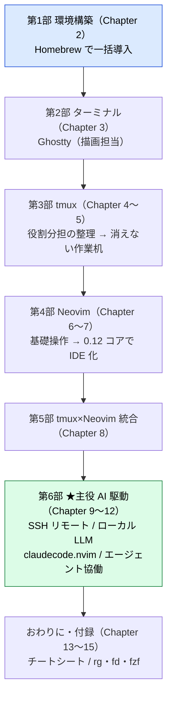

この本は、**Mac（Apple Silicon）で Neovim を「AI 駆動開発時代の統合開発環境（IDE）」として組む**ための実践本です。まず Ghostty と tmux で土俵を整え、Neovim を 0.12 のコア機能で IDE 化し、最後に **AI エージェントを Neovim に繋いで協働する**（クラウドの Claude Code から、自前のローカル LLM まで）ところまでを一本道で扱います。Neovim の基礎はさっと素振りする程度に留め、深掘りは併読書に譲ります（本書の主役は AI 連携です）。

## この本でやること

踏み込む題材は、次の 3 つです。

- **AI を Neovim から使います**（codecompanion / Claude Code 等）— クラウドのエージェントから、**自前のローカル LLM（localllm / Ollama）まで**つなぎます。
- **SSH 越しに、サーバ上を直接編集してヘッドレスで自走させます。**
- **tmux でエージェントに「目と手」を与えて協働します。**

クラウド LLM の利用も当然想定のうちです。そのうえで本書が他にないのは、エディタ（Neovim）・ターミナル（tmux）・サーバ接続（SSH）に加えて、**ローカル LLM の構築・接続・自走まで一本道で扱う**点です。

## 全体構成 — 何を、どの順で組むか

- **第1部（環境準備 / Chapter 2）:**
  必要なツール（Ghostty / tmux / Neovim 0.12 / Nerd Font / 補助コマンド）を Homebrew で一括導入します。ここではインストールと確認のみに留めます。
- **第2〜3部（画面と端末 / Chapter 3〜5）:**
  描画担当の Ghostty と、作業空間を維持する tmux を扱います。tmux 本編の前に「ターミナルエミュレータと tmux は誰が何をしているのか」で両者の役割分担を整理してから進みます。
- **第4〜5部（IDE 化 / Chapter 6〜8）:**
  まず Neovim の基礎操作（モーダル編集）を素振りし、0.12 のコア機能をベースに IDE 化を進め、さらに tmux とシームレスに統合します。
- **第6部（AI 駆動 / Chapter 9〜12）:**
  SSH 越しのリモート編集、Ollama を使ったローカル LLM 接続、**Claude Code の Neovim IDE 統合（claudecode.nvim）**、tmux でのエージェント協働を構築します。クラウドの API だけでなく、**ローカル LLM まで自前で動かす**仕組みこそ、本書最大の差別化ポイントです。
- **おわりに・付録（Chapter 13〜15）:**
  巻末に、本書全体のキー操作をまとめた**チートシート（早見表）**と、単体でも強力な **rg / fd / fzf の使い方**を置いています。

## 一周すると、できるようになること

ゴールを先に見ておきましょう。本書を一周し終えるころには、次のことが自分の手でできるようになっています。

- **Neovim 0.12 をコア機能中心の IDE として使えます**
  TypeScript / Web 開発で、補完・定義ジャンプ・エラー表示・フォーマットがひととおり動きます。
- **tmux と Neovim をシームレスに行き来できます**
  `Ctrl+h/j/k/l` でペインとウィンドウを一体で移動でき、ターミナルを閉じても作業は消えません。
- **SSH 越しにリモート（localllm）上を直接編集できます**
  回線が切れても作業机はそのまま生き続け、つなぎ直せばすぐ続きから再開できます。
- **Neovim から自前のローカル LLM につなげます**
  Ollama にチャット・インライン生成・FIM 補完でつなぎ、tmux でエージェントと協働できます。クラウドの API はもちろん、**ローカル LLM まで自分で動かせる**のが本書の到達点です。

## 前提と方針

- **Neovim 0.12 を前提**にします。
  2026/03 の 0.12 で、プラグイン頼みだった機能（プラグイン管理・LSP・補完・シンタックス）が `vim.pack` / `vim.lsp.config()` などとしてコアに入りました。古い `lazy.nvim` + `nvim-cmp` 一式の記事とは作法が違うので注意してください（Before / After は [okamos「Neovim 0.12 でモダナイズ」](https://zenn.dev/okamos/articles/d99fd14c53fbb8) が分かりやすいです）。
- **配布ディストリ（LazyVim / NvChad 等）は使いません。**
  [kickstart.nvim](https://github.com/nvim-lua/kickstart.nvim) を起点に、**中身を理解しながら少しずつ育てていきます**。
- 各章末に **アンインストール手順** を添えているので、いつでも環境を戻せます。
- **対象読者**:
  - ターミナルに抵抗がなく、**AI（クラウド／ローカル）を Neovim に組み込みたい人**
  - とりわけ **ローカル LLM まで自前で組みたい人**
  - 基礎の要点は本書でも触れますので、Vim 経験は不問です。

## 併読書（本書が扱わないこと）

Neovim の入門書・編集技術書はすでに優れたものがあります。基礎を深く知りたいときは、次を併読してください。

- **Neovim の基礎と設定を網羅的に** → kawarimidoll『[Neovimをはじめよう feat. mini.nvim](https://zenn.dev/kawarimidoll/books/6064bf6f193b51)』（無料・全 53 章）。プラグイン群 mini.nvim を軸にした濃い入門。
- **モーダル編集の技術そのもの** → [Drew Neil『実践Vim（Practical Vim）「思考のスピードで編集しよう!」』](https://tatsu-zine.com/books/practical-vim?srsltid=AfmBOoo8BlPNHOwjamVK9PwtH-xl_bvYxo7NitG_40XGngRJuXNY815l) など。
