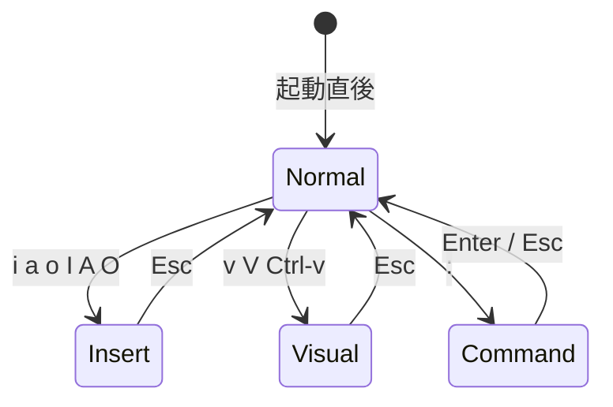
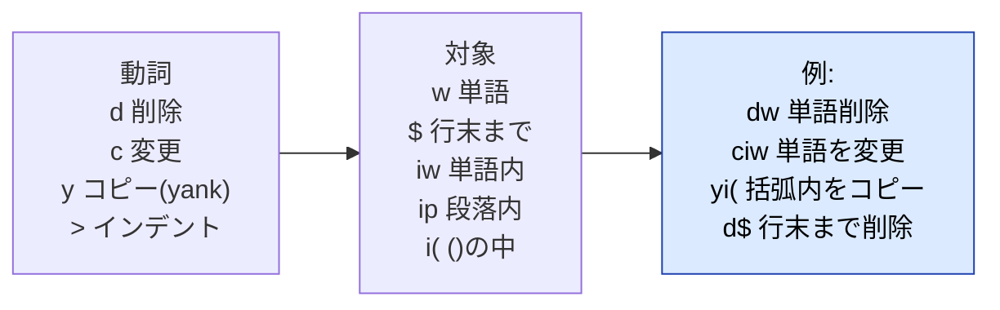

:::message
**この章でできるようになること**
Normal / Insert / Visual / Command の 4 モードを行き来し、移動・編集・コピペ・検索置換・ウィンドウ分割・ファイル操作を **マウスなしで** 一通り回せるようになります。
:::

:::message
**前提**: setup 章で Neovim 0.12 を導入済みであること。
:::

VS Code 出身者がまずつまずくのは「キーが全部コマンドになる」感覚です。ここは理屈より **素振り**。`nvim` で適当なファイルを開いて、実際に打ちながら読んでみてください。

:::message
Neovim には対話型チュートリアルが同梱されています。**最初の 30 分はこれが最短**です。

```bash
nvim +Tutor
```

**日本語版もランタイムに同梱**されています（追加インストール不要）。英語がつらければこちらからどうぞ。

```bash
nvim -c "Tutor ja/vim-01-beginner"   # 日本語・第1章
nvim -c "Tutor ja/vim-02-beginner"   # 日本語・第2章
```

Neovim 内からは `:Tutor ja/vim-01-beginner`。`:Tutor ` まで打って `<Tab>` を押すと候補が補完されます。よく使うなら `alias vimtutor-ja='nvim -c "Tutor ja/vim-01-beginner"'` を `~/.zshrc` に入れておくと楽です。
:::

## モードの行き来（最重要）



| やりたいこと              | キー                                  | モード遷移       |
| ------------------------- | ------------------------------------- | ---------------- |
| 文字を打ち始める          | `i`（カーソル前） / `a`（カーソル後） | Normal → Insert  |
| 行頭 / 行末から打つ       | `I` / `A`                             | Normal → Insert  |
| 下 / 上に空行を開いて打つ | `o` / `O`                             | Normal → Insert  |
| 打つのをやめる            | `Esc`（または `Ctrl-[`）              | Insert → Normal  |
| コマンドを打つ            | `:`                                   | Normal → Command |

:::message alert
**困ったら `Esc` を連打して Normal に戻りましょう。** Normal が「司令塔」で、すべての操作の起点です。VS Code 感覚で常に文字入力できると思っていると迷子になります。「まず Normal に戻る」を体に入れてください。
:::

## 移動（Normal モード）

| キー                  | 動き                                                       |
| --------------------- | ---------------------------------------------------------- |
| `h` `j` `k` `l`       | 左・下・上・右（矢印キーでも動きますが指を慣らしましょう） |
| `w` / `b`             | 次の単語の先頭へ / 前の単語の先頭へ                        |
| `e`                   | 単語の末尾へ                                               |
| `0` / `$`             | 行頭 / 行末                                                |
| `^`                   | 行の最初の非空白文字へ                                     |
| `gg` / `G`            | ファイル先頭 / 末尾                                        |
| `{` / `}`             | 段落単位で上 / 下                                          |
| `Ctrl-u` / `Ctrl-d`   | 半画面 上 / 下スクロール                                   |
| `f<文字>` / `t<文字>` | 行内でその文字へ / その手前へ                              |
| `%`                   | 対応する括弧へジャンプ                                     |

数字と組み合わせると倍速になります。`5j` で 5 行下、`3w` で 3 単語先です。**相対行番号（`relativenumber`）** を入れておくと、左の数字を見て `5j` がそのまま打てて便利です（お好みで `init.lua` に `vim.opt.relativenumber = true` を足してください）。

## 編集 — 「動詞 + 対象」の文法

Vim の編集は **動詞（operator）+ 対象（motion / text object）** の組み合わせです。これが分かると暗記量が一気に減ります。



| 操作                 | キー                         |
| -------------------- | ---------------------------- |
| 1 文字削除           | `x`                          |
| 単語削除             | `dw`                         |
| 行削除               | `dd`                         |
| 行末まで削除         | `D`（= `d$`）                |
| 単語を打ち直す       | `ciw`（change inner word）   |
| 括弧の中身を打ち直す | `ci(` / `ci"` / `ci{`        |
| 行コピー / 貼り付け  | `yy` → `p`（下） / `P`（上） |
| 取り消し / やり直し  | `u` / `Ctrl-r`               |
| 直前操作の繰り返し   | `.`（ドット。これが強力）    |

:::message
`ciw`（単語を打ち直す）、`ci"`（文字列の中身を打ち直す）、`.`（繰り返し）の 3 つを覚えるだけで、編集速度が体感で変わります。まずはこの 3 つを素振りしてみましょう。
:::

## Visual モード（範囲選択）

| キー     | 選択           |
| -------- | -------------- |
| `v`      | 文字単位       |
| `V`      | 行単位         |
| `Ctrl-v` | 矩形（列単位） |

選択してから動詞を打ちます。`V` で行選択 → `d` で削除、`y` でコピー、`>` でインデント。`Ctrl-v` で複数行を矩形選択 → `I` で先頭に一括挿入（手動コメントアウト等に便利）です。

## コメントアウト

VS Code の `Cmd+/` に当たる **コメント切り替えはコア標準**（Neovim 0.10 以降）です。プラグインは要りません。`gc` は `d` / `y` と同じ **オペレータ** なので、対象と組み合わせて使います。

| やりたいこと     | キー                                                         | VS Code 相当       |
| ---------------- | ------------------------------------------------------------ | ------------------ |
| 現在行をトグル   | `gcc`                                                        | `Cmd+/`            |
| 選択範囲をトグル | Visual で選んで `gc`                                         | 範囲選択 + `Cmd+/` |
| 範囲指定         | `gc` + 対象（`gcip` 段落 / `gc3j` 下 3 行 / `gcG` 末尾まで） | —                  |
| ブロックコメント | `gbc`（行） / `gb` + 対象                                    | `/* */` 系         |

コメント記号は filetype ごとに自動判定（`commentstring`）されるので、`.ts` は `//`、`.html` は `<!-- -->`、CSS は `/* */` と勝手に切り替わります。

:::message
VS Code の指の癖のまま **`Ctrl+/` 一発**にしたい場合は、`init.lua` にキーマップを足します（ターミナル内では `Cmd+/` は Neovim に届かないため、`Ctrl+/` に割り当てます）。
:::

## 検索・置換

| 操作                 | キー            |
| -------------------- | --------------- |
| 前方検索             | `/語` → `Enter` |
| 後方検索             | `?語`           |
| 次 / 前のマッチ      | `n` / `N`       |
| カーソル下の語を検索 | `*`             |
| ファイル全体を置換   | `:%s/旧/新/g`   |
| 確認しながら置換     | `:%s/旧/新/gc`  |

検索後のハイライトが残って気になるときは `:nohlsearch`（短く `:noh`）で消えます。`<Esc>` にこれを割り当てておくと、`Esc` 一発で消せて快適です（お好みで）。

## ウィンドウ（画面分割）とバッファ

VS Code の「エディタグループ」に相当します。

| 操作              | キー                                             |
| ----------------- | ------------------------------------------------ |
| 縦分割 / 横分割   | `:vsplit`（`Ctrl-w v`） / `:split`（`Ctrl-w s`） |
| 分割間を移動      | `Ctrl-w h/j/k/l`                                 |
| 分割を閉じる      | `Ctrl-w q`                                       |
| 次 / 前のバッファ | `:bnext` / `:bprevious`                          |
| バッファ一覧      | `:ls`                                            |

:::message
`Ctrl-w h/j/k/l` でのペイン移動は、tmux と組み合わせると **tmux のペインへもシームレスに** 拡張できます。その設定は neovim-tmux 章で扱います。
:::

## ファイル操作とコマンド

| 操作                               | コマンド                         |
| ---------------------------------- | -------------------------------- |
| 保存                               | `:w`                             |
| 終了 / 保存して終了 / 破棄して終了 | `:q` / `:wq` / `:q!`             |
| 別ファイルを開く                   | `:e パス`                        |
| 標準ファイラを開く                 | `:Ex`（netrw）                   |
| ヘルプ                             | `:help 語`（例 `:help vim.lsp`） |

## 素振りメニュー（この章のゴール）

以下を **マウスを触らず** にできれば、次章へ進んで大丈夫です。

1. `nvim +Tutor` を一周する（日本語がよければ `nvim -c "Tutor ja/vim-01-beginner"`）
2. 適当な `.ts` を開き、`ciw` で変数名を打ち直す
3. `gcc` で 1 行、`V` で数行選んで `gc` でまとめてコメントアウト → もう一度で解除
4. `V` で数行選択して `>` でインデント、`u` で戻す
5. `:%s/foo/bar/gc` で確認しながら置換する
6. `:vsplit` で 2 画面にし、`Ctrl-w l/h` で行き来する

## ここまでの到達点

モーダル編集の文法（動詞 + 対象）、移動・編集・検索置換・分割が一通り回せる状態になりました。ここから先は「素の Vim」を「IDE」に育てていきます。
