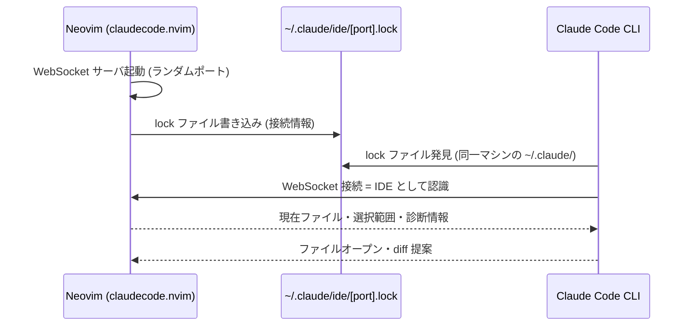
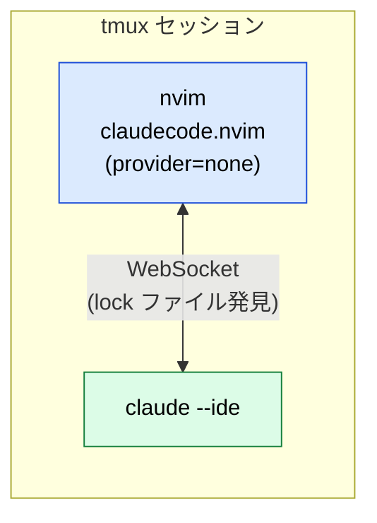

# Neovim ⇄ Claude Code — claudecode.nvim で「公式にない IDE 統合」を組む

:::message
**この章でできるようになること**
Neovim の中から **Claude Code** を起動し、いま見ているファイル・選択範囲が自動で Claude に共有され、
Claude の提案が **エディタ内の diff** で返ってくる——公式が VS Code / JetBrains にしか提供していない
IDE 統合を、[claudecode.nvim](https://github.com/coder/claudecode.nvim) で Neovim に持ち込みます。
:::

:::message
**前提**: [neovim-ide 章](neovim-ide.md) で IDE 化済み。[Claude Code CLI](https://docs.anthropic.com/ja/docs/claude-code) が
導入・ログイン済みであること (`claude doctor` で確認できます)。
前章の [neovim-llm](neovim-llm.md) (ローカル LLM 連携) とは**併存**できます。むしろ併存が本書の狙いです。
:::


## 位置づけ — 前章のローカル LLM と何が違うか

前章で組んだ codecompanion / minuet は「**自前のローカル LLM** をエディタに繋ぐ」話でした。
本章は「**クラウドのエージェント (Claude Code)** をエディタに統合する」話です。intro で予告した
「クラウドの Claude Code から、自前のローカル LLM まで」の**クラウド側の口**がここで埋まります。

| 観点         | 前章 (codecompanion / minuet)        | 本章 (claudecode.nvim)           |
| ------------ | ------------------------------------ | -------------------------------- |
| 頭脳         | localllm (Ollama)                    | クラウド (Anthropic)             |
| 得意         | チャット・FIM 補完・機密コードの相談 | 設計・多ファイル編集・自律タスク |
| コードの扱い | LAN の外に出ない                     | **クラウドに送られる**           |
| コスト       | ¥0 (電気代のみ)                      | サブスクリプション / API 課金    |

:::message alert
**Claude Code に送ったコードはクラウドに出ます。** 機密リポジトリはローカル LLM (前章)、
本気の設計・多ファイル編集は Claude Code、と**リポジトリとタスクで使い分ける**のが本書の運用です。
:::

## 仕組み — なぜ「同じマシン」がキーになるか

claudecode.nvim は、公式 VS Code 拡張の通信を**リバースエンジニアリング**して作られた純 Lua 実装です
(依存ゼロ、プロトコルは [PROTOCOL.md](https://github.com/coder/claudecode.nvim/blob/main/PROTOCOL.md) として全文書化されています)。
Neovim 側が WebSocket サーバ (MCP の WebSocket 変種) を立て、Claude Code CLI が**接続しに来ます**。



発見機構が **`~/.claude/ide/` の lock ファイル**なので、**nvim と claude は同じマシンで動いている必要があります**。
手元の Mac で完結させるなら両方手元に、[remote-dev 章](remote-dev.md) のように SSH 越しにサーバ上で
開発しているなら **nvim も claude もサーバ側に**置きます (設定は同じものが両方で使えます)。

## ステップ 1: プラグイン導入

`init.lua` の `vim.pack.add` に足します:

```lua
vim.pack.add({
  -- 任意: ターミナル UI 強化 (フロート表示等)。無くても native provider で動く
  { src = "https://github.com/folke/snacks.nvim" },
  { src = "https://github.com/coder/claudecode.nvim" },
})
```

:::message
公式 README のインストール例は lazy.nvim 形式 (`config = true` / `keys`) で書かれています。
本書の `vim.pack` では **`setup()` とキーマップを自分で書きます** (以下)。
:::

## ステップ 2: setup

```lua
require("claudecode").setup({
  -- terminal_cmd = "/path/to/claude",  -- which claude が PATH 外を指す場合のみ (トラブルシュート参照)
  git_repo_cwd = true,   -- git root を作業ディレクトリに固定
  terminal = {
    split_side = "right",
    split_width_percentage = 0.35,
    provider = "auto",   -- snacks があれば snacks、無ければ native
  },
  diff_opts = {
    layout = "vertical",
  },
})
```

:::message
Homebrew (`brew install --cask claude-code`) や npm グローバルで入れた claude は PATH 上にあるので、
`terminal_cmd` の指定は不要です (実機確認済み)。`claude migrate-installer` で `~/.claude/local/` に
移した場合や、ネイティブバイナリ導入の場合だけ、`which claude` の実パスを指定します
(**シェルの alias は Neovim に届かない**ため)。
:::

## ステップ 3: キーマップ — 前章との衝突回避

公式 README の推奨は `<leader>a*` ですが、**`<leader>aa` / `<leader>ac` は前章で codecompanion に
割当済み**です。本章では Claude Code 系を **`<leader>c*`** に寄せて共存させます。

```lua
local map = vim.keymap.set
map("n", "<leader>cc", "<cmd>ClaudeCode<cr>",            { desc = "Claude トグル" })
map("n", "<leader>cf", "<cmd>ClaudeCodeFocus<cr>",       { desc = "Claude フォーカス" })
map("n", "<leader>cr", "<cmd>ClaudeCode --resume<cr>",   { desc = "Claude 再開" })
map("n", "<leader>cm", "<cmd>ClaudeCodeSelectModel<cr>", { desc = "Claude モデル選択" })
map("n", "<leader>cb", "<cmd>ClaudeCodeAdd %<cr>",       { desc = "バッファを Claude へ" })
map("v", "<leader>cs", "<cmd>ClaudeCodeSend<cr>",        { desc = "選択を Claude へ" })
map("n", "<leader>cy", "<cmd>ClaudeCodeDiffAccept<cr>",  { desc = "diff 承認" })
map("n", "<leader>cn", "<cmd>ClaudeCodeDiffDeny<cr>",    { desc = "diff 却下" })
-- ファイルツリー上でファイルをコンテキストへ
vim.api.nvim_create_autocmd("FileType", {
  pattern = { "oil", "netrw", "NvimTree", "neo-tree", "minifiles" },
  callback = function(ev)
    map("n", "<leader>cs", "<cmd>ClaudeCodeTreeAdd<cr>", { buffer = ev.buf, desc = "ファイルを Claude へ" })
  end,
})
```

:::message alert
**diff 承認を `<leader>ca` にしてはいけません** (README 推奨の `<leader>aa` を `c*` に写すと `ca` になりがちです)。
本書の構成では LspAttach で **`<leader>ca` → `vim.lsp.buf.code_action` をバッファローカル**に張っており、
バッファローカルはグローバルより優先されるため、**LSP が付いたバッファでは diff 承認が発火しません** (実機で発覚)。
承認/却下は `<leader>cy` / `<leader>cn` (yes / no) に逃がします。`:verbose nmap <leader>cy` で
奪い合いの有無を確認できます。なお `:w` / `:q` でも承認/却下できるので、迷ったらそちらが確実です。
:::

:::message
使い分けの覚え方: **`<leader>a*` = ローカル LLM (¥0・軽い相談と FIM)、`<leader>c*` = Claude Code
(本気の設計・多ファイル編集)**。エディタは 1 つ、頭脳を 2 系統持つ構成です。
:::

## 使い方

1. `<leader>cc` で右スプリットに Claude Code が開きます (この時点で IDE 接続済み)
2. カーソル位置・Visual 選択は**自動で** Claude に共有されます (selection tracking)
3. Claude が編集を提案すると **Neovim ネイティブの diff ビュー**が開きます
   - 承認: `:w` または `<leader>cy` / 却下: `:q` または `<leader>cn`
   - **承認前に提案側バッファを直接編集してから確定してもかまいません**。提案を叩き台に自分で直して `:w`、が最速です

:::message
コンテキストは能動的に絞れます。`:ClaudeCodeAdd <file> [開始行] [終了行]` で行範囲まで指定できるので、
リポジトリ全体を舐めさせるより関連ファイルだけ載せる方が速く正確です。
:::

:::message alert
**auto-save 系プラグインを使っている場合は要対策です。** diff バッファ (`buftype=acwrite`) が開いた瞬間に
自動保存され、**提案が問答無用で承認されます**。公式 README の「Auto-Save Plugin Issues」節にある
除外 condition (バッファ名 `(proposed)` / `vim.b[buf].claudecode_diff_*` / `acwrite` の除外) を auto-save 側に入れてください。
:::

## tmux 派の形 — provider "none" で次章に接続する

「Claude は tmux の隣ペインで大きく開きたい」場合は、Neovim 内ターミナルを使わず
**WebSocket サーバだけ**動かす構成にできます:

```lua
require("claudecode").setup({
  terminal = { provider = "none" },  -- UI は作らない。サーバと IDE 連携は生きる
})
```

```bash
# tmux: 左ペイン nvim / 右ペイン claude
nvim               # 左: WebSocket サーバが起動して待ち受け
claude --ide       # 右: 起動時に IDE へ自動接続 (または起動後に /ide で選択)
```



この形なら SSH が切れても tmux ごと生存し、nvim ⇄ claude の IDE 接続も維持されます。
[agent-pair 章](agent-pair.md) の「エージェントを隣のペインに置く」構成 (B 層) に、
**IDE 接続という背骨が 1 本通った**形と捉えてください。

:::message
**OpenCode などエディタ外の CLI エージェントは本章の対象外です。** それらは agent-pair 章の
「tmux ペインの CLI」として扱う領分で、ローカル LLM に直結したエージェント運用
(OpenCode / A2A / Routing) は姉妹本 [`local-llm-on-mac`](https://github.com/shuji-bonji/local-llm-on-mac) が本籍です。
本章はあくまで「**Neovim の IDE として統合できるもの**」= claudecode.nvim に絞ります。
:::

## トラブルシュート

| 症状                                      | 原因と対処                                                                                                                                                                            |
| ----------------------------------------- | ------------------------------------------------------------------------------------------------------------------------------------------------------------------------------------- |
| claude が IDE を認識しない                | `:ClaudeCodeStatus` でサーバ確認 → `ls ~/.claude/ide/` に lock があるか (`$CLAUDE_CONFIG_DIR` 設定時はそちらの `ide/`)                                                                |
| `/ide` に Neovim が出ない                 | nvim と claude が**別マシン**で動いている。同一マシンに揃える                                                                                                                         |
| nvim 内ターミナルで claude が見つからない | シェル alias は nvim に届かない。`terminal_cmd` に `which claude` の実パス                                                                                                            |
| ターミナル表示が乱れる                    | `provider = "native"` に切替 (snacks 起因の切り分け)                                                                                                                                  |
| diff が勝手に承認される                   | auto-save プラグイン (上記 alert)。除外 condition を追加                                                                                                                              |
| diff 承認キーが効かない (却下は効く)      | 承認キーがバッファローカルマップに奪われている (上記 alert)。`:verbose nmap` で確認。`:w` なら常に通る                                                                                |
| SSH 先で `claude doctor` が Keychain 警告 | SSH セッションではログインキーチェーンがロックされ資格情報の**新規保存**のみ失敗。ログイン済みなら実害なし。必要なら `security unlock-keychain ~/Library/Keychains/login.keychain-db` |
| 詳細ログが見たい                          | `log_level = "debug"` を opts に                                                                                                                                                      |

## ここまでの到達点

- Neovim が Claude Code の **公式相当の IDE** になりました (選択共有・エディタ内 diff・コンテキスト管理)
- 前章のローカル LLM (`<leader>a*`) と Claude Code (`<leader>c*`) が 1 つのエディタに同居しました
- provider "none" + tmux で、次章のエージェント協働に IDE 接続を持ち込む準備ができました

これで intro の予告 ——「クラウドの Claude Code から、自前のローカル LLM まで」—— が両輪とも揃いました。
次章では、この作業机 (tmux) にエージェントを並べて協働させます。

## アンインストール手順

```bash
# init.lua から削除:
#   - vim.pack.add の claudecode.nvim (snacks.nvim を他で使っていなければそれも)
#   - require("claudecode").setup ブロックと <leader>c* キーマップ
# プラグイン本体は neovim-ide のリセット (~/.local/share/nvim) で消える

# 残骸の lock ファイル (nvim 終了時に消えるが、異常終了で残った場合)
rm -f ~/.claude/ide/*.lock
# Claude Code CLI 本体には何も足していないので変更不要
```
