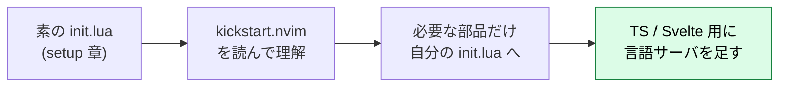
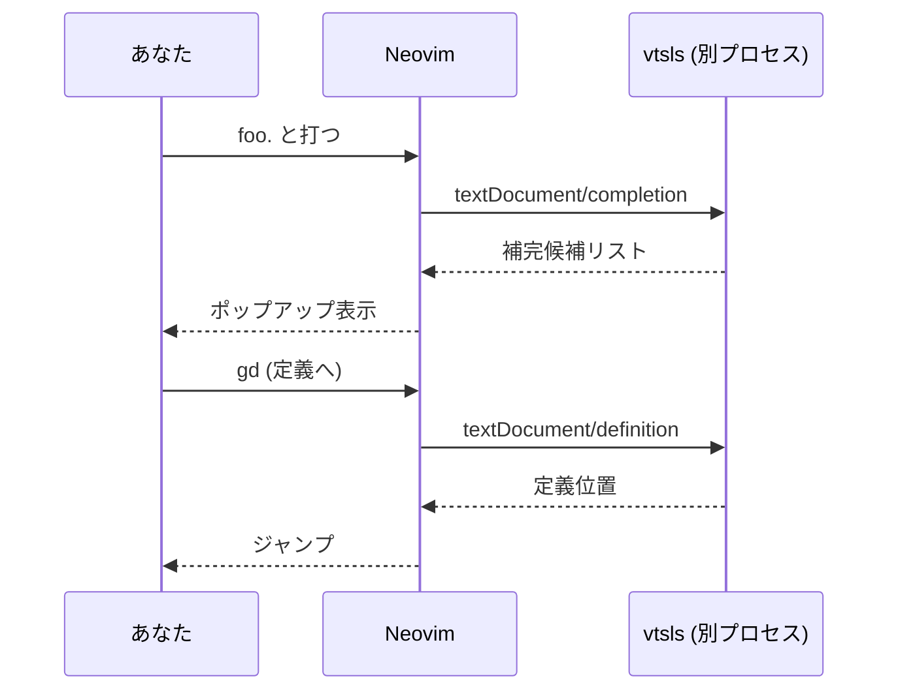

# 開発環境の構築 — kickstart.nvim 流で IDE 化する

:::message
**この章でできるようになること**
Neovim 0.12 を **TypeScript / Web 開発の実用 IDE** にします。
LSP (補完・定義ジャンプ・エラー表示)、ファジー検索、ファイラ、Git 差分、フォーマッタを、
**中身を理解しながら** 段階的に積み上げられるようになります。
:::

:::message
**前提**: setup 章で Neovim 0.12 / `node` / `ripgrep` / `fd` を導入済み。
モーダル編集（`hjkl`・`i`/`Esc` 等）の基礎は **前章「Neovim 基本操作」** で素振り済みとします（不安なら戻って復習してください）。
:::

## 方針: ディストリではなく kickstart.nvim を起点にする

LazyVim や NvChad は「完成品 IDE」なので手早く使えますが、その分 **中身がブラックボックス** になりやすいのが難点です。
本プロジェクトは「原理 → 設計 → 実装の循環を閉じる」方針 ([`https://github.com/shuji-bonji/ai-agent-architecture/discussions/80`](https://github.com/shuji-bonji/ai-agent-architecture/discussions/80)) を掲げているので、
ここでは **[kickstart.nvim](https://github.com/nvim-lua/kickstart.nvim)** を出発点に選んでみましょう。

kickstart.nvim は「設定の出発点」というコンセプトどおり、読めば「何がどう IDE を構成しているか」が分かる単一ファイルの教育用テンプレートです。（プラグイン管理には lazy.nvim を使っています）
本書はこの「読んで理解する」流儀を受け継ぎつつ、プラグイン管理だけは 0.12 コアの vim.pack に置き換えて組み直します。



:::message
本章は **「kickstart を丸ごとコピーして使う」のではなく、構成要素を理解して自分の `init.lua` に積む」** 方式で進めます。
まるごと試したい場合は下記「付録: kickstart をそのまま使う」を参照してください。
:::

## 0.12 の前提を再確認

「はじめに」で見たとおり、0.12 では多くの機能がコアに取り込まれました。
そのため、**旧来の `require('lspconfig').xxx.setup{}` 流の記事はそのまま使えません**。
まずはここを押さえておきましょう。

| やること       | 0.12 のコア API                                 |
| -------------- | ----------------------------------------------- |
| プラグイン導入 | `vim.pack.add{ ... }`                           |
| LSP 設定       | `vim.lsp.config('名', { ... })`                 |
| LSP 有効化     | `vim.lsp.enable('名')`                          |
| 補完を出す     | `vim.lsp.completion.enable(...)` (LspAttach 時) |
| ハイライト     | コア同梱パーサ (主要言語は素で色付き)           |

## ステップ 1: init.lua の冒頭でリーダーキーを決める

本書のキーマップは `<leader>`（リーダーキー）を多用します。

**`<leader>` とは**、自分用ショートカットの「接頭キー」です。
たとえば `<leader>ff` は「**リーダーキーを押してから `f`・`f`**」という意味です。
よく使う操作を `<leader>` 始まりにまとめておくと、Vim の既存キーと衝突せず、覚えやすくなります。

Neovim の既定のリーダーキーは `\`（バックスラッシュ）です。Space ではありません。
ただ押しやすさから **`Space` に変えるのが定番**で（kickstart や各種ディストリも Space）、本書も Space にします。
リーダーキーは **プラグイン読み込みやキーマップ定義より前に決める必要がある** ので、`init.lua` の **先頭** に置きます。

```lua
-- ~/.config/nvim/init.lua の先頭（他のどの設定より前に置く）
vim.g.mapleader = " "        -- <leader> を Space に
vim.g.maplocalleader = " "   -- ファイルタイプ別の <localleader> も Space に

-- 最小キーマップ（チートシートで使う基本操作）
local map = vim.keymap.set
map("n", "<leader>w", "<cmd>w<cr>",      { desc = "保存" })
map("n", "<leader>q", "<cmd>q<cr>",      { desc = "閉じる" })
map("n", "<Esc>", "<cmd>nohlsearch<cr>", { desc = "検索ハイライト消し" })
-- VS Code 風コメントトグル（端末により <C-/> が <C-_> で届くため両方割当）
map("n", "<C-/>", "gcc", { remap = true, desc = "コメントトグル" })
map("n", "<C-_>", "gcc", { remap = true })
map("x", "<C-/>", "gc",  { remap = true, desc = "コメントトグル" })
map("x", "<C-_>", "gc",  { remap = true })
```

これで本書の `<leader>ff` は「**Space → f → f**」になります。以降のキーマップはすべてこの前提です。

## ステップ 2: プラグインを vim.pack で入れる

まずは `init.lua` に追記していきます。
`vim.pack.add` は **GitHub の URL を渡すだけ** でクローンから管理までこなしてくれます。

```lua
-- ~/.config/nvim/init.lua の末尾に追記

vim.pack.add({
  -- LSP / ツールの導入係
  { src = "https://github.com/mason-org/mason.nvim" },
  -- ファジー検索
  { src = "https://github.com/nvim-lua/plenary.nvim" },        -- telescope 依存
  { src = "https://github.com/nvim-telescope/telescope.nvim" },
  -- ファイラ
  { src = "https://github.com/nvim-neo-tree/neo-tree.nvim" },
  { src = "https://github.com/MunifTanjim/nui.nvim" },          -- neo-tree 依存
  { src = "https://github.com/nvim-tree/nvim-web-devicons" },   -- アイコン
  -- Git 差分表示
  { src = "https://github.com/lewis6991/gitsigns.nvim" },
  -- フォーマッタ
  { src = "https://github.com/stevearc/conform.nvim" },
  -- 配色 (truecolor を活かす / 好みで差し替え可)
  -- name を明示している (リポジトリ名が汎用的な "nvim" のため。理由は下の :::message)
  { src = "https://github.com/catppuccin/nvim", name = "catppuccin" },
})
```

:::message
**catppuccin だけ `name` を付けている理由。** `vim.pack` は `name` を省略すると、**URL の末尾をそのままプラグイン名（＝インストール先ディレクトリ名）** にします。
catppuccin はリポジトリが `catppuccin/nvim` なので、そのままだと名前が汎用的な「`nvim`」になってしまい、紛らわしく、将来 `org/nvim` 形式の別リポジトリを足したときに**名前が衝突**します。
そこで `name = "catppuccin"` を明示しています（他のプラグインは末尾がそのまま固有名なので不要）。
なお `name` は**インストール先の識別名**であって、配色名 `catppuccin-mocha` 自体はプラグインが登録するので、`name` の有無に関わらず効きます。
:::

保存して `nvim` を再起動すると、初回に自動でクローンされます。
更新は `:lua vim.pack.update()` で行い、状態確認も `:lua vim.pack.update()` の差分プレビューで確認できます。

:::message
`vim.pack` は lockfile を持ち、**マシン間で同じプラグインバージョンを再現** できます。
旧来の `lazy.nvim` 相当の遅延ロードまでは持ちませんが、教育用途・LAN 内開発では十分です。
:::

続いて、配色を適用します。
ここで指定する `catppuccin-mocha` は、**ステップ2の `vim.pack.add` で入れた catppuccin プラグインが提供する配色**です。「プラグインを入れる → そのプラグインの配色を `colorscheme` で有効化する」という流れになります。入れていない配色名は指定できません。

```lua
vim.cmd.colorscheme("catppuccin-mocha")
```

:::message
配色は完全に好みなので、上の plugin 行と `colorscheme` 名を差し替えるだけで乗り換えられます。
truecolor 前提の候補:

| テーマ          | plugin (`src`)              | `colorscheme` 名   |
| --------------- | --------------------------- | ------------------ |
| catppuccin      | `catppuccin/nvim`           | `catppuccin-mocha` |
| moonfly         | `bluz71/vim-moonfly-colors` | `moonfly`          |
| tender          | `jacoborus/tender.vim`      | `tender`           |
| xcode (dark HC) | `arzg/vim-colors-xcode`     | `xcodedarkhc`      |

既定を **catppuccin-mocha** にしたのは、Treesitter / LSP 診断のハイライト網羅が最も厚く、
この章で入れる LSP・補完の見栄えを一番確認しやすいためです。moonfly / tender / xcodedarkhc は
元が VimScript 配色で網羅はやや落ちますが、`termguicolors` 前提でそのまま使えます。
プラグインを足さず **Neovim 標準** で済ませるなら `vim.cmd.colorscheme("habamax")` でもよいでしょう。
:::

## ステップ 3: LSP — 言語サーバを入れて繋ぐ

ここからが本番です。LSP は IDE の心臓にあたります。
**言語サーバは Neovim の外で動く別プロセス** として動きます。
まずはそれを入れていきましょう。

### 3-1. mason で言語サーバを導入

`mason.nvim` は、言語サーバやフォーマッタを **Neovim の中から導入できる** ツールです。

```lua
require("mason").setup()
```

再起動したら、コマンドで導入していきます (`:Mason` の UI からも操作できます)。

```vim
:Mason
```

`:Mason` の一覧で `i` を押して導入します。考え方は **「どのフレームワークでも共通のものを入れ、そのうえで自分が使うフレームワークの言語サーバだけ足す」** です。

**共通（TypeScript / Web 開発なら全員）**

| 言語サーバ / ツール | mason パッケージ名    | 役割                                                                |
| ------------------- | --------------------- | ------------------------------------------------------------------- |
| **vtsls**           | `vtsls`               | TypeScript / JavaScript。**JSX/TSX も担当**（React もこれでカバー） |
| lua_ls              | `lua-language-server` | Neovim 設定 (Lua) の補完                                            |
| eslint              | `eslint-lsp`          | Lint                                                                |
| **prettier**        | `prettier`            | フォーマッタ (conform から呼ぶ)                                     |

**フレームワーク別（自分が使うものだけ足す）**

| フレームワーク          | 追加で入れる言語サーバ                      | mason パッケージ名        |
| ----------------------- | ------------------------------------------- | ------------------------- |
| **React / 素の TS・JS** | **追加不要**（`vtsls` が JSX/TSX を見ます） | —                         |
| Svelte / SvelteKit      | svelte                                      | `svelte-language-server`  |
| Angular                 | angularls                                   | `angular-language-server` |
| Vue                     | Volar                                       | `vue-language-server`     |

:::message
**自分のスタックに読み替えてください。** このあとの 3-2 の設定例は、本書の筆者が使う **Svelte** を入れた形になっています。React なら svelte を足さず `vtsls` だけ、Angular なら `angularls`、Vue なら Volar、と上の表に従って自分の分に差し替えれば、そのまま進められます。
:::

:::message
TypeScript の言語サーバは `ts_ls` (= typescript-language-server) と `vtsls` の 2 択です。
2026 時点では **`vtsls` が推奨** です。`tsserver` を直接ラップしていて高速・高機能で、
Vue/Svelte 等のフレームワーク連携の前提にもなりやすいです。
モノレポ前提なら `ts_ls` も `tsconfig.json` を自動追従するので選択肢に残ります。
:::

### 3-2. vim.lsp.config / enable で繋ぐ

mason で **入れただけ** では、まだ繋がりません。0.12 のコア API で設定して有効化していきましょう。

```lua
-- 全 LSP 共通の capabilities (補完を有効化するため)
local caps = vim.lsp.protocol.make_client_capabilities()

-- TypeScript / JavaScript
vim.lsp.config("vtsls", {
  capabilities = caps,
  -- mason 導入版は PATH に入るので cmd 指定は不要なことが多い
})

-- Svelte（フレームワーク別の例。React は不要 / Angular は "angularls" / Vue は "volar" に読み替え）
vim.lsp.config("svelte", {
  capabilities = caps,
  filetypes = { "svelte" },
})

-- Lua (Neovim 設定編集用。vim グローバルを既知にする)
vim.lsp.config("lua_ls", {
  capabilities = caps,
  settings = { Lua = { diagnostics = { globals = { "vim" } } } },
})

-- 有効化 (これで対象ファイルを開くと自動起動する)
-- "svelte" は自分のフレームワークに差し替え (React なら "vtsls", "lua_ls" だけでOK)
vim.lsp.enable({ "vtsls", "svelte", "lua_ls" })
```

:::message
`vim.lsp.config('名', {...})` は **`nvim-lspconfig` が同梱する既定値にマージ** されます。
`nvim-lspconfig` を `vim.pack.add` に足しておくと、`root_markers` 等の定義済みプリセットが効いて楽です。
純粋にコアだけで完結させたい場合は `cmd` / `root_markers` / `filetypes` を自分で書きます。
:::

### 3-3. 補完とキーマップを LspAttach で有効化

LSP がファイルにアタッチした瞬間に、補完とキーマップを有効化するようにします。

```lua
vim.api.nvim_create_autocmd("LspAttach", {
  callback = function(args)
    local client = vim.lsp.get_client_by_id(args.data.client_id)
    local buf = args.buf
    local map = function(keys, fn, desc)
      vim.keymap.set("n", keys, fn, { buffer = buf, desc = desc })
    end

    -- 定義ジャンプ・参照・リネーム・コードアクション
    map("gd", vim.lsp.buf.definition, "定義へ")
    map("gr", vim.lsp.buf.references, "参照一覧")
    map("K",  vim.lsp.buf.hover, "ホバー情報")
    map("<leader>rn", vim.lsp.buf.rename, "リネーム")
    map("<leader>ca", vim.lsp.buf.code_action, "コードアクション")
    map("[d", function() vim.diagnostic.jump({ count = -1 }) end, "前の診断")
    map("]d", function() vim.diagnostic.jump({ count = 1 }) end, "次の診断")

    -- インサートモード補完をコア機能で有効化 (0.12)
    if client and client:supports_method("textDocument/completion") then
      vim.lsp.completion.enable(true, client.id, buf, { autotrigger = true })
    end
  end,
})
```

これで `.ts` を開くと **補完・定義ジャンプ・エラー表示・リネーム** が動くようになります。
VS Code でやっていたことの大半が、ここで揃いました。



## ステップ 4: ファジー検索 (telescope)

これは VS Code の `Cmd+p` や全文検索に相当する機能です。
setup 章で入れた `ripgrep` / `fd` がここで効いてきます。

```lua
local telescope = require("telescope.builtin")
vim.keymap.set("n", "<leader>ff", telescope.find_files, { desc = "ファイル検索" })
vim.keymap.set("n", "<leader>fg", telescope.live_grep,  { desc = "全文検索 (grep)" })
vim.keymap.set("n", "<leader>fb", telescope.buffers,    { desc = "バッファ一覧" })
vim.keymap.set("n", "<leader>fd", telescope.diagnostics,{ desc = "診断一覧" })
```

設定したキーの使い方は次のとおりです。

| キー         | 何が開くか                | VS Code 相当  |
| ------------ | ------------------------- | ------------- |
| `<leader>ff` | ファイル名で開く          | `Cmd+p`       |
| `<leader>fg` | プロジェクト全文検索      | `Cmd+Shift+f` |
| `<leader>fb` | 開いているバッファ一覧    | タブ一覧      |
| `<leader>fd` | 診断（エラー / 警告）一覧 | Problems      |

telescope のウィンドウが開いたら、**入力で絞り込み → `Ctrl-j` / `Ctrl-k` で候補を移動 → `Enter` で開く → `Esc` で閉じる**、が共通の操作です。

## ステップ 5: ファイラ (neo-tree)

```lua
require("neo-tree").setup({})
vim.keymap.set("n", "<leader>e", "<cmd>Neotree toggle<cr>", { desc = "ファイラ" })
```

`<leader>e` でファイラを開閉します。ファイラの中では次のように操作します。

- `j` / `k` で上下移動、`Enter` で開く
- `a` で新規作成（末尾を `/` にするとフォルダ）、`d` / `r` / `c` で削除 / リネーム / コピー
- `H` で隠しファイルの表示を切り替え

## ステップ 6: Git 差分 (gitsigns)

```lua
require("gitsigns").setup()
```

これで編集中のファイルの**行の左側に、追加・変更・削除を示す記号**が出るようになります。主な操作はコマンドで呼び出せます。

- `:Gitsigns preview_hunk` — カーソル位置の差分（hunk）をその場でプレビュー
- `:Gitsigns stage_hunk` / `:Gitsigns reset_hunk` — hunk 単位でステージ / 取り消し
- `:Gitsigns next_hunk` / `:Gitsigns prev_hunk` — 変更箇所を次 / 前へ移動

## ステップ 7: フォーマッタ (conform + prettier)

仕上げに、保存時に prettier で整形されるようにしておきましょう。

```lua
require("conform").setup({
  formatters_by_ft = {
    typescript = { "prettier" },
    javascript = { "prettier" },
    svelte     = { "prettier" },
    css        = { "prettier" },
    html       = { "prettier" },
    json       = { "prettier" },
    lua        = { "lua_ls" },
  },
  format_on_save = { timeout_ms = 2000, lsp_format = "fallback" },
})
```

これで TypeScript / Web 系のファイルを**保存するたびに prettier で自動整形**されます。手動で整形したいときは `:Conform format`（または `:lua require("conform").format()`）を使います。`format_on_save` の `lsp_format = "fallback"` は「prettier が設定されていなければ LSP の整形にフォールバックする」という意味です。

## 動作確認

```bash
cd ~/任意の TypeScript プロジェクト
nvim src/index.ts
```

- 入力中に **補完ポップアップ** が出る
- `gd` で **定義へジャンプ**、`K` で型情報、`gr` で参照一覧
- 型エラーが **赤波線** で出る (`]d` で次の診断へ)
- `<leader>ff` でファイル検索、`<leader>fg` で全文検索
- `<leader>e` でファイラ開閉
- 保存で **prettier 整形** が走る

最後に `:checkhealth` を通して、LSP / mason / telescope がすべて緑になっていれば IDE 化は完了です。お疲れさまでした。

## 言語別メモ

| スタック               | 言語サーバ                 | 補足                                                 |
| ---------------------- | -------------------------- | ---------------------------------------------------- |
| **TypeScript**         | `vtsls`                    | 第一選択。モノレポなら `ts_ls` も検討                |
| **Angular**            | `angularls` + `vtsls`      | テンプレート補完は angularls、TS 本体は vtsls の併用 |
| **Svelte / SvelteKit** | `svelteserver` + `vtsls`   | `.svelte` は svelteserver、`.ts` は vtsls            |
| **RxJS**               | (vtsls の型のみ)           | 専用 LSP はない。型補完で十分                        |
| **CSS / SCSS**         | `cssls` (mason: `css-lsp`) | 必要なら追加                                         |

## 付録: kickstart をそのまま使う

理解よりも先に「完成形を触ってみたい」という場合は、kickstart 一式を入れて挙動を眺めるのが手っ取り早いです。

```bash
mv ~/.config/nvim ~/.config/nvim.bak    # 既存を退避
git clone https://github.com/nvim-lua/kickstart.nvim ~/.config/nvim
nvim                                      # 初回起動でプラグインが入る
```

中の `init.lua` は **コメントが手厚い 1 ファイル** になっています。読みながら不要な部分を削り、
本章のように自分の構成へ移植していくのが王道です。元に戻したいときは `~/.config/nvim` を消して、退避したものを戻してください。

:::message
**L3 リンク機会メモ**: 「言語サーバ = Neovim 外の別プロセス、LSP プロトコルで会話」という分離は、
L3 (`ai-agent-architecture`) の **MCP Layer = エージェント外のツールを標準プロトコルで叩く** 設計と同型。
LSP ↔ MCP の構造的アナロジーは ZennBook の良い接続点。`zennbook-toc-memo.md` の L3/L4 リンク表に追記候補。
:::

## アンインストール手順 (フェーズ C 用)

```bash
# プラグイン本体と mason 導入物をまとめて消す (素の状態に戻る)
rm -rf ~/.local/share/nvim ~/.local/state/nvim ~/.cache/nvim
# init.lua をステップ 2 以降の追記前まで戻す (バックアップ推奨)
# mason で入れた言語サーバは ~/.local/share/nvim/mason 配下なので上記で消える
```

:::message
`vtsls` 等は mason 経由なら `~/.local/share/nvim/mason/` に隔離されています。
システムの `node` / `npm` グローバルは汚さないので、リセットが綺麗に効きます。
:::
