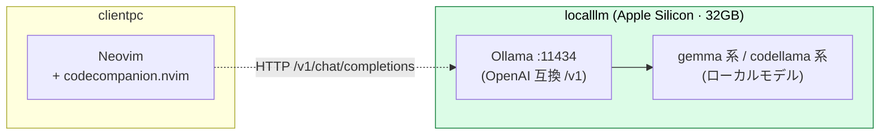
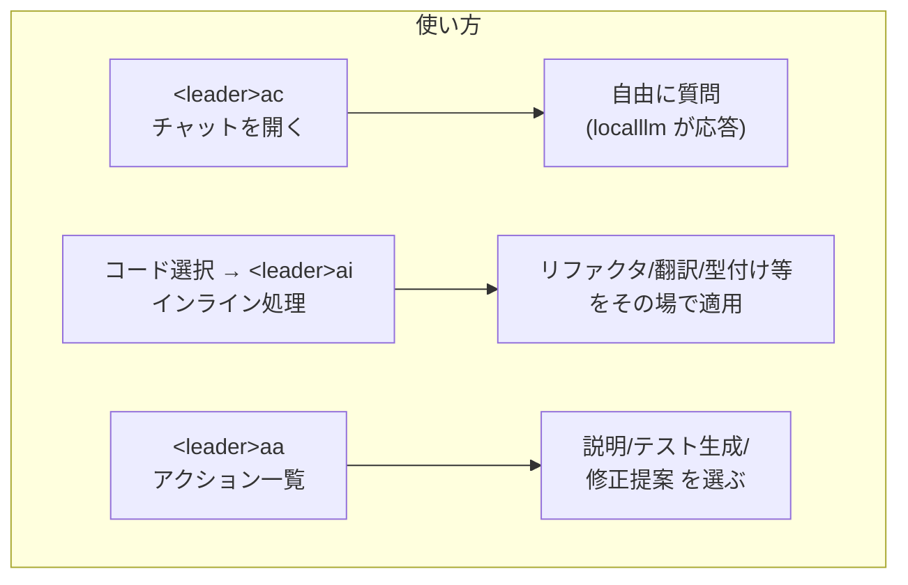
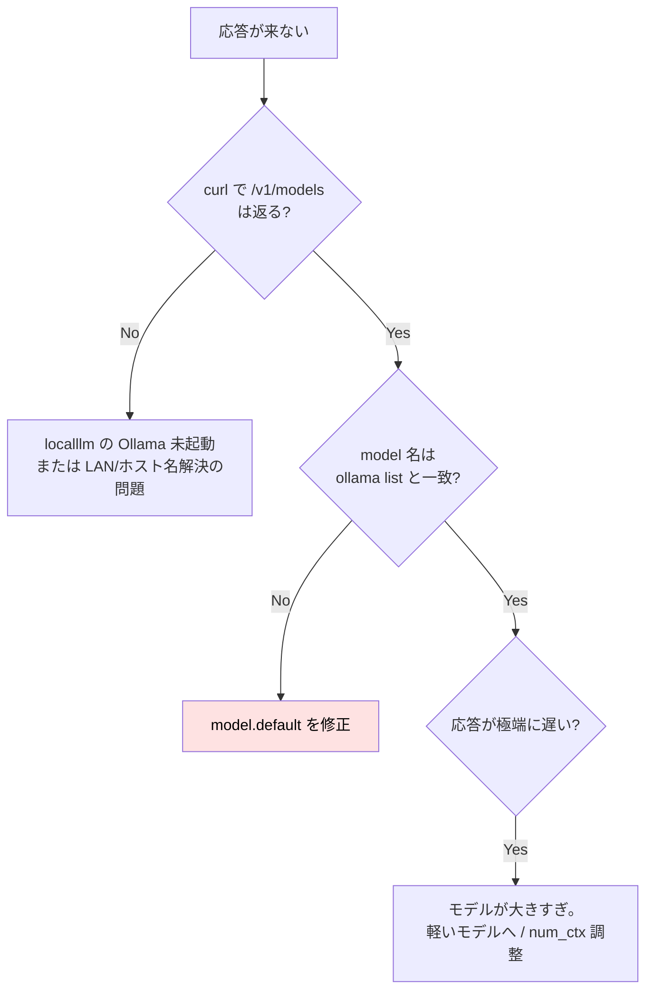

# Neovim から localllm を叩く — codecompanion.nvim でローカル LLM 連携

:::message
**この章でできるようになること**
Neovim に **codecompanion.nvim** を入れ、localllm (Ollama / OpenAI 互換 API) を
チャット・インラインコード生成・コードアクションとして使えるようになります。
まず **LAN 内で完結する AI 支援開発** 環境を組み、そのうえで **同じ codecompanion のまま
クラウド（Claude / OpenAI）も併用**できるようにします（→ §「クラウド（Anthropic / OpenAI）も併用する」）。
:::

:::message
**前提**: [neovim-ide 章](neovim-ide.md) で IDE 化済み。
localllm が稼働し、`http://localllm.local:11434` で Ollama API が叩けること
([`local-llm-on-mac`](https://github.com/shuji-bonji/local-llm-on-mac))。
:::

:::message alert
**ホスト名は `.local` まで書くこと**。`~/.ssh/config` の `Host localllm` という短い名前は **ssh / scp / rsync にしか効きません**。HTTP でアクセスする本章の URL (codecompanion / minuet / curl) は DNS・mDNS で名前を引くため、mDNS (Bonjour) の正式名 **`localllm.local`** か LAN の IP を書く必要があります。`http://localllm:11434` のように書くと名前解決に失敗します。
:::

## 全体像



VS Code の Copilot に相当する体験を、**クラウドではなく自分の localllm** で実現します。
コードが外に出ないので、業務リポジトリでも安心して使えます。

:::message
本章は **Neovim 単体で完結** させる構成です。VS Code など他のエディタでも同じ localllm を使えますが、ここではエディタに依存せず Neovim だけで AI 支援を組む一例として読んでみてください。
:::

## なぜ codecompanion.nvim か

Neovim の LLM プラグインは複数ありますが、本章では **codecompanion.nvim** を選びます。なぜこれなのか、まずは比較から見ていきましょう。

| プラグイン             | 特徴                                                                     | 本章での評価                      |
| ---------------------- | ------------------------------------------------------------------------ | --------------------------------- |
| **codecompanion.nvim** | アダプタ抽象で OpenAI 互換を素直に繋げる。チャット/インライン/アクション | **採用**。Ollama 連携の実績が厚い |
| avante.nvim            | Cursor 風の差分適用 UI                                                   | 派手だが設定が重め。好みで        |
| gen.nvim               | 最小・軽量                                                               | 機能は限定的                      |

codecompanion は **「OpenAI 互換エンドポイントを `extend` で差し替える」** だけで localllm に向けられます。
localllm の Ollama は `/v1/chat/completions` を OpenAI 互換で公開しているので、相性が非常に良いです。

## ステップ 1: プラグイン導入

まずは `init.lua` の `vim.pack.add` に足しましょう (依存の `plenary.nvim` は neovim-ide 章で導入済みです):

```lua
vim.pack.add({
  { src = "https://github.com/olimorris/codecompanion.nvim" },
  -- plenary.nvim は neovim-ide で導入済み
})
```

## ステップ 2: localllm を向くアダプタを定義

続いて、`http://localllm.local:11434` の Ollama に向く OpenAI 互換アダプタを作っていきましょう。

```lua
require("codecompanion").setup({
  adapters = {
    http = {                                   -- v19 で adapters.http にネストするようになった
      -- localllm 上の Ollama を OpenAI 互換アダプタとして定義
      localllm = function()
        return require("codecompanion.adapters").extend("openai_compatible", {
          env = {
            url = "http://localllm.local:11434",     -- localllm の Ollama。LAN の IP でも可
            api_key = "TERM",                  -- Ollama はキー不要。実在する環境変数 TERM をダミーに流用
            chat_url = "/v1/chat/completions",
          },
          schema = {
            -- localllm に pull 済みのモデル名に合わせる (例)
            model = { default = "gemma2:9b" },
          },
        })
      end,
    },
  },
  interactions = {                             -- 旧 strategies。v19 で改名
    chat   = { adapter = "localllm" },
    inline = { adapter = "localllm" },
    cmd    = { adapter = "localllm" },
  },
})
```

:::message
**codecompanion v19 で設定キーが変わりました**。アダプタは `adapters.http.*` の下にネストし、
ストラテジ指定は `strategies` → **`interactions`** に改名されました。
古い記事にある `adapters = { <name> = ... }` / `strategies = {...}` は旧 API なので注意してください。
手元のバージョンが古ければ、旧キーに読み替えてください (`:checkhealth codecompanion` で確認できます)。
:::

:::message
`api_key` は Ollama では不要ですが、フィールドは埋める必要があります。
存在しない名前 (`"ollama"` 等) を置くと extend 時に警告が出る版があるため、
**確実に存在する環境変数 `TERM` を「使わないがフィールドを埋める値」** として置くのが安全です。
:::

:::message
`model.default` は **localllm に実際に pull 済みのモデル名** に揃えましょう。
`ssh localllm 'ollama list'` で確認できます。本プロジェクトの方針上、
自律エージェント/コード生成用途では **中国・ロシア系モデル (Qwen / DeepSeek 等) は使いません**。
gemma 系や codellama 系など、方針に沿ったモデルを指定してください。
:::

:::message
Ollama ネイティブの `/api/chat` を使う `ollama` アダプタも codecompanion に同梱されています。
ただしリモートホスト指定や挙動の素直さを考えて、本章では **`openai_compatible` を `extend` する方式** を採ります。
ローカル (同一機) で動かす場合は、`url` を `http://localhost:11434` にするだけで大丈夫です。
:::

## クラウド（Anthropic / OpenAI）も併用する（任意）

本書の主役はローカル LLM ですが、codecompanion は **アダプタを足すだけ** でクラウドのモデルにも向けられます。「機密リポジトリはローカル、難しい設計相談はクラウド」と **用途で使い分ける** のが現実的です。

`adapters.http` に Anthropic / OpenAI のアダプタを追加し、`env` で API キーを渡します（キーは値そのものではなく **環境変数名** を渡すのが安全）。

```lua
require("codecompanion").setup({
  adapters = {
    http = {
      -- （前述の localllm アダプタはそのまま残す）

      -- Anthropic (Claude) を足す
      anthropic = function()
        return require("codecompanion.adapters").extend("anthropic", {
          env = { api_key = "ANTHROPIC_API_KEY" },  -- 環境変数名（値ではない）
        })
      end,

      -- OpenAI を足す
      openai = function()
        return require("codecompanion.adapters").extend("openai", {
          env = { api_key = "OPENAI_API_KEY" },
        })
      end,
    },
  },
})
```

事前に `~/.zshrc` 等で `export ANTHROPIC_API_KEY=sk-...` のようにキーを通しておきます。チャットを開いたら、画面上部のアダプタ選択で **localllm / anthropic / openai を切り替え** られます。既定をクラウドにしたいときは、`interactions.chat.adapter` を `"anthropic"` などに変えるだけです。

:::message alert
**クラウドに送るときはコードが外に出ます。** 機密リポジトリでは localllm（ローカル完結）、一般的な相談や難しめの生成だけクラウドに切り替える運用が安全です。本書がローカル LLM を主役に据えるのは、まさにこの「**外に出さない選択肢を持てる**」点にあります。
:::

## ステップ 3: キーマップ

```lua
local map = vim.keymap.set
map({ "n", "v" }, "<leader>aa", "<cmd>CodeCompanionActions<cr>", { desc = "AI アクション" })
map({ "n", "v" }, "<leader>ac", "<cmd>CodeCompanionChat Toggle<cr>", { desc = "AI チャット" })
map("v", "<leader>ai", "<cmd>CodeCompanion<cr>", { desc = "選択範囲をインライン処理" })
-- 選択範囲をチャットに送る
map("v", "ga", "<cmd>CodeCompanionChat Add<cr>", { desc = "選択をチャットへ追加" })
```

## 使い方



3 つの入口は「同じ localllm に、どういう形で聞くか」の違いです。**会話したい→チャット、直してほしい→インライン、いつもの頼み事→アクション**、と覚えてください。

### チャット (`<leader>ac`) — 往復対話

VS Code のチャットパネルに相当します。markdown のバッファとして開き、`## Me` / `## CodeCompanion` の見出しで往復が区切られます。バッファなので `y` や `/` 等の編集操作が履歴にそのまま効きます。

1. `<leader>ac` で開閉します (閉じても会話は残り、再度開くと続きから)
2. `i` で質問を書き、**Normal に戻って `<CR>` (Enter)** で送信します (insert のままなら `<C-CR>`)
3. 応答がストリーミングで流れてきます

コンテキストの渡し方は 3 通りです。Visual 選択 → `ga` で添付、入力欄で `#` を打つと変数補完 (`#{buffer}` = 現在ファイル全体)、`/` でスラッシュコマンド (`/file` 等)。ローカル LLM は渡しすぎると精度が落ちるので、**ファイル全体より Visual 選択で絞って渡す**のがコツです。

チャットバッファ内で使える主なキー (Normal・このバッファ限定):

| キー | 動作 | キー | 動作 |
| ---- | ---- | ---- | ---- |
| `?` | **キー一覧を表示 (迷ったらこれ)** | `gy` | 最後のコードブロックをヤンク |
| `q` | 生成を中断 | `gr` | 最後の応答を再生成 |
| `<C-c>` | バッファを閉じる | `gx` | チャットをクリア |
| `ga` | アダプタ/モデル切替 (localllm ⇄ クラウド) | `]]` / `[[` | 次/前の見出しへ |

### インライン (Visual → `<leader>ai`) — コードを直接編集させる

チャットを開かず、コードそのものを書き換えさせる入口です。

1. Visual で対象を選択 → `<leader>ai` → コマンドラインに `:'<,'>CodeCompanion ` が出ます
2. プロンプトを書いて Enter (例: 「これを RxJS で書き直して」)
3. 提案が **diff としてバッファに重なります**
4. **`gda` で採用 / `gdr` で破棄** — この二択に答えるまで終わりません

Normal モードから `:CodeCompanion <プロンプト>` と打つと新規生成になり、応答の置き場所 (カーソル位置・置換・新規バッファ) は LLM が自動判別します。プロンプト入力中のキャンセルは `<Esc>` です。

### アクション (`<leader>aa`) — 定型メニュー

プロンプトを書かなくていい定型タスク集です。

1. (対象があるなら Visual 選択して) `<leader>aa` でパレットが開きます
2. メニューから選択: Explain / Unit Tests / Fix Code / Explain LSP Diagnostics / Generate a Commit Message 等
3. 結果の行き先はタスク次第 — 説明系はチャットへ、修正系はインライン diff へ (以降の操作は上記と同じ)
4. キャンセルは `<Esc>` です

:::message
バッファ内キーは codecompanion **v19 系の既定値**です。バージョンで変わることがあるので、迷ったらチャットバッファ内で **`?`** を押してその場の一覧を確認するのが確実です。終了の型は 3 入口で共通しています: **チャットは閉じるだけ (履歴保持)、インラインは gda/gdr の二択が必須、パレットは選ぶか Esc**。インラインだけ返事を迫られるのは、バッファを書き換える提案だからです ([neovim-claudecode 章](neovim-claudecode.md) の `<leader>cy`/`cn` と同じ「人間が gate」の構造)。
:::

### 動作確認

```bash
# 事前に localllm で疎通確認
curl http://localllm.local:11434/v1/models     # OpenAI 互換のモデル一覧が返る
```

Neovim で `.ts` を開いて `<leader>ac` を押し、何か質問して localllm が応答すれば成功です。
応答が遅い・出ない場合は、下記のトラブルシュートを参照してください。

## トラブルシュート



| 症状              | 確認                                   | 対処                                                           |
| ----------------- | -------------------------------------- | -------------------------------------------------------------- |
| 接続できない      | `curl http://localllm.local:11434/v1/models` | Ollama 起動・ファイアウォール・URL が `.local` まで書かれているか (冒頭の alert) |
| `model not found` | `ssh localllm 'ollama list'`           | `model.default` を pull 済み名に合わせる                       |
| `ssh localllm '...'` が `command not found` | `ssh localllm 'echo $PATH'` | 非対話シェルは `.zshenv` しか読まない。localllm 側の `~/.zshenv` に `export PATH="/opt/homebrew/bin:$PATH"` ([remote-dev 章](remote-dev.md) 参照) |
| 応答が遅い        | localllm のメモリ使用                  | より軽いモデルへ。`num_ctx` を絞る (Open WebUI の知見が流用可) |
| 文字化け/途切れ   | アダプタ設定                           | `openai_compatible` で `/v1` パスが正しいか確認                |

:::message
localllm 側のモデル選定・`num_ctx` 等のチューニングは、本プロジェクトの
[`local-llm-on-mac`](https://github.com/shuji-bonji/local-llm-on-mac) の知見がそのまま効きます。
「コード支援に使うなら tool calling 対応モデルか」も併せて確認しておくと、後で効いてきます。
:::

## FIM (Fill-In-Middle) 補完を足す

codecompanion は **チャット/インライン主体** で、行内の Copilot 的ゴースト補完 (FIM) は守備範囲外です。
ゴースト補完まで欲しい場合は、**`minuet-ai.nvim`** を Ollama の FIM 対応モデルと組み合わせましょう。
`vim.pack.add` に `{ src = "https://github.com/milanglacier/minuet-ai.nvim" }` を足したうえで、次のように設定します:

```lua
require("minuet").setup({
  provider = "openai_fim_compatible",
  n_completions = 1,        -- ローカルは 1 で軽く
  context_window = 512,     -- まず小さく始めて、マシン性能を見て上げる
  provider_options = {
    openai_fim_compatible = {
      api_key   = "TERM",   -- Ollama はキー不要。実在する環境変数 TERM をダミーに
      name      = "Ollama",
      end_point = "http://localllm.local:11434/v1/completions",
      model     = "starcoder2:7b",  -- FIM(insert)対応モデルを指定 (下の :::message 参照)
      optional  = { max_tokens = 56, top_p = 0.9 },
    },
  },
  virtualtext = {
    auto_trigger_ft = { "typescript", "javascript", "svelte", "lua", "python" },
    keymap = {
      accept      = "<Tab>",
      accept_line = "<A-Tab>",
      next        = "<A-]>",
      prev        = "<A-[>",
      dismiss     = "<C-e>",   -- ⚠️ <Esc> にしないこと (下記)
    },
  },
})
```

:::message alert
**`dismiss` に `<Esc>` を割り当ててはいけません**。`auto_trigger` でほぼ常にゴースト候補が出ているため、
insert モードの `<Esc>` が minuet の「候補消し」に奪われ、**ノーマルモードに戻れなくなります**
(Ctrl+c なら抜けられるので切り分けできます)。`dismiss` は補完の慣例どおり `<C-e>` にして、
`<Esc>` はモード離脱専用に残してください。誤って割り当てた場合は `:verbose imap <Esc>` で犯人を確認できます。
:::

:::message
**FIM モデルは「`insert` capability を持つもの」を選びます。** minuet は `/v1/completions` に `suffix` を送る＝FIM (Fill-in-the-Middle) なので、Ollama 側がその capability を持たないモデルだと `does not support insert` で弾かれます。`ollama show <model>` の **Capabilities に `insert` があるか**で判別できます。

```sh
ollama show codellama:7b   # → completion のみ（insert なし）= FIM 不可
ollama show starcoder2:7b  # → completion + insert            = FIM 可
```

そのため **FIM 既定は `starcoder2:7b`**（BigCode、`insert` 対応・多言語に強い）を採用します。本プロジェクトの方針上、`qwen2.5-coder` / `deepseek-coder` 等は使いません。localllm 側のモデル知見は、姉妹本 [`local-llm-on-mac`](https://github.com/shuji-bonji/local-llm-on-mac) が詳しいです。
:::

:::message alert
**`model` は必ず `ollama list` にある（pull 済みの）名前を指定すること。** 未 pull のモデル名を書くと、補完が出ないだけでなく、**プラグイン設定が起動時にエラーし、init.lua がそこで中断 → それ以降に書いたキーマップ（`<leader>` 群）が丸ごと未登録**になることがあります。「なぜか `<leader>` が全部効かない」の正体は、たいていこれです。まず `:messages` で起動時エラーを確認し、`ssh localllm 'ollama list'` と指定モデル名を突き合わせてください（FIM 既定の `starcoder2:7b` は pull 済み前提）。
:::

:::message
**「`codellama:7b` は FIM 不可」は minuet の方式に限った話です。** FIM の実装には 2 通りあります。**① エディタ側が FIM プロンプト (`<PRE>/<SUF>/<MID>` 等) を自前で組み、ただの `completion` として送る**方式（例: VS Code の Continue）は `insert` が不要なので `codellama:7b` でも動きます。**② `/v1/completions` の `suffix` を送って FIM 化を Ollama に委ねる**方式（minuet はこちら）は `insert` capability が必須です。同じ FIM でも経路によってモデル要件が変わる。ここが面白いところです。
:::

## ここまでの到達点

- Neovim から localllm の Ollama を OpenAI 互換で叩けるようになりました
- チャット / インライン / アクションの 3 経路で AI 支援が使えます
- コードが LAN 外に出ない、自前完結の Copilot 代替が完成しました

これで「自前のローカル LLM を Neovim に繋ぐ」側は完成です。次章では、intro で予告したもう片方の主役——**クラウドの Claude Code を Neovim の IDE に統合する** ([neovim-claudecode 章](neovim-claudecode.md))——を組み、ローカルとクラウドの 2 系統をエディタ 1 つに同居させます。

## アンインストール手順

```bash
# プラグイン本体は neovim-ide のリセット (~/.local/share/nvim) で消える
# init.lua から codecompanion の setup ブロックとキーマップを削除
# localllm 側は何も足していない (既存 Ollama を叩いただけ) ので変更不要
```
