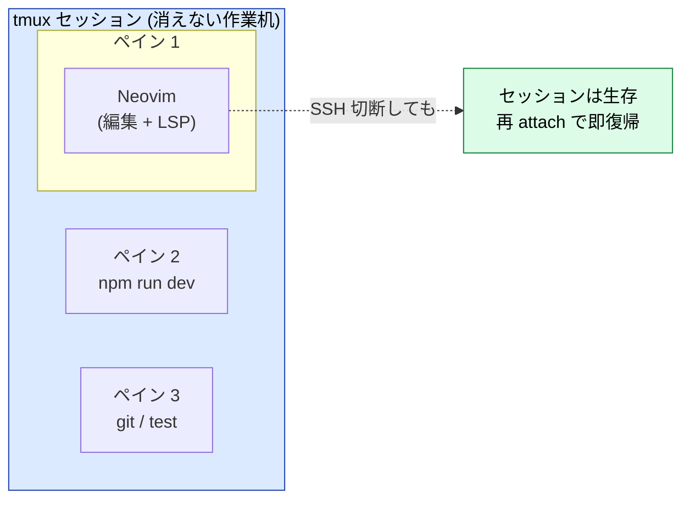
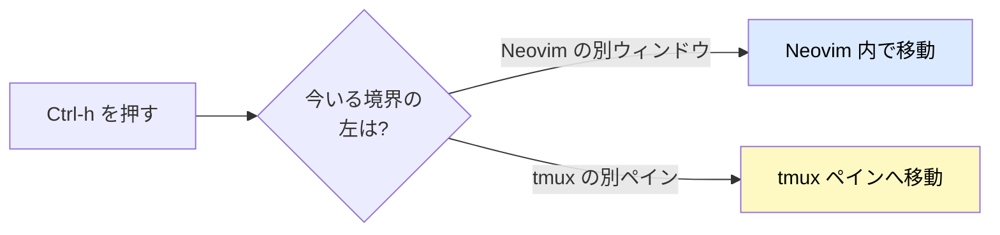
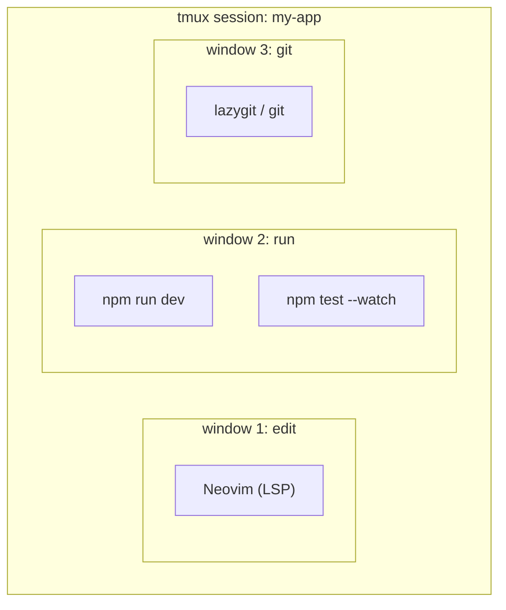

# Neovim × tmux — シームレスな開発レイアウトを組む

:::message
**この章でできるようになること**
Neovim を tmux の中で破綻なく動かします。色化けを直し、`Ctrl-h/j/k/l` で
**Neovim のウィンドウと tmux のペインを区別なく行き来** し、プロジェクト単位でセッションを瞬時に切り替えられるようになります。
:::

:::message
**前提**: [neovim-ide 章](neovim-ide.md) で IDE 化済み。
tmux の基礎 (セッション / ウィンドウ / ペイン、detach/attach) は
[tmux 章](tmux.md) を読了していること。本章は **重複を避け、統合だけ** に絞ります。
:::

## なぜ Neovim を tmux の中で動かすのか



- **編集 (Neovim) と実行 (dev サーバ / test / git) を 1 画面に並べられます**
- SSH が切れても **セッションが生き残る** ので、リモート開発 (`remote-dev.md`) の土台になります
- ペイン移動・ウィンドウ切替が **キーボードだけ** で完結します

## 課題 1: 色化け (truecolor) を直す

tmux を挟むと、Neovim の配色がくすんだり化けたりすることがあります。
これを直すには、**Neovim 側で `termguicolors` を ON にし、tmux 側で RGB を通す** の両方が必要です。

Neovim 側はすでに neovim-ide 章で済ませています (`vim.opt.termguicolors = true`)。
ここでは tmux 側を `~/.tmux.conf` に設定していきましょう。

```tmux
# ~/.tmux.conf

# 端末の既定を 256 色端末に
set -g default-terminal "tmux-256color"
# truecolor (24bit RGB) を通す  ※ お使いのターミナルの $TERM に合わせる
set -ag terminal-overrides ",xterm-256color:RGB"
# tmux 3.2+ なら下の書き方でも可:
# set -as terminal-features ",xterm-256color:RGB"

# Esc の遅延をなくす (Neovim のモード切替が機敏になる。重要)
set -sg escape-time 10

# フォーカス変化を Neovim に伝える (autoread 連携)
set -g focus-events on
```

反映:

```bash
tmux source-file ~/.tmux.conf   # tmux 内から。または tmux を再起動
```

:::message
`escape-time` を下げないと、tmux 内の Neovim で **`Esc` の反応が一拍遅れます**。
モーダル編集ではここが致命的なので必ず設定してください。`10`〜`20` ms が目安です。
:::

確認:

```vim
:checkhealth vim.health
```

color 関連が緑で、かつ配色が tmux の外と同じに見えれば成功です。
あわせて `:lua print(vim.o.termguicolors)` が `true` になっていることも確認しておきましょう。

## 課題 2: Ctrl-h/j/k/l でシームレスに移動する

Neovim のウィンドウ間移動は `Ctrl-w h/j/k/l`、tmux のペイン移動は `prefix → 矢印` と、**作法が違います**。
ここで `vim-tmux-navigator` を入れると、**`Ctrl-h/j/k/l` だけで両者を区別なく** 移動できるようになります。



### Neovim 側 (プラグイン追加)

`init.lua` の `vim.pack.add` に足します。

```lua
vim.pack.add({
  { src = "https://github.com/christoomey/vim-tmux-navigator" },
})
```

### tmux 側 (`~/.tmux.conf`)

```tmux
# vim-tmux-navigator: Neovim にいる時は Ctrl-hjkl を Neovim へ委譲
is_vim="ps -o state= -o comm= -t '#{pane_tty}' | grep -iqE '^[^TXZ ]+ +(\\S+\\/)?g?(view|l?n?vim?x?|fzf)(diff)?$'"
bind-key -n 'C-h' if-shell "$is_vim" 'send-keys C-h'  'select-pane -L'
bind-key -n 'C-j' if-shell "$is_vim" 'send-keys C-j'  'select-pane -D'
bind-key -n 'C-k' if-shell "$is_vim" 'send-keys C-k'  'select-pane -U'
bind-key -n 'C-l' if-shell "$is_vim" 'send-keys C-l'  'select-pane -R'
```

:::message
この `is_vim` 判定は plugin 公式 README が配っているスニペットです。
「Neovim にフォーカスがある時だけキーを Neovim へ渡し、それ以外は tmux が処理する」のが肝です。
これで `Ctrl-l` (画面クリア) と衝突する点だけ注意してください (`prefix C-l` 等に退避できます)。
:::

反映できたら、Neovim を縦分割 (`:vsplit`) しつつ tmux でも横にペインを割ってみましょう。
`Ctrl-h/l` で **全部を一筆書きのように** 移動できれば成功です。

## 課題 3: プロジェクト単位の sessionizer

「リポジトリごとに tmux セッションを 1 つ」という運用にすると、頭の中がぐっと整理されます。
ここでは有名な **tmux-sessionizer** パターン (ThePrimeagen 流) を入れてみましょう。

まず `~/bin/tmux-sessionizer` を用意します (パスを通しておいてください)。

```bash
#!/usr/bin/env bash
# 候補ディレクトリから fzf で選んで、その名前の tmux セッションへ
selected=$(find ~/workspace ~/dev -mindepth 1 -maxdepth 2 -type d 2>/dev/null | fzf)
[ -z "$selected" ] && exit 0
name=$(basename "$selected" | tr . _)

if ! tmux has-session -t "$name" 2>/dev/null; then
  tmux new-session -ds "$name" -c "$selected"
fi
# tmux 内なら switch、外なら attach
if [ -z "$TMUX" ]; then
  tmux attach -t "$name"
else
  tmux switch-client -t "$name"
fi
```

```bash
chmod +x ~/bin/tmux-sessionizer
brew install fzf            # まだなら
```

これを tmux のキーバインドに割り当てます (`~/.tmux.conf`)。

```tmux
# prefix + f でプロジェクト選択 → 専用セッションへ
bind-key f run-shell "tmux neww ~/bin/tmux-sessionizer"
```

これで `prefix → f` から fzf でリポジトリを選ぶと、**そのプロジェクト専用の tmux セッション** に飛べます。
Neovim はその中で開けば OK です。

## 推奨レイアウト例



- **window 1**: Neovim 専用（フルスクリーンで編集に集中）
- **window 2**: dev サーバ + テストの watch を上下ペインで並べる
- **window 3**: git 操作（`brew install lazygit` を入れると一段と捗る）

`prefix → 1/2/3` でウィンドウを切り替え、`Ctrl-h/j/k/l` でペインを移動します。

## ここまでの到達点

- tmux 内でも Neovim の配色が正しく出るようになりました (truecolor + escape-time)
- `Ctrl-h/j/k/l` で Neovim ↔ tmux をシームレスに移動できます
- `prefix → f` でプロジェクト単位のセッションへ即座に移動できます

この「消えない作業机」が、そのまま次章の **リモート開発** の土台になります。
それでは `remote-dev.md` へ進みましょう。

## アンインストール手順

```bash
# Neovim 側プラグインは neovim-ide のリセットで消える (~/.local/share/nvim)
# tmux 側: ~/.tmux.conf から本章で足した行を削除し再読込
tmux source-file ~/.tmux.conf
rm -f ~/bin/tmux-sessionizer
# brew uninstall fzf lazygit  # 他で使っていなければ
```
