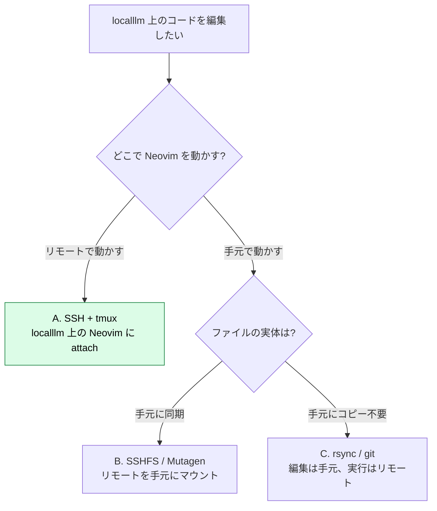
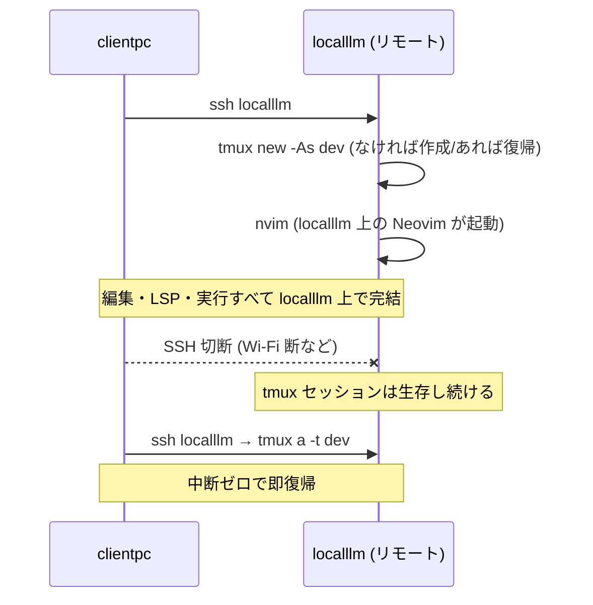
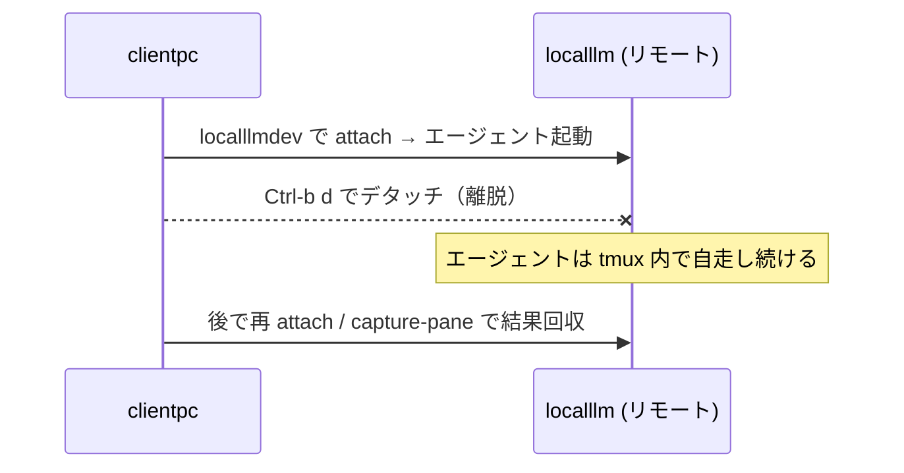
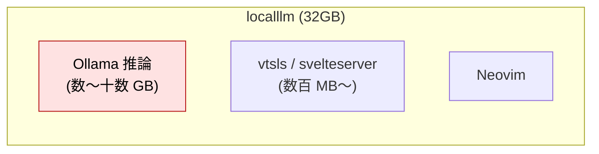
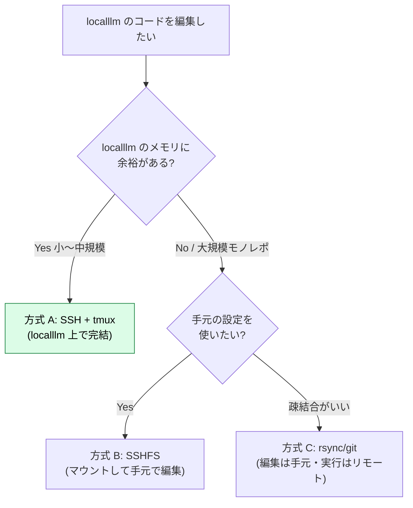

# ローカルとリモート — SSH + tmux で localllm 上を直接編集する

:::message
**この章でできるようになること**
clientpc と LLM サーバ localllm を行き来する開発の選択肢を整理し、
**SSH + tmux で localllm 上の Neovim を直接動かす** 構成を組めるようになります。
クリップボード・LSP・dotfiles 同期といったリモート特有の落とし穴も塞ぎます。
:::

:::message
**前提**: [neovim-ide 章](neovim-ide.md) と [neovim-tmux 章](neovim-tmux.md) 完了。
localllm へ SSH できること ([`local-llm-on-mac`](https://github.com/shuji-bonji/local-llm-on-mac) で構築済みの前提)。
:::

## リモート開発の 3 つの流儀

「リモートのコードを Neovim で編集する」には、大きく 3 通りのやり方があります。Neovim はターミナル内で完結するので、
**SSH + tmux 方式が最も素直で強い**ですが、用途で選べるように、まずは全部並べてみましょう。



| 方式               | Neovim 実行         | LSP の場所 | 向くケース                                       |
| ------------------ | ------------------- | ---------- | ------------------------------------------------ |
| **A. SSH + tmux**  | リモート (localllm) | リモート   | localllm で完結させたい。**第一選択**            |
| B. SSHFS / Mutagen | ローカル            | ローカル   | 手元の重い設定を使いたい。ネットワーク次第で遅延 |
| C. rsync / git     | ローカル            | ローカル   | 編集は手元、実行だけリモート。疎結合             |

本章は **A. SSH + tmux** を主に扱います。Neovim はターミナル内で完結し、SSH 越しでも同一環境がそのまま動くという特性があり、この構成で最も活きます。[neovim-tmux 章](neovim-tmux.md) の「消えない作業机」がそのまま遠隔地でも使えます。

## 方式 A: SSH + tmux で localllm 上を編集する

### 全体像



### 手順

まずは localllm 側に Neovim と tmux を入れておきましょう (まだなら):

```bash
ssh localllm
brew install neovim tmux ripgrep fd node
```

続けて、**localllm 側の `~/.zshenv` に PATH を通しておきます** (重要):

```bash
# localllm 上で実行 (~/.zshenv が無ければ作られる)
echo 'export PATH="/opt/homebrew/bin:$PATH"' >> ~/.zshenv
```

:::message alert
**これを飛ばすと、この章のワンライナーがほぼ全部 `command not found` になります**。`ssh localllm 'tmux ...'` や後述のエイリアス `ssh -t localllm "tmux new -As dev"` のような**リモートコマンド実行は非対話シェル**で走り、読まれる設定は `.zshenv` だけです (`.zshrc` は対話専用、Homebrew が PATH を書く `.zprofile` はログインシェル専用)。Apple Silicon の Homebrew (`/opt/homebrew/bin`) は既定 PATH に入っていないため、brew で入れた tmux / nvim / ollama が非対話シェルから見えません。環境変数は `.zshenv`、プロンプトやエイリアスは `.zshrc`、が zsh の設計上の役割分担です。
:::

localllm 側にも setup 章 / neovim-ide 章 の設定を置きます
(後述の dotfiles 同期で楽にできます)。

手元から **一発で接続して作業机に座る** ためのエイリアスを `~/.zshrc` に書いておきましょう:

```bash
# 手元の ~/.zshrc
alias localllmdev='ssh -t localllm "tmux new -As dev"'
```

- `tmux new -As dev` = "dev" セッションがあれば attach、なければ作って attach
- `ssh -t` = 擬似端末を割り当て (tmux に必須)

```bash
localllmdev      # これだけで localllm の作業机へ
```

切断されても localllm 側の tmux は生きているので、`localllmdev` で **同じ画面に即復帰** できます。

:::message
`~/.ssh/config` に `localllm` を定義しておくと `ssh localllm` で繋がります:

```
Host localllm
  HostName localllm.local      # または LAN の IP
  User you
  ServerAliveInterval 30    # 切断検知を早める
```

この短い名前が効くのは **ssh / scp / rsync だけ** です。HTTP でアクセスする場面 (curl や [neovim-llm 章](neovim-llm.md) のアダプタ URL) では mDNS の正式名 **`localllm.local`** か IP を書いてください。素の `localllm` は DNS では解決できません。
:::

## 応用: エージェントをヘッドレスで自走させる

`localllmdev` で作った「切れても残る作業机」は、**人が座らなくても回り続けます**。ここに AI エージェント CLI を載せれば、**SSH 先でエージェントを起動 → デタッチして放置 → ヘッドレス自走 → 後でつなぎ直して結果を回収**、という運用ができます。長いリファクタやテスト修正を「投げて離れる」イメージです。

```bash
# 1. localllm の作業机へ（前述のエイリアス）
localllmdev

# 2. tmux の中でエージェントを起動（例: aider を localllm の Ollama に直結）
#    SSH で localllm に入っているので、Ollama は localhost
aider --openai-api-base http://localhost:11434/v1 --openai-api-key ollama --model gemma2:9b

# 3. 走り出したら Ctrl-b d でデタッチ（エージェントは tmux の中で動き続ける）
#    → Mac を閉じても・Wi-Fi が切れても localllm 側で自走

# 4. 後で結果を回収
localllmdev                                   # 再 attach して画面を見る
ssh localllm 'tmux capture-pane -p -t dev'    # attach せず、いまの画面テキストだけ取得
```



ここで効くのが、agent-pair 章の **「目（`capture-pane`）と手（`send-keys`）」** です。`capture-pane` で出力を定期取得して進捗を監視し、承認プロンプトには `send-keys` で条件付き自動応答すれば、**人が張り付かなくても安全に回せます**（具体的なループは agent-pair 章 §C を参照）。

:::message alert
自走は強力ですが、**エージェントに実質シェルを渡している**状態です。重要リポジトリでは専用ユーザー / 使い捨て環境で動かし、`rm` 等の破壊的操作の扱いと自動承認の条件を決めてから自走させてください（安全策は agent-pair 章と同じ）。
:::

## リモート特有の落とし穴と対処

### 落とし穴 1: クリップボードが手元に渡らない

localllm 上の Neovim で yank しても、clientpc のクリップボードには入ってくれません。
ここは **OSC 52** (端末経由のクリップボード転送) を使うと解決します。0.10+ の Neovim はこれを内蔵しています。

```lua
-- localllm 側 Neovim の init.lua に、SSH 接続時だけ OSC52 を使う設定
if os.getenv("SSH_TTY") then
  vim.opt.clipboard = "unnamedplus"
  vim.g.clipboard = {
    name = "OSC 52",
    copy = {
      ["+"] = require("vim.ui.clipboard.osc52").copy("+"),
      ["*"] = require("vim.ui.clipboard.osc52").copy("*"),
    },
    paste = {
      ["+"] = require("vim.ui.clipboard.osc52").paste("+"),
      ["*"] = require("vim.ui.clipboard.osc52").paste("*"),
    },
  }
end
```

:::message
OSC52 は **ターミナルエミュレータ側の対応** が必要です。
iTerm2 / WezTerm / kitty / Ghostty などは対応しています。macOS 標準ターミナルは設定で許可が要る場合があります。
tmux を挟む場合は、`~/.tmux.conf` に `set -g set-clipboard on` も入れておきましょう。
:::

### 落とし穴 2: LSP が localllm で動く = localllm のリソースを食う

方式 A では、**言語サーバ (vtsls など) も localllm 上で動きます**。
localllm は LLM 推論で 32GB を使う前提なので、**LSP と推論が同時にメモリを取り合う** 点には注意しておきましょう。



- 大規模モノレポを localllm 上で開くと vtsls が重い → その場合は **方式 C (編集は手元)** に切り替えます
- 推論を回しながらの編集は、小〜中規模リポジトリに留めるのが無難です

### 落とし穴 3: 設定 (dotfiles) を 2 台で同期したい

手元と localllm で同じ Neovim 設定を使いたいなら、**dotfiles を git 管理** するのが定石です。

```bash
# 例: ~/.config/nvim を git 管理し、localllm でも clone する
cd ~/.config/nvim && git init && git remote add origin <your-dotfiles-repo>
# localllm 側
ssh localllm 'git clone <your-dotfiles-repo> ~/.config/nvim'
```

GNU Stow / chezmoi のような dotfiles マネージャを使うと、より体系的に管理できます。

:::message alert
**「SSH 越しだと `<leader>` が全部効かない」はキー転送の問題ではありません。** 方式 A では Neovim はリモート（localllm）の `~/.config/nvim` を読みます。リモート側だけモデル指定などが古く、プラグイン設定が起動時にエラーすると、**init.lua がそこで止まり、以降のキーマップ（`<leader>` 群）が丸ごと未登録**になります。Space 自体は SSH でも tmux でも普通に通るので、まず `:messages` で起動エラーを、`:echo $MYVIMRC` / `:checkhealth` で設定・プラグインの読み込みを確認してください（未 pull モデルが原因になりやすい点は neovim-llm 章の FIM 注意を参照）。
:::

## 方式 B / C を選ぶ目安 (簡潔に)

### B. SSHFS / Mutagen (リモートを手元にマウント)

```bash
brew install sshfs                 # macOS は macFUSE 前提
mkdir -p ~/mnt/localllm
sshfs localllm:/Users/you/project ~/mnt/localllm
nvim ~/mnt/localllm/src/index.ts      # 手元の Neovim / LSP で編集
```

- **利点**: 手元のリッチな設定・LSP をそのまま使えます
- **欠点**: ファイル I/O がネットワーク遅延を受けます。LSP が大量に stat するモノレポは遅くなりがちです
- Mutagen は双方向同期でこれを緩和する選択肢です

### C. rsync / git (編集は手元、実行はリモート)

```bash
# 手元で編集 → 変更を localllm へ送って実行
rsync -avz --delete ./ localllm:~/project/
ssh localllm 'cd ~/project && npm test'
```

- **利点**: LSP もエディタも手元。localllm は実行専用でシンプルです
- **欠点**: 同期の一手間があります。watch (`fswatch` 等) で自動化すると楽になります

## 判断フロー (まとめ)



## ここまでの到達点

- リモート編集の 3 方式と、その選び方が分かりました
- `localllmdev` 一発で、切れても復帰できる localllm 上の作業机に座れるようになりました
- OSC52 でクリップボード、dotfiles 同期、LSP のメモリ競合という落とし穴を塞ぎました

次は、その localllm で動いている **Ollama を Neovim のコーディング支援につないでいきます**。
`neovim-llm.md` へ進みましょう。

:::message
**L3 リンク機会メモ**: 「編集する場所 / 実行する場所 / 状態を持つ場所」を分離して選ぶ判断は、
L3 のエージェント配置 (ローカル実行 vs リモート実行 vs ハイブリッド) の設計判断と同型です。
`zennbook-toc-memo.md` の L3/L4 リンク表に追記候補。
:::

## アンインストール手順

```bash
# 手元
# ~/.zshrc から localllmdev エイリアスと ~/.ssh/config の Host localllm を削除
# SSHFS を使った場合
umount ~/mnt/localllm 2>/dev/null
brew uninstall sshfs              # 他で使っていなければ
# localllm 側
ssh localllm 'rm -rf ~/.config/nvim ~/.local/share/nvim ~/.local/state/nvim'
ssh localllm 'brew uninstall neovim'   # localllm から Neovim ごと消す場合
```
