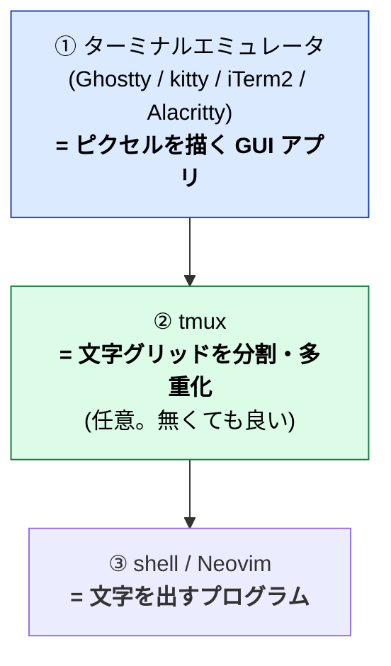
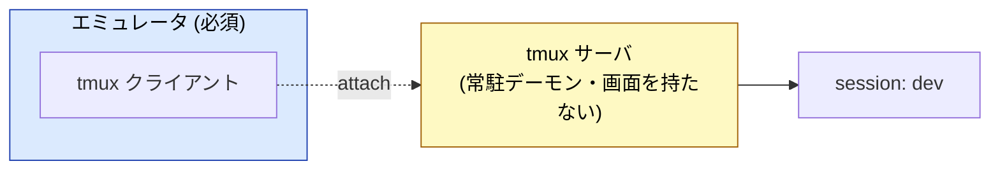
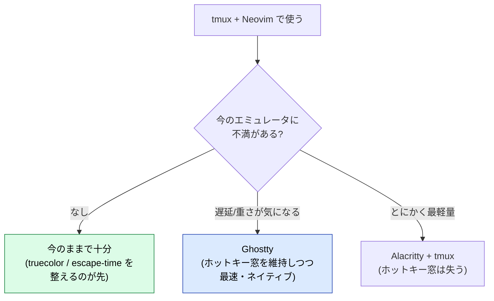

:::message
**この章でできるようになること**
「ターミナルエミュレータ」「tmux」「shell」の **3 層の役割分担** を区別でき、なぜ tmux 単体では起動できず、その下に必ずエミュレータが要るのかを説明できるようになります。macOS の主要エミュレータ（Ghostty / kitty / iTerm2 / Alacritty）を、tmux + Neovim 用途で選べるようにもなります。
:::

:::message
**前提**: ghostty 章で Ghostty を設定済み。tmux の実践は次章で扱うので、ここではまだ触っていなくても大丈夫です。
:::

## まず結論: tmux はエミュレータの「中」で動く

混乱しやすい部分なので、最初に整理しておきましょう。
tmux はターミナルエミュレータではありません。
画面（ピクセル）を描画するのはターミナルの役割であり、tmux はその中で「文字グリッドを多重化する」レイヤー（層）です。そのため、tmux 単体では画面を表示することはできず、必ずベースとなるターミナルエミュレータ（または生の TTY）が必要になります。

| 層             | 役割                                                                         | 具体例                            | 単体で起動できるか |
| -------------- | ---------------------------------------------------------------------------- | --------------------------------- | ------------------ |
| ① エミュレータ | **描画**（ピクセル・色・フォント・GPU）、キー入力 → エスケープシーケンス変換 | Ghostty, kitty, iTerm2, Alacritty | ○ GUI アプリ       |
| ② tmux         | **多重化**（分割・タブ・detach/attach）                                      | tmux                              | ✗ ①の中で動く      |
| ③ プログラム   | **文字の入出力**                                                             | zsh, Neovim, git                  | ✗ 端末が要る       |

:::message
②の tmux は **任意の中間層**です。無くてもエミュレータ + shell で開発はできます。tmux は「分割」と「detach/attach（消えない作業机）」が欲しいときに挟む層です。一方①のエミュレータは **必須**。これが無いと、文字を表示する画面がそもそも存在しません。
:::

## 重複する機能はどちらに寄せるか（分割・タブ・コピー）

Ghostty も tmux も「分割・タブ」を持つため、**同じことが 2 か所でできてしまいます**。
どちらに寄せるかを先に決めておくと、操作が混乱しません。本書の方針は次のとおりです。

| 機能               | Ghostty                           | tmux                               | 本書の寄せ先                                                                                   |
| ------------------ | --------------------------------- | ---------------------------------- | ---------------------------------------------------------------------------------------------- |
| 画面分割           | `⌘+d` / `⌘+Shift+d`（GPU で軽快） | `prefix %` / `"`                   | **基本は tmux**（SSH 先でも同じ操作・切断しても残る）。ローカルだけの軽い分割は Ghostty でも可 |
| タブ               | `⌘+t`（macOS ネイティブ）         | `prefix c`（window）               | 好みで。リモートをまたぐなら tmux の window                                                    |
| ペイン移動         | `⌘+Option+矢印`                   | `prefix 矢印` / vim-tmux-navigator | **tmux**（Neovim とシームレスに統一）                                                          |
| コピー / ペースト  | `⌘+c` / `⌘+v`（素直）             | コピーモード                       | **ローカルは Ghostty、リモートは tmux コピーモード**                                           |
| スクロール検索     | （組み込み検索なし）              | コピーモードで検索                 | **tmux**（または Ghostty の `write_scrollback_file`）                                          |
| 常駐ドロップダウン | Quick Terminal                    | （相当なし）                       | **Ghostty 固有**（→ ghostty 章 §7）                                                            |

考え方はシンプルです。**「リモートでも同じに使いたい / 切断に耐えたい」ものは tmux**、**ローカル限定で軽く済ませたいものや Ghostty にしかない機能（Quick Terminal）は Ghostty** に寄せます。とくに **分割を tmux に寄せておく**と、`ssh` 先でも手元でも操作が変わらず、Neovim のペイン移動（`Ctrl-h/j/k/l`）とも一本化できます（→ neovim-tmux 章）。Ghostty 側の操作一覧は ghostty 章 §6 にまとめてあります。

## なぜ tmux 単体で起動できないのか

tmux は GUI を持ちません。`tmux` と打てる時点で、すでに **何らかのエミュレータの中にいます**。さらに、次章の tmux で詳しく見ますが、tmux は **クライアント / サーバ構造** で、サーバは端末から切り離されたデーモンとして常駐します。「サーバは端末と無関係に走り続ける」けれど「見る・操作するには端末が要る」。ここが核心です。

## エミュレータが実際にやっていること（tmux ではできないこと）

「描画担当」が具体的に何を握っているかを知ると、エミュレータ選びの基準が見えてきます。

- **GPU でのグリフ描画**: 文字をテクスチャ化して GPU でまとめて描く。速さと省電力の源です
- **truecolor (24bit)**: Neovim の配色を正しく出す土台。tmux は「通す」だけで、出すのはエミュレータです
- **フォント・リガチャ**: `=>` 等の合字をどう描くか
- **カーソル形状**: Normal=ブロック / Insert=バー の切り替え（DECSCUSR）
- **undercurl / 色付き下線**: LSP 診断の波線表示
- **キー入力の変換**: Option キーを Meta にするか等

:::message
これらは **全部エミュレータの責務**です。tmux を変えても解決しません。「Neovim の色が出ない」「波線が出ない」系は、まずエミュレータ設定（と truecolor）を疑いましょう。tmux はそれを **劣化させずに通す** 役で、その設定は neovim-tmux 章で扱います。
:::

## リモートとの関係 — terminfo / $TERM

エミュレータは自分の種類を `$TERM`（例: Alacritty なら `alacritty`、Ghostty なら `xterm-ghostty`）で名乗ります。SSH 先がその **terminfo エントリ** を持たないと表示が崩れます。

ただし **tmux を挟むと tmux 自身の `$TERM`（`tmux-256color`）がリモートに見える** ため、リモート側は個別エミュレータの terminfo を必要としません。SSH + tmux 構成（remote-dev 章）にしている限り、この問題はほぼ自動で回避されます。

## macOS 主要エミュレータ比較（tmux + Neovim 視点・2026 時点）

tmux を使う前提だと **「分割内蔵」は不要**です（tmux が担うため）。着目すべきは描画速度・レイテンシ・メモリ・ホットキーウィンドウの有無です。

| エミュレータ  | 技術              | アイドルメモリ | 入力レイテンシ | ホットキー窓     | リガチャ | 一言                                                   |
| ------------- | ----------------- | -------------- | -------------- | ---------------- | -------- | ------------------------------------------------------ |
| **Ghostty**   | Zig / **Metal**   | 60〜100MB      | 約 1.2ms       | ○ Quick Terminal | ○        | Mac ネイティブ感・ほぼ設定不要・現状最速級             |
| **kitty**     | C+Python / OpenGL | 中             | 低             | △ 別途           | ○        | 独自 graphics protocol・多機能・クロスプラットフォーム |
| **iTerm2**    | ネイティブ        | 約 185MB       | 約 4.1ms       | ◎ 看板機能       | ○        | 機能成熟・プラグイン・AI 統合(3.5)。やや重い           |
| **Alacritty** | Rust / OpenGL     | 約 14〜30MB    | 最小クラス     | ✗                | ✗(方針)  | 最軽量・最小主義・分割は tmux 前提                     |

:::message
数値は 2026 時点のスナップショットです。この層はバージョンで容易に変わります。truecolor とカーソル形状は 4 つとも対応、undercurl も新しめのバージョンなら概ね対応します。
:::

## 選び方の指針

要点は、**tmux + Neovim を始めること自体はエミュレータ乗り換えの理由にならない** ということです。いま使っているエミュレータ（iTerm2 など）はこの用途に十分で、まず truecolor と（tmux 側の）`escape-time` を整えるのが先です。

そのうえで入力の軽さやネイティブ感に興味が湧いたら、**ホットキーウィンドウを維持できる Ghostty** を並行で試すのが低コストです。tmux 設定は共通なので、いつでも比較できます。Ghostty の導入・設定・常駐ドロップダウン化は ghostty 章にまとめてあります。

:::message
**L4 リンク機会メモ**: 「描画 / 多重化 / プログラム」の 3 層分離は、L4 (`understanding-llm-through-claude-code`) の「責務を層で切り、各層は隣としか会話しない」構造と同型です。tmux が `$TERM` を付け替えてリモートを隔離するのは、層境界での I/F 変換の良い実例。`zennbook-toc-memo.md` の L3/L4 リンク表に追記候補。
:::
