# tmux とは — まず触って分かる入門

:::message
**この章でできるようになること**
tmux を「なぜ使うのか」が腑に落ち、インストールして最初のセッションを作り、
**画面分割 → 離脱（detach）→ 復帰（attach）** までを自分の手で一通り回せるようになります。
:::

:::message
**前提**：macOS のターミナル（標準ターミナル / iTerm2 等）が開ければOKです。
コマンドを数個打てれば十分で、tmux の予備知識は一切いりません。
:::

## 1. ひとことで言うと

**tmux = terminal multiplexer（ターミナル多重化ツール）** です。

難しく聞こえますが、やることは 2 つだけです。

1. **1枚のターミナルを分割・タブ化する**（作業机を広げる）
2. **ターミナルを閉じても、中の作業を生かしたまま残す**こと

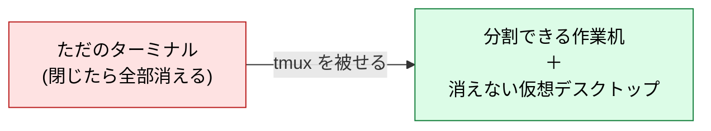

まずは「**便利なターミナルの皮**」くらいの理解で読み進めてください。

## 2. tmux がない世界の不便（なぜ使うのか）

tmux を入れる理由は、次の 3 つの「あるある」を消したいからだと考えるとすっきりします。

| 困りごと                  | tmux がない世界                                                     | tmux があると                                        |
| ------------------------- | ------------------------------------------------------------------- | ---------------------------------------------------- |
| **作業が消える**          | ターミナルの窓を閉じた瞬間、開いていたものが全部リセット            | 窓を閉じても中身は生き残る                           |
| **画面が 1 つしか使えない** | 長い処理を流すと、その窓は終わるまで占有される                    | 1 画面を分割して、片方で処理・片方で別作業          |
| **回線が切れると死ぬ**    | SSH 先で作業中に Wi-Fi が切れると、走っていた処理ごと巻き添えで終了 | サーバ側の tmux が処理を走らせ続け、後でつなぎ直せる |

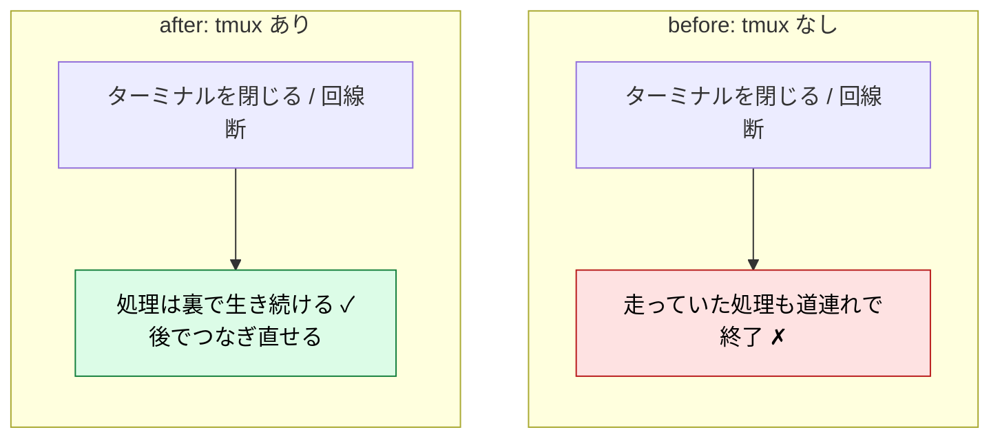

この「**閉じても消えない**」が tmux 最大の売りです。ここだけ覚えて帰ってもいいくらいです。

## 3. インストール（macOS）

setup 章でまとめて導入済みなら、ここはスキップして次へ進めます。個別に入れるなら Homebrew で一発です。

まずは、**setup 章でまとめて導入済み** の tmux のバージョンだけ確認しておきます。
（未導入であれば `brew install tmux` を実行してください）

```sh
tmux -V        # バージョンが出ればOK（例: tmux 3.5a）
```

## 4. まず触ってみる：最初のセッション

ターミナルで、ただ `tmux` と打つだけです。

```sh
tmux
```

画面の見た目はほぼ変わりませんが、**一番下に緑色の帯（ステータスバー）** が出ます。
これが「いま tmux の中にいます」の目印です。

```
┌───────────────────────────────┐
│ $ _                           │  ← 中身は普通のシェル
│                               │
│                               │
├───────────────────────────────┤
│ [0] 0:zsh*           "host" … │  ← tmux のステータスバー（緑の帯）
└───────────────────────────────┘
```

### 最重要：prefix キー（`Ctrl-b`）という「合図」

tmux への命令は、**いきなり打ちません**。
必ず最初に「これから tmux に指示するよ」という合図キーを押します。
これが **prefix = `Ctrl-b`** です。

:::message
**操作のリズムは常にこの 2 段階**
① `Ctrl-b` を押して離す（合図）
↓
② 続けて命令キーを1つ押す
:::

例えば「画面を縦割りにする」なら、`Ctrl-b` を押して離してから `%` を押す、という流れになります。
最初はここで必ずつまずくので、「**合図 → 命令**の 2 段ロケット」と覚えてください。

## 5. 画面を分割する（作業机を広げる）

prefix（`Ctrl-b`）に続けて次を押します。

```
Ctrl-b  %      ペインを縦に分割（左右に並ぶ）
Ctrl-b  "      ペインを横に分割（上下に並ぶ）
Ctrl-b  ←↑↓→  分割した区画（ペイン）の間を移動
Ctrl-b  x      いまのペインを閉じる
```

「分割された1区画」を **pane（ペイン）** と呼びます。左で Vim、右でログ監視、みたいに並べられます。

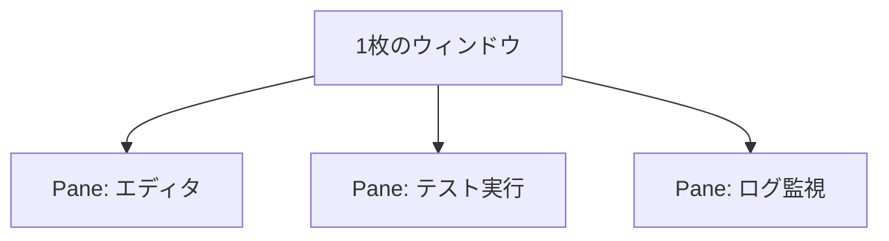

:::message
マウスでペインをクリック・リサイズしたいなら、後述の `.tmux.conf` に `set -g mouse on` を足します（初回はキー操作に慣れる意味で、まずはキーボードだけで触るのがおすすめ）。
:::

## 6. tmux の真骨頂：離れても消えない（detach / attach）

ここが一番の感動ポイントです。

`Ctrl-b` に続けて `d` を押してみてください。（**d = detach、離脱**）

#### デタッチ（detach）

```
Ctrl-b  d      tmux から離脱する（中身は生かしたまま外に出る）
```

すると緑の帯が消えて、普通のターミナルに戻ります。
**動いていたセッションは裏で生き続け、消えていません**。
稼働している tmux セッションの確認方法と、つなぎ直し（attach）は以下のコマンドで行います。

#### セッションの確認

```sh
% tmux ls               # いま生きているセッションの一覧
0: 1 windows (created Mon Jun 29 14:24:39 2026)
```

#### アタッチ（attach）

```sh
% tmux attach           # さっきのセッションにつなぎ直す（復帰）
```

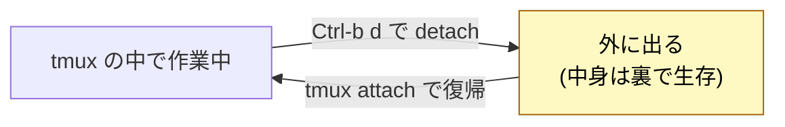

例えるなら、**仮想デスクトップを開いたまま部屋を出て、後で戻ってきたら全部そのまま続いている**感覚です。長い処理を流したまま離脱 → Mac を閉じる → 後でつなぎ直して結果を回収、ということができます。

### 6.1 「離れる（維持）」と「閉じる（破棄）」を混同しない

プロセスを維持したいのであれば、「閉じる（破棄）」はしてはいけません。
ここが事故りやすいところなので、次の二択をはっきり区別してください。

| 操作              | 意味                           | 中のプロセスは                |
| ----------------- | ------------------------------ | ----------------------------- |
| `Ctrl-b d`        | detach（離脱）                 | 🟢 **維持**（裏で生き続ける） |
| `exit` / `Ctrl-d` | そのペインのシェルを終了       | 🔴 **破棄**（中身が死ぬ）     |
| `Ctrl-b x`        | 今のペインを閉じる（確認あり） | 🔴 **破棄**                   |
| `Ctrl-b &`        | 今のウィンドウを閉じる         | 🔴 **破棄**                   |

:::message
覚え方：**閉じる系（`x` / `exit` / `&`）＝中身が死ぬ／`d`＝生かしたまま離れる**。
なお `Ctrl-b c` は「閉じる」ではなく **新規ウィンドウ作成（c = create）** で、何も終了しません。
`exit` を繰り返してペインを全部閉じる → ウィンドウが消える → 最後のウィンドウが消えると、**そのセッションも終了**します。残したいなら閉じずに `Ctrl-b d`。
:::

### 6.2 `nohup` や `&` とは何が違う？

「ターミナルを閉じても処理が残る」だけなら、`nohup cmd &` や `cmd &` + `disown` でもできます。これらは SIGHUP（端末切断シグナル）を無視させて、プロセスを生かし続けます。
では tmux と何が違うのでしょうか？

ひとことで言うと、**`nohup` は「投げっぱなしで生かす」、tmux は「作業机ごと残して、戻って続けられる」** です。

|                                           | `nohup` / `&` + disown       | tmux                                               |
| ----------------------------------------- | ---------------------------- | -------------------------------------------------- |
| プロセスが生き残る                        | ◯                            | ◯                                                  |
| 後から**戻って操作**できる                | ✗（入力を送れない）          | ◯（re-attach で続き）                              |
| **ライブな画面**を見られる                | ✗（出力は `nohup.out` 等へ） | ◯（その場の画面に再合流）                          |
| 対話プロンプト・TUI（vim / REPL / `y/n`） | ✗（TTY が要る）              | ◯（本物の PTY が残る）                             |
| 守る対象                                  | コマンド 1 個                | シェル・複数ペイン・スクロールバック・cwd まるごと |

`nohup` が守るのは **単発のコマンド**で、出力はファイルに垂れ流し、もう一度中に入って対話することはできません。一方 tmux は **PTY（疑似端末）を持った作業環境そのもの**を常駐サーバが抱えるので、`detach → attach` で **同じ画面に戻って続きから操作** できます。

だから住み分けはこうなります。「長いビルドを投げて、結果だけ後でファイルで見たい」なら `nohup` で十分です。「リモートで **作業そのもの** を続けたい・対話的なツールを使いたい」なら tmux が要ります。

:::message
**ローカル（手元の作業端末）では、tmux を常用しない選択もアリです。** 画面分割は Ghostty 自身ができるので、手元では tmux を起動しないことも多いでしょう（むしろ「閉じても消えない」が、かえって散らかって感じる場面もあります）。tmux の真価がはっきり発揮されるのは、**SSH 越しのリモート作業**です。回線が切れても作業机が生き残り、つなぎ直せば続きから再開できる——この一点のために使うと捉えると、役割がはっきりします（→ remote-dev 章）。
:::

## 7. 名前を付けて管理する

セッションが増えると区別したくなります。名前を付けて作れます。

```sh
$ tmux new -s dev       # "dev" という名前でセッションを作成
$ tmux ls               # 一覧（dev が見える）
dev: 1 windows (created Mon Jun 29 17:32:22 2026) (attached)
$ tmux attach -t dev    # "dev" を指定してつなぎ直す
$ tmux kill-session -t dev   # "dev" を終了（不要になったら）
```

### 7.1 `tmux ls` の出力を読む

`tmux ls` は「いま生きているセッションの一覧」です。1行が1セッションで、こう読みます。

```
0: 2 windows (created Sun Jun 14 00:10:34 2026) (attached)
│  │                                            └ いま端末が接続中（未接続なら表示なし）
│  └ そのセッション内のウィンドウ（タブ）の枚数
└ セッション名（-s を付けなければ 0,1,2… の連番。dev 等の名前ならここに出る）
```

たとえば次の出力なら、

```
0: 2 windows (created Sun Jun 14 00:10:34 2026) (attached)
1: 1 windows (created Sun Jun 14 00:11:22 2026) (attached)
```

**セッションが 2 つあり、`0` はウィンドウ（タブ）を 2 枚、`1` は 1 枚持っている**、という意味です。
両方 `(attached)` なので、それぞれ別の端末からつながっています。

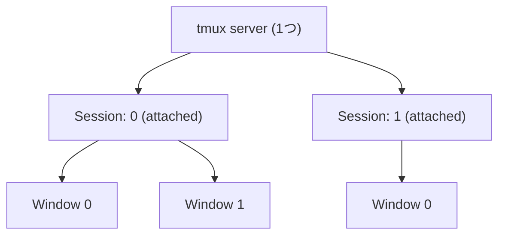

:::message
先頭の数字（または名前）が、そのまま `-t` で指定する宛先です。
`tmux attach -t 0`（0番に入り直す）／`tmux kill-session -t 1`（1番を消す）のように使います。
:::

#### `(attached)` の有無でデタッチ済みを見分ける

末尾の `(attached)` は「**いま端末（client）がそのセッションを覗いている**」印です。`Ctrl-b d` で離脱すると client が外れるので消えます。

```
（離脱前）1: 1 windows (...) (attached)   ← 接続中
（Ctrl-b d 後）1: 1 windows (...)          ← (attached) が消えた = デタッチ済み
```

- **`(attached)` あり** … どこかの端末が接続中
- **`(attached)` なし** … デタッチ済み（裏で生きているが、誰も見ていない）

注意が2つあります。

1. **`(attached)` の有無は生死とは無関係**です。`tmux ls` に行が出ている時点でセッションは生存しており、`(attached)` は _誰か見ているか_ を表しています。
   デタッチ済み（表示なし）でも中のプロセスは server が抱えて動き続けています。
2. `(attached)` は接続中の client が**1 つでもあれば**付きます。複数端末で同じセッションを共有しても、まとめて 1 つの `(attached)` 表示されます。誰が何本つないでいるか正確に見たいときは次を使います。

```sh
% tmux list-clients     # どの client がどのセッションに付いているか一覧
/dev/ttys006: 0 [77x55 xterm-256color] (attached,focused,UTF-8)
/dev/ttys003: 0 [77x55 xterm-256color] (attached,focused,UTF-8)
# セッション 0 に ttys003 と ttys006 がアタッチしています。
```

## 8. ここまでの全体像（言葉の整理）

ここまでで「セッション」「ウィンドウ」「ペイン」という言葉が出てきましたが、少し整理しておきましょう。
tmux はこれらを **常駐するサーバ（server）** がまとめて抱えています。
閉じても消えないのは、この server が裏で抱え続けてくれているからです。

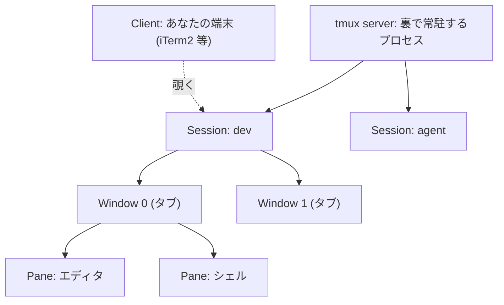

| 階層        | ざっくり言うと       | 役割                                                 |
| ----------- | -------------------- | ---------------------------------------------------- |
| **Server**  | 裏方の本体           | セッションを抱え続ける。**閉じても消えない**の正体   |
| **Session** | 作業環境ひとまとまり | 離脱／復帰の単位。作業中のプロセスはここで生き続ける |
| **Window**  | タブ                 | 1セッション内のタブ。切り替えて使う                  |
| **Pane**    | 画面分割の1区画      | 1ウィンドウを縦横に割って並列表示                    |
| **Client**  | あなたが見ている端末 | セッションを覗く窓口にすぎない                       |

:::message
**覚えておくと混乱しないコツ**
離脱・復帰（detach / attach）するのは、いつも **セッション** です。
ウィンドウは「切り替え」、ペインは「分割」、出たり戻ったりするのは常にセッション。
あなた（Client）が離れても、Session は server に抱えられたまま生き続けます。
:::

### 8.1 プロセスとして見る（暴走したときに効く）

CLI を使うなら、抽象の裏で**実際に動いているプロセス**も意識しておきましょう。そうしておくと、何かが暴走したときに落ち着いて対処できます。`tmux` という名前で立つプロセスは、実は2種類だけです。

- tmux server ← 常駐する本体（1 つだけ）。セッション/ウィンドウ/ペインを抱える
- tmux client ← 端末ごとの窓口。attach 中だけ存在する

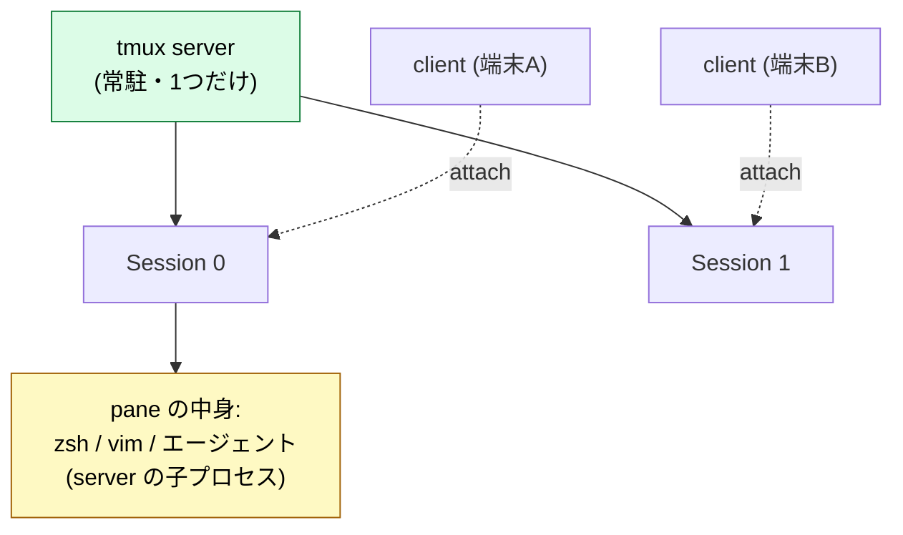

ポイントを3つ押さえると数が読めます。

- **server は常に1つ**。`tmux` を何回起動しても使い回されるので増えません。
- **client は attach 中の端末ごとに1つ**
  `tmux` のプロセス数 ≒ `1 (server) + attach 中の client 数`
- **セッション自体はプロセスではない**（server が抱える論理的な箱）
  だから `detach` すると client は消えてもセッションは残り、`tmux new -d` なら client を立てずにセッションだけ増えます。
- **実際に重い処理を走らせているのは pane の中身**（`zsh`・ビルド・AI エージェント等）で、これらは **server の子プロセス**として動きます。

:::message
**実用上の割り切り**：厳密には「セッション＝プロセス」ではありませんが、運用の頭の中では
「**最初のセッションだけ server 分で +1、以降はほぼ “セッション＝中で動く処理”、`Ctrl-b d` でそれを生かしたまま離れる**」と丸めて構いません。
唯一 `kill-server`（後述）が出てきた時だけ「箱ごと＝全セッション巻き添え」を思い出せれば事故りません。
:::

#### 多重化を実機で確認する（`w` と `list-panes` の差）

「内側の複数 pty が、外側1本の端末に畳み込まれている」
——この multiplex の正体は、2つのコマンドを並べてみると目で見えてきます。

各ペインは**専用の pty（疑似端末）**を持っていて、**分割するたびに pty が1つ増えます**。まずは内側を覗いてみましょう。

```sh
tmux list-panes -F '#{pane_index}: #{pane_tty}  pid=#{pane_pid}'
# 0: /dev/ttys007  pid=3818
# 1: /dev/ttys001  pid=4790
# 2: /dev/ttys010  pid=4157
# 3: /dev/ttys000  pid=5261     ← 4ペイン = 4つの pty
```

次に、ログインセッション台帳（utmp）を見る `w` を実行してみると——

```
USER   TTY      ... WHAT
you  console  ... -            ← GUI ログイン
you  s002     ... ssh localllm.local
you  s003     ... -zsh
you  s005     ... tmux         ← これが tmux client（attach 元の本物の tty）
```

**ポイント：上の4つのペイン pty（ttys000/001/007/010）は、`w` に1つも出てきません。** 理由は明快で、

- `w` / `who` が見るのは **login セッション**（ターミナル窓・ssh）。utmp に登録されたものだけ。
- **tmux のペインは login ではなく tmux server の子プロセス**なので、utmp に載らず `w` に現れません。

結果として、`w` 側では tmux は **client の1行（上記 `s005 ... tmux`）だけ**。
一方 `list-panes` 側にはペインが複数出力されます。

```
w から見える tmux       = client 1 つ（s005）             ← 外側の本物の tty
list-panes から見える   = pane 複数（ttys000/001/007/010） ← 内側の server 側 pty
```

:::message
**内側の N 本の pty が、外側のたった 1 本のログインに畳み込まれている**。
これが「multiplexer（多重化）」の名前そのものです。

`w` が「6 users」と数えても、その中で tmux はあくまで 1 ユーザー分（ペインはログイン数に数えられない＝login ではない）。

ペインの `pid` の親を `ps -o ppid= -p <PID>` で辿ると、いずれも tmux server に行き着きます（8.1 の「pane の中身は server の子プロセス」の実機確認）。
:::

### 暴走したときの落とし方（軽い順）

「ペインの中のプロセスが暴走」と「tmux 自体がおかしい」を切り分けて、軽い手から順に試していきましょう。

```sh
# ① まずペインの中のプロセスを止める（tmux はそのまま）
#    暴走ペインで Ctrl-c。効かなければ、そのペインだけ閉じる：
#    tmux の中で Ctrl-b x

# ② セッション単位で落とす（そのセッションの pane プロセスごと終了）
tmux kill-session -t 0

# ③ どの tmux プロセスが居るか外から確認
ps aux | grep -i tmux        # server と client が見える
ps -ef | grep -i ollama      # 暴走中の“中身”のプロセスを名指しで探す

# ④ 中身のプロセスだけ名指しで止める（tmux は生かす）
kill <PID>                   # 効かなければ kill -9 <PID>

# ⑤ 最終手段：tmux ごと全部落とす（server を殺す＝全セッション消滅）
tmux kill-server
```

:::message alert
段階の意味：①②④は **必要な所だけ**止める手当て、⑤の `kill-server` は **server を殺す＝全セッションと全 pane プロセスを巻き込む核オプション**です。
AI エージェントを並走させているときは、まず②でセッション単位、それでも残る子プロセスは③④で個別に止め、最後の手段として⑤を使う、という順が安全です。
:::

## 9. 最低限の早見表

```
# シェルから（tmux の外で打つ）
tmux                      新規セッション開始
tmux new -s NAME          名前付きで開始
tmux ls                   セッション一覧
tmux attach -t NAME       指定セッションに復帰
tmux kill-session -t NAME 指定セッションを終了

# tmux の中で（必ず prefix = Ctrl-b が先）
Ctrl-b  d     離脱（detach）
Ctrl-b  %     縦分割
Ctrl-b  "     横分割
Ctrl-b  ←↑↓→  ペイン移動
Ctrl-b  c     新しいウィンドウ（タブ）
Ctrl-b  n / p next / prev ウィンドウ切替
Ctrl-b  [     コピーモード（画面スクロール。q で抜ける）
Ctrl-b  x     ペインを閉じる
Ctrl-b  ?     キー割り当て一覧（困ったら）
```

:::message
`Ctrl-b [` で**スクロールできる**のは地味に重要です。
tmux の中ではマウスホイールが効かないことがあり、過去ログを遡るときはこのコピーモードを使います（`q` で抜ける）。
:::

## 10. ちょっとだけ設定（任意）

毎回の使い勝手をぐっと上げる、最小限の設定を紹介します。ホームに `~/.tmux.conf` を作って、次のように書いてみましょう。

```conf
# ~/.tmux.conf
set -g mouse on            # マウスでペイン選択・スクロール・リサイズを可能に
set -g history-limit 10000 # スクロールできる行数を増やす
```

反映は、tmux の中で `Ctrl-b` → `:` と押して `source-file ~/.tmux.conf` と打つか、tmux を入り直せばOKです。

## 11. どんな場面で「必要」になるのか（ユースケース）

ここまでの「分割」「消えない」が、実際の開発でどう役立つのかを見ていきましょう。tmux の使い手は歴史的に **2 つのタイプ** に分かれてきました。まずこの 2 つを押さえておくと、「自分がなぜ tmux を欲しくなったのか」がはっきりしてきます。

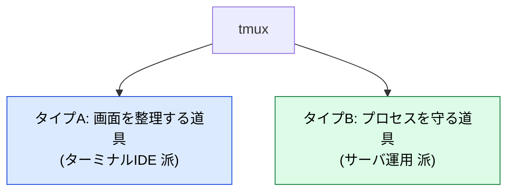

### 11.1 タイプA：ターミナルIDE として使う（画面を整理する）

エディタ（Vim / Neovim 等）をターミナルで使う人は、tmux を **マウスなしで完結する自前IDE** にします。1つのウィンドウを pane で割り、エディタ・テスト・ログ・git を並べて、キーボードだけで行き来します。

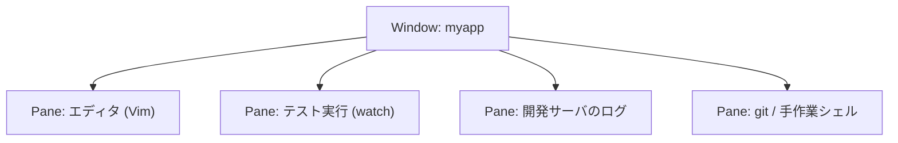

- プロジェクトごとに `tmux new -s myapp` でセッションを分ける
- 一度組んだレイアウトを `.tmux.conf` で再現でき、**毎朝同じ作業環境がすぐ立ち上がる**
- VS Code 等のGUIエディタ派でも、「ターミナルパネルを増やす代わりに tmux で割る」用途で効きます

:::message
**効いてくる瞬間**：タブやウィンドウをいくつも開いて、どれがどれだか分からなくなってきた時。
:::

### 11.2 タイプB：サーバ運用で使う（プロセスを守る）

サーバに SSH で入って、**時間のかかる作業**（ビルド、デプロイ、DBマイグレーション、バックアップ、大量ファイル処理）を流す人は、tmux を **回線が切れても作業を守る盾** として使います。これは古くからある `screen` の後継的な使い方です。

- サーバ上で `tmux new -s deploy` → 重い処理を開始 → `Ctrl-b d` で離脱
- ノートPCを閉じて移動しても、**サーバ側の tmux が処理を走らせ続ける**
- 戻ってきたら `tmux attach -t deploy` で続きを確認

:::message
**効いてくる瞬間**：「あと10分かかるデプロイ、この電車を降りる前に終わるかな…」という時。tmux なら回線が切れても平気です。
:::

### 11.3 つまずきポイント：SSH「前」と「後」で性質が変わる

ここが初心者が最も混乱するところです。**tmux を“どのマシンの上で”動かすか**で、意味がガラッと変わります。

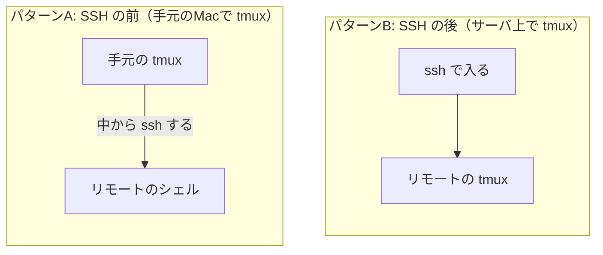

| 観点            | A：SSH の前（手元で起動）     | B：SSH の後（サーバ上で起動）  |
| --------------- | ----------------------------- | ------------------------------ |
| tmux が動く場所 | 自分の Mac                    | リモートのサーバ               |
| 主目的          | 複数の接続先を1画面に**整理** | リモート作業の**永続化・保護** |
| 回線が切れたら  | リモート作業は**死ぬ**        | リモート作業は**生き残る**     |
| どっちのタイプ  | タイプA（IDE派）              | タイプB（サーバ運用派）        |

:::message
**覚え方**：永続化（消えない）が欲しいなら、tmux は **守りたい処理と同じマシンの上**で動かす必要があります。
clientpc で tmux を動かして、その中から ssh しても、回線が切れればリモート作業は道連れです。
「どっちのマシンの tmux か？」を常に意識すると、挙動が一気に腑に落ちます。
:::

### 11.4 そして AI エージェント時代（A と B がひとつになる）

最近 tmux の価値が一段上がったのは、**AI エージェント（Claude Code / Codex CLI 等）を長時間・自律的に走らせ、人間は非同期に監視する**という使い方が広がったからです。

これは面白いことに、これまで別タイプだった **A（整理）と B（永続化）の両方を同時に要求** します。

| 欲しいもの                     | 由来      | tmux でどう実現するか                                                       |
| ------------------------------ | --------- | --------------------------------------------------------------------------- |
| **投げて離れる**<br>（永続化） | タイプB   | 長いタスクを走らせて `Ctrl-b d` <br>→ 後で `attach` して結果回収            |
| **手綱を握る**<br>（可観測性） | タイプA   | pane に「本体・`git diff` 監視・ログ」を並べ、暴走に気づける                |
| **並列で回す**                 | 両方      | `tmux new -s agent-a` / `agent-b` でエージェントを並走させ俯瞰              |
| **プログラムから操作**         | tmux 固有 | `tmux capture-pane`（出力取得）<br>／`tmux send-keys`（入力送信）で半自動化 |

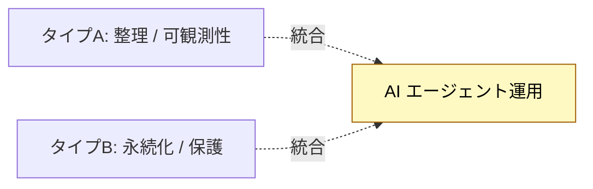

**具体例①：監視レイアウト（手綱を握る）**
自律実行は「いま何をしているか見えにくい」のが弱点です。
そこで pane を並べてテレメトリを一望し、暴走にすぐ気づける配置にしておきましょう。

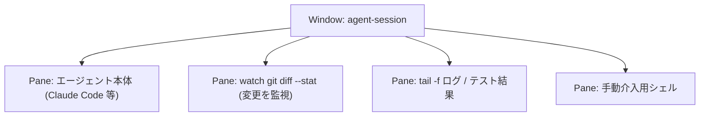

**具体例②：投げて離れる（永続化）**

```sh
tmux new -s agent-refactor    # サーバ上でエージェントを開始
# … 長いタスクを走らせて Ctrl-b d で離脱、Mac を閉じてもOK …
tmux attach -t agent-refactor # 後でつなぎ直して結果を回収
```

**具体例③：プログラムから半自動で操作する**
tmux は外部から pane を操作できるため、エージェントの入出力を**プログラム的に扱える**のが他ツールにない強みです。

```sh
# pane の出力を取得（ログ解析や別エージェントへの受け渡しに）
tmux capture-pane -p -t agent-refactor:0.0

# 承認プロンプトに自動で y を返す（最小例）
tmux send-keys -t agent-refactor:0.0 'y' Enter
```

:::message alert
自動応答は便利な反面、**エージェントの暴走をそのまま承認**してしまう危険があります。条件は厳しめにし、`git diff` の監視（具体例①の P2）とセットで使うのが安全です。
:::

つまり「なぜ今 tmux を学ぶのか」の答えは、**IDE 派の画面整理と、サーバ運用派の永続化が、AI エージェント運用で 1 つに溶け合うから**です。この発展的な観点は別記事に詳しくまとめてあります。

> 📄 続き：[tmuxとは — LLMエージェント時代の利用観点からの整理](https://qiita.com/shuji-bonji/items/24b226cb9d8a59e33cb4)

:::message
**補足：A と B の融合は、AI 専用ではありません。**
SSH 先で neovim を IDE として動かす（→ remote-dev 章）時点で、すでに **B の永続化の上で A の画面整理**をしています。
さらに同じ session を複数 client で共有すれば、人間同士のペアプロ／モブにもなります（→ agent-pair 章）。

整理すると、tmux のユースケースは次の 3 軸で捉えられます。

- **どこで動かすか**: 手元（A）/ サーバ（B）
- **誰が編集するか**: 自分 / 人間ペア・モブ / 人間 + AI エージェント
- **どう操作するか**: 手動 / プログラム経由（`send-keys`・`capture-pane`）

AI エージェント運用は、この 3 軸が **すべて「サーバ側・複数主体・プログラム操作」へ振り切った先**にあると捉えると、位置づけが明確になります。
:::

## 仕上げ: ターミナルを開いたら自動で tmux に入る

毎回手で `tmux` と打たなくても、ターミナル（Ghostty 等）を開いた瞬間に作業机へ座れます。`.zshrc` に次を足します。

```bash
# ~/.zshrc
if [ -z "$TMUX" ] && command -v tmux >/dev/null; then
  tmux new -As main
fi
```

`-As main` は「`main` セッションがあれば attach、無ければ作成」の意味です。これで「開いたら、消えない作業机がそこにある」状態になります。

## リセット手順（この章で入れたものを消す）

```sh
# セッションを全部終了して server を落とす
tmux kill-server

# tmux 本体をアンインストール
brew uninstall tmux

# 設定ファイルを消す（作っていれば）
rm -f ~/.tmux.conf

# .zshrc に足した自動起動スニペットも手で戻す
```

:::message
**章末メモ（L3/L4 へのリンク機会）**
「閉じても消えない」の正体が _常駐 server がプロセスを抱える_ 構造である点は、
AI エージェント運用の **永続化レイヤ**（投げて離れる）の土台に直結します。
`capture-pane` / `send-keys` による外部制御は、L3 のオーケストレーション層
（対話的CLIを半自動で回す土台）への入口として `zennbook-toc-memo.md` に追記候補。
:::
